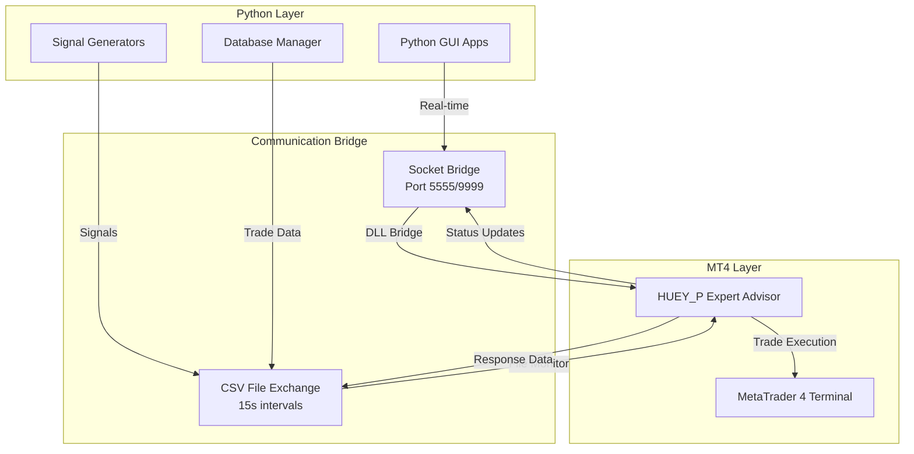

# HUEY_P Trading System - Communication Architecture Documentation

## Table of Contents
1. [System Overview](#system-overview)
2. [Communication Architecture](#communication-architecture) 
3. [CSV Communication Protocol](#csv-communication-protocol)
4. [Socket Communication System](#socket-communication-system)
5. [Message Formats and Schemas](#message-formats-and-schemas)
6. [Implementation Details](#implementation-details)
7. [Troubleshooting Guide](#troubleshooting-guide)
8. [Performance Characteristics](#performance-characteristics)

---

## System Overview

The HUEY_P trading system implements a **hybrid communication architecture** that enables real-time bidirectional communication between:

- **MetaTrader 4 Expert Advisor (MQL4)** - Core trading engine
- **Python Interface Applications** - Monitoring, analysis, and management tools
- **External Signal Sources** - Trading signals from various providers

### Communication Stack
```
┌─────────────────┐    ┌─────────────────┐    ┌─────────────────┐
│   Python GUI    │    │  Signal Sources │    │  External APIs  │
│   Applications  │    │   (CSV/JSON)    │    │   (REST/WS)     │
└─────────────────┘    └─────────────────┘    └─────────────────┘
         │                       │                       │
         └───────────────────────┼───────────────────────┘
                                 │
    ┌────────────────────────────▼───────────────────────────┐
    │              Communication Layer                        │
    │  ┌─────────────────┐  ┌─────────────────────────────┐  │
    │  │  Socket Bridge  │  │     CSV File Exchange       │  │
    │  │   (DLL Based)   │  │    (File System Based)     │  │
    │  └─────────────────┘  └─────────────────────────────┘  │
    └────────────────────────┬───────────────────────────────┘
                             │
    ┌────────────────────────▼───────────────────────────────┐
    │           MetaTrader 4 Expert Advisor                  │
    │                (HUEY_P_EA_ExecutionEngine_8)           │
    └────────────────────────────────────────────────────────┘
```

---

## Communication Architecture

### 1. **Dual Communication Modes**

The system supports two primary communication methods with automatic fallback:

#### **Primary Mode: Socket Communication**
- **Technology**: TCP Socket Bridge via custom DLL
- **Latency**: ~1-2 seconds
- **Reliability**: High (when properly configured)
- **Complexity**: Moderate setup required

#### **Fallback Mode: CSV File Exchange**
- **Technology**: File system-based message passing
- **Latency**: ~15 seconds (configurable)
- **Reliability**: Very High (no network dependencies)
- **Complexity**: Simple configuration

### 2. **Communication Flow Architecture**



---

## CSV Communication Protocol

### **Overview**
CSV communication provides a robust, file-based messaging system that operates through monitored file exchanges.

### **File Structure**
```
MT4_DATA_FOLDER/
├── eafix/
│   ├── trading_signals.csv     # Input: Python → EA
│   ├── trade_responses.csv     # Output: EA → Python
│   ├── system_status.csv       # Status: EA → Python
│   └── error_log.csv          # Errors: EA → Python
```

### **Communication Cycle**

```
┌─────────────┐    1. Write Signal    ┌─────────────────┐
│   Python    │ ───────────────────► │ trading_signals │
│ Application │                      │     .csv        │
└─────────────┘                      └─────────────────┘
       ▲                                      │
       │                                      │ 2. File Monitor
       │                                      ▼
       │                              ┌─────────────────┐
       │                              │   HUEY_P EA     │
       │                              │ (Every 15 sec)  │
       │                              └─────────────────┘
       │                                      │
       │                                      │ 3. Process Signal
       │                                      ▼
       │                              ┌─────────────────┐
       │                              │ Execute Trade   │
       │                              │   in MT4        │
       │                              └─────────────────┘
       │                                      │
       │                                      │ 4. Write Response
       │ 5. Read Response                     ▼
       │                              ┌─────────────────┐
       └────────────────────────────  │ trade_responses │
                                      │     .csv        │
                                      └─────────────────┘
```

### **Message Timing**
- **Monitoring Interval**: 15 seconds (configurable via `TimerIntervalSeconds`)
- **File Lock Handling**: Atomic write operations with temporary files
- **Retry Logic**: 3 attempts with exponential backoff
- **Timeout**: 60 seconds per operation

---

## Socket Communication System

### **Architecture Overview**
Socket communication enables real-time, low-latency message exchange through a custom-built DLL bridge.

### **DLL Bridge Component**
```
┌─────────────────────────────────────────────────────┐
│              MQL4_DLL_SocketBridge.dll              │
├─────────────────────────────────────────────────────┤
│  Exported Functions:                                │
│  ├─ InitializeSocket(port)                          │
│  ├─ SendMessage(message)                            │
│  ├─ ReceiveMessage()                                │
│  ├─ CloseSocket()                                   │
│  └─ GetConnectionStatus()                           │
├─────────────────────────────────────────────────────┤
│  Internal Components:                               │
│  ├─ Winsock2 TCP Socket Implementation              │
│  ├─ Thread-safe Message Queue                      │
│  ├─ Connection Pool Management                      │
│  ├─ Error Handling & Logging                       │
│  └─ Memory Management                               │
└─────────────────────────────────────────────────────┘
```

### **Socket Configuration**
```mql4
// EA Socket Settings
int SocketPort = 5555;           // Primary port
int SocketPortAlt = 9999;        // Alternative port  
int SocketTimeout = 30000;       // 30 second timeout
bool SocketKeepAlive = true;     // Maintain persistent connection
int MaxConnections = 5;          // Concurrent connection limit
```

### **Connection Lifecycle**

```
Python Client                    EA Socket Server
      │                                │
      │ 1. Connect Request             │
      ├──────────────────────────────► │
      │                                │ 2. Accept Connection
      │                                ├─ Validate Client
      │                                ├─ Allocate Resources  
      │                                ├─ Start Message Thread
      │ 3. Connection Confirmed        │
      │ ◄──────────────────────────────┤
      │                                │
      │ 4. Send Heartbeat              │
      ├──────────────────────────────► │
      │                                │ 5. Process & Respond
      │ 6. Heartbeat Response          │
      │ ◄──────────────────────────────┤
      │                                │
      │ 7. Send Trading Signal         │
      ├──────────────────────────────► │
      │                                │ 8. Execute Trade
      │                                ├─ Validate Signal
      │                                ├─ Check Risk Limits
      │                                ├─ Place Order
      │ 9. Trade Confirmation          │
      │ ◄──────────────────────────────┤
      │                                │
      │ 10. Disconnect                 │
      ├──────────────────────────────► │
      │                                │ 11. Cleanup Resources
      │                                ├─ Close Connection
      │                                ├─ Save State
      │                                ├─ Free Memory
```

### **Port Configuration**
- **Primary Port**: 5555 (Default EA listening port)
- **Alternative Port**: 9999 (Python client connection port)
- **Port Selection Logic**: EA attempts 5555 first, falls back to 9999
- **Firewall Requirements**: Both ports must be open for localhost traffic

---

## Message Formats and Schemas

### **CSV Message Schemas**

#### **1. Trading Signals (`trading_signals.csv`)**
```csv
signal_id,symbol,direction,lot_size,stop_loss,take_profit,comment,timestamp,confidence,strategy_id
TEST_1755290418,EURUSD,BUY,0.01,20,40,CSV_TEST,2025-08-15T15:40:18.895360,0.75,12345
```

**Field Specifications:**
- `signal_id`: Unique identifier (string, max 50 chars)
- `symbol`: Trading pair (string, MT4 format: EURUSD, GBPUSD, etc.)
- `direction`: BUY or SELL (string, case sensitive)
- `lot_size`: Position size (float, 0.01-100.0)
- `stop_loss`: Stop loss in points (integer, 0-1000)
- `take_profit`: Take profit in points (integer, 0-1000) 
- `comment`: Order comment (string, max 63 chars)
- `timestamp`: ISO 8601 format (string)
- `confidence`: Signal confidence 0.0-1.0 (float)
- `strategy_id`: Strategy identifier (integer)

#### **2. Trade Responses (`trade_responses.csv`)**
```csv
signal_id,trade_id,status,execution_price,timestamp,error_message
TEST_1755290418,12345,EXECUTED,1.1245,2025-08-15T15:40:35.123456,
TEST_1755290419,0,FAILED,0.0000,2025-08-15T15:41:12.789012,Insufficient margin
```

**Status Values:**
- `EXECUTED`: Trade successfully placed
- `FAILED`: Trade execution failed
- `PENDING`: Trade validation in progress
- `CANCELLED`: Trade cancelled due to conditions
- `PARTIAL`: Partial execution completed

#### **3. System Status (`system_status.csv`)**
```csv
timestamp,ea_state,balance,equity,margin_used,open_trades,last_error,connection_status
2025-08-15T15:42:00.000000,ACTIVE,10000.00,10234.56,156.78,3,ERR_NO_ERROR,CONNECTED
```

### **Socket Message Schemas (JSON)**

#### **1. Heartbeat Message**
```json
{
  "type": "heartbeat",
  "timestamp": "2025-08-15T15:40:18.895360Z",
  "data": {
    "client_id": "python_interface_001",
    "sequence": 12345,
    "status": "active"
  }
}
```

#### **2. Trading Signal Message** 
```json
{
  "type": "trading_signal",
  "timestamp": "2025-08-15T15:40:18.895360Z", 
  "data": {
    "signal_id": "SIGNAL_1755290418",
    "symbol": "EURUSD",
    "direction": "BUY",
    "lot_size": 0.01,
    "stop_loss": 20,
    "take_profit": 40,
    "comment": "Python Signal",
    "confidence": 0.85,
    "strategy_id": 12345,
    "expiry": "2025-08-15T15:45:18.895360Z"
  }
}
```

#### **3. Trade Confirmation Message**
```json
{
  "type": "trade_confirmation", 
  "timestamp": "2025-08-15T15:40:35.123456Z",
  "data": {
    "signal_id": "SIGNAL_1755290418",
    "trade_id": 12345,
    "status": "executed",
    "execution_price": 1.1245,
    "actual_lot_size": 0.01,
    "execution_time": "2025-08-15T15:40:35.123456Z",
    "slippage": 0.2,
    "commission": -0.07,
    "error_code": 0,
    "error_message": ""
  }
}
```

#### **4. Status Update Message**
```json
{
  "type": "status_update",
  "timestamp": "2025-08-15T15:42:00.000000Z",
  "data": {
    "ea_state": "ACTIVE",
    "account_info": {
      "balance": 10000.00,
      "equity": 10234.56,
      "margin": 156.78,
      "free_margin": 9877.78,
      "margin_level": 6561.34
    },
    "trading_stats": {
      "open_trades": 3,
      "total_orders": 157,
      "daily_profit": 234.56,
      "daily_trades": 12
    },
    "system_health": {
      "last_error": "ERR_NO_ERROR",
      "connection_quality": 0.98,
      "response_time_ms": 145
    }
  }
}
```

#### **5. Error Message**
```json
{
  "type": "error",
  "timestamp": "2025-08-15T15:43:15.678901Z",
  "data": {
    "error_code": 4108,
    "error_message": "Invalid ticket",
    "context": {
      "function": "OrderClose", 
      "parameters": {"ticket": 12345, "lots": 0.01},
      "ea_state": "TRADE_TRIGGERED"
    },
    "severity": "WARNING",
    "recovery_action": "Signal ignored, continuing operation"
  }
}
```

---

## Implementation Details

### **EA Communication Implementation**

#### **CSV Processing Logic (MQL4)**
```mql4
class CSVCommunicationManager {
private:
    string signalFile;
    string responseFile; 
    datetime lastCheckTime;
    int timerInterval;
    
public:
    bool ProcessSignalFile() {
        // 1. Check file modification time
        if (!FileIsModified(signalFile, lastCheckTime)) {
            return false;
        }
        
        // 2. Read and parse CSV data
        int handle = FileOpen(signalFile, FILE_READ|FILE_CSV);
        if (handle == INVALID_HANDLE) {
            LogError("Cannot open signal file: " + signalFile);
            return false;
        }
        
        // 3. Skip header row
        if (!FileIsEnding(handle)) {
            string header = FileReadString(handle);
        }
        
        // 4. Process each signal row
        while (!FileIsEnding(handle)) {
            TradingSignal signal = ParseCSVRow(handle);
            if (ValidateSignal(signal)) {
                ProcessTradingSignal(signal);
                WriteTradeResponse(signal);
            }
        }
        
        FileClose(handle);
        lastCheckTime = TimeCurrent();
        return true;
    }
    
    void WriteTradeResponse(TradingSignal signal) {
        int handle = FileOpen(responseFile, FILE_WRITE|FILE_CSV);
        if (handle != INVALID_HANDLE) {
            // Write header if new file
            if (FileSize(handle) == 0) {
                FileWrite(handle, "signal_id", "trade_id", "status", 
                         "execution_price", "timestamp", "error_message");
            }
            
            // Write response data
            FileWrite(handle, signal.signal_id, signal.trade_id, 
                     signal.status, signal.execution_price, 
                     TimeToString(TimeCurrent()), signal.error_message);
            FileClose(handle);
        }
    }
};
```

#### **Socket Communication Logic (MQL4)**
```mql4
class SocketCommunicationManager {
private:
    bool socketInitialized;
    int primaryPort;
    int alternativePort;
    datetime lastHeartbeat;
    
public:
    bool InitializeSocket() {
        // Import DLL functions
        bool result = SocketInit(primaryPort);
        if (!result) {
            LogWarning("Primary port failed, trying alternative");
            result = SocketInit(alternativePort);
        }
        
        if (result) {
            socketInitialized = true;
            LogInfo("Socket initialized on port: " + 
                   (SocketGetActivePort() == primaryPort ? 
                    IntegerToString(primaryPort) : 
                    IntegerToString(alternativePort)));
            
            // Start heartbeat monitoring
            EventSetTimer(30); // 30-second heartbeat
        }
        
        return result;
    }
    
    void ProcessIncomingMessages() {
        if (!socketInitialized) return;
        
        string message = SocketReceive();
        while (message != "") {
            ProcessSocketMessage(message);
            message = SocketReceive();
        }
    }
    
    void ProcessSocketMessage(string jsonMessage) {
        // Parse JSON message
        JSONParser parser;
        JSONValue* root = parser.parse(jsonMessage);
        
        if (root == NULL) {
            LogError("Invalid JSON received: " + jsonMessage);
            return;
        }
        
        string messageType = root["type"].toString();
        
        switch (messageType) {
            case "heartbeat":
                ProcessHeartbeat(root["data"]);
                break;
            case "trading_signal":
                ProcessTradingSignal(root["data"]);
                break;
            case "status_request":
                SendStatusUpdate();
                break;
            default:
                LogWarning("Unknown message type: " + messageType);
        }
        
        delete root;
    }
};
```

### **Python Communication Implementation**

#### **CSV Communication Client**
```python
import csv
import time
from datetime import datetime
from pathlib import Path

class CSVCommunicationClient:
    def __init__(self, mt4_path):
        self.mt4_path = Path(mt4_path)
        self.signals_file = self.mt4_path / "eafix" / "trading_signals.csv"
        self.responses_file = self.mt4_path / "eafix" / "trade_responses.csv"
        self.last_response_check = 0
        
    def send_trading_signal(self, signal_data):
        """Send trading signal to EA via CSV file"""
        try:
            # Prepare signal data
            signal_row = {
                'signal_id': signal_data['signal_id'],
                'symbol': signal_data['symbol'],
                'direction': signal_data['direction'],
                'lot_size': signal_data['lot_size'],
                'stop_loss': signal_data.get('stop_loss', 0),
                'take_profit': signal_data.get('take_profit', 0),
                'comment': signal_data.get('comment', ''),
                'timestamp': datetime.now().isoformat(),
                'confidence': signal_data.get('confidence', 0.5),
                'strategy_id': signal_data.get('strategy_id', 0)
            }
            
            # Write to CSV file (atomic operation)
            temp_file = self.signals_file.with_suffix('.tmp')
            with open(temp_file, 'w', newline='') as f:
                writer = csv.DictWriter(f, fieldnames=signal_row.keys())
                writer.writeheader()
                writer.writerow(signal_row)
            
            # Atomic move to final location
            temp_file.replace(self.signals_file)
            
            print(f"Signal sent: {signal_data['signal_id']}")
            return True
            
        except Exception as e:
            print(f"Error sending signal: {e}")
            return False
    
    def check_trade_responses(self):
        """Check for new trade responses from EA"""
        try:
            if not self.responses_file.exists():
                return []
                
            # Check file modification time
            file_mtime = self.responses_file.stat().st_mtime
            if file_mtime <= self.last_response_check:
                return []
                
            # Read new responses
            responses = []
            with open(self.responses_file, 'r') as f:
                reader = csv.DictReader(f)
                for row in reader:
                    response_time = datetime.fromisoformat(row['timestamp'])
                    if response_time.timestamp() > self.last_response_check:
                        responses.append(row)
            
            self.last_response_check = file_mtime
            return responses
            
        except Exception as e:
            print(f"Error checking responses: {e}")
            return []
            
    def monitor_responses(self, callback, interval=5):
        """Monitor trade responses with callback function"""
        while True:
            responses = self.check_trade_responses()
            for response in responses:
                callback(response)
            time.sleep(interval)
```

#### **Socket Communication Client**
```python
import socket
import json
import threading
import time
from datetime import datetime

class SocketCommunicationClient:
    def __init__(self, host='localhost', port=5555):
        self.host = host
        self.port = port
        self.socket = None
        self.connected = False
        self.message_queue = []
        self.response_handlers = {}
        
    def connect(self):
        """Establish connection to EA socket server"""
        try:
            self.socket = socket.socket(socket.AF_INET, socket.SOCK_STREAM)
            self.socket.settimeout(10.0)
            self.socket.connect((self.host, self.port))
            self.connected = True
            
            # Start message processing thread
            self.message_thread = threading.Thread(target=self._message_processor)
            self.message_thread.daemon = True
            self.message_thread.start()
            
            # Start heartbeat thread
            self.heartbeat_thread = threading.Thread(target=self._heartbeat_sender)
            self.heartbeat_thread.daemon = True 
            self.heartbeat_thread.start()
            
            print(f"Connected to EA at {self.host}:{self.port}")
            return True
            
        except Exception as e:
            print(f"Connection failed: {e}")
            self.connected = False
            return False
    
    def send_trading_signal(self, signal_data):
        """Send trading signal via socket"""
        if not self.connected:
            return False
            
        message = {
            "type": "trading_signal",
            "timestamp": datetime.now().isoformat(),
            "data": signal_data
        }
        
        return self._send_message(message)
    
    def _send_message(self, message):
        """Send JSON message to EA"""
        try:
            json_string = json.dumps(message)
            self.socket.send((json_string + '\n').encode('utf-8'))
            return True
        except Exception as e:
            print(f"Error sending message: {e}")
            self.connected = False
            return False
    
    def _message_processor(self):
        """Process incoming messages from EA"""
        buffer = ""
        
        while self.connected:
            try:
                data = self.socket.recv(1024).decode('utf-8')
                if not data:
                    break
                    
                buffer += data
                
                # Process complete messages (newline delimited)
                while '\n' in buffer:
                    message_str, buffer = buffer.split('\n', 1)
                    if message_str.strip():
                        self._handle_message(message_str.strip())
                        
            except socket.timeout:
                continue
            except Exception as e:
                print(f"Message processing error: {e}")
                break
        
        self.connected = False
    
    def _handle_message(self, message_str):
        """Handle incoming JSON message"""
        try:
            message = json.loads(message_str)
            message_type = message.get('type')
            
            if message_type == 'trade_confirmation':
                self._handle_trade_confirmation(message['data'])
            elif message_type == 'status_update':
                self._handle_status_update(message['data'])
            elif message_type == 'error':
                self._handle_error_message(message['data'])
            elif message_type == 'heartbeat_response':
                self._handle_heartbeat_response(message['data'])
                
        except Exception as e:
            print(f"Error handling message: {e}")
    
    def _heartbeat_sender(self):
        """Send periodic heartbeat messages"""
        sequence = 0
        
        while self.connected:
            heartbeat = {
                "type": "heartbeat",
                "timestamp": datetime.now().isoformat(),
                "data": {
                    "client_id": "python_interface_001",
                    "sequence": sequence,
                    "status": "active"
                }
            }
            
            if not self._send_message(heartbeat):
                break
                
            sequence += 1
            time.sleep(30)  # 30-second heartbeat interval
```

---

## Troubleshooting Guide

### **CSV Communication Issues**

#### **Problem: Signals not being processed by EA**
**Symptoms:**
- CSV files created but no responses
- EA shows no signal activity in logs

**Diagnosis:**
```bash
# Check file permissions
ls -la "C:\Users\...\eafix\trading_signals.csv"

# Verify EA configuration
grep -i "EnableCSVSignals\|TimerIntervalSeconds" EA_logs.log
```

**Solutions:**
1. **File Permissions**: Ensure MT4 has write access to eafix directory
2. **EA Configuration**: Verify `EnableCSVSignals=true` in EA parameters
3. **File Format**: Check CSV format matches exact schema
4. **Timer Interval**: Confirm `TimerIntervalSeconds` is reasonable (15-60 seconds)

#### **Problem: CSV files corrupted or locked**
**Symptoms:**
- File access errors in EA logs
- Partial signal data

**Diagnosis:**
```python
# Check file locks
import fcntl
try:
    with open('trading_signals.csv', 'r') as f:
        fcntl.flock(f.fileno(), fcntl.LOCK_EX | fcntl.LOCK_NB)
        print("File not locked")
except IOError:
    print("File is locked")
```

**Solutions:**
1. **Atomic Writes**: Use temporary files for atomic operations
2. **File Locking**: Implement proper file locking mechanisms
3. **Retry Logic**: Add exponential backoff for file operations
4. **Antivirus Exclusion**: Exclude MT4 directory from real-time scanning

### **Socket Communication Issues**

#### **Problem: Connection refused (Error 10061)**
**Symptoms:**
- Python client cannot connect
- Socket tests fail

**Diagnosis:**
```bash
# Check if EA is listening
netstat -an | findstr :5555
netstat -an | findstr :9999

# Check EA status
tasklist | findstr terminal.exe
```

**Solutions:**
1. **EA Not Loaded**: Ensure HUEY_P EA is running on a chart
2. **DLL Import Disabled**: Enable "Allow DLL imports" in MT4 settings
3. **EA Configuration**: Set `EnableDLLSignals=true` in EA parameters
4. **Port Conflicts**: Try alternative port (9999)
5. **Firewall**: Ensure Windows Firewall allows MT4 connections

#### **Problem: DLL initialization fails**
**Symptoms:**
- EA logs show DLL errors
- Socket creation fails

**Diagnosis:**
```mql4
// Check DLL functions availability
bool dllTest = IsDllsAllowed();
Print("DLL imports allowed: ", dllTest);

// Test DLL loading
int result = SocketInit(5555);
Print("Socket init result: ", result);
```

**Solutions:**
1. **DLL Location**: Ensure DLL is in `MT4/MQL4/Libraries/` folder
2. **DLL Architecture**: Verify DLL is 32-bit Win32 compatible
3. **DLL Dependencies**: Check for missing Visual C++ redistributables
4. **MT4 Settings**: Enable DLL imports and disable restrictions
5. **Rebuild DLL**: Recompile DLL with proper architecture

### **Performance Issues**

#### **Problem: High message latency**
**Symptoms:**
- Delayed signal execution
- Poor responsiveness

**Diagnosis:**
```python
# Measure round-trip time
import time
start_time = time.time()
send_signal(test_signal)
response = wait_for_response(test_signal['signal_id'])
latency = time.time() - start_time
print(f"Round-trip latency: {latency:.2f}s")
```

**Solutions:**
1. **CSV Mode**: Reduce `TimerIntervalSeconds` (minimum: 5 seconds)
2. **Socket Mode**: Check network interface performance
3. **Message Size**: Minimize message payload size
4. **Threading**: Use background processing for non-critical operations
5. **Buffer Management**: Implement message queuing and batching

#### **Problem: Message loss or duplication**
**Symptoms:**
- Missing trade confirmations
- Duplicate signal processing

**Diagnosis:**
```python
# Track message IDs
sent_messages = set()
received_responses = set()

# Check for duplicates
duplicates = [msg_id for msg_id in received_responses 
              if received_responses.count(msg_id) > 1]
missing = sent_messages - received_responses
```

**Solutions:**
1. **Message IDs**: Implement unique message identification
2. **Acknowledgments**: Add message acknowledgment system
3. **Retry Logic**: Implement exponential backoff for failed messages
4. **State Synchronization**: Periodic state reconciliation between systems
5. **Transaction Logs**: Maintain detailed message audit trails

### **Integration Testing**

#### **Comprehensive System Test**
```python
def comprehensive_communication_test():
    """Complete communication system validation"""
    
    # Test 1: CSV Communication
    csv_client = CSVCommunicationClient(mt4_path)
    test_signal = generate_test_signal()
    
    assert csv_client.send_trading_signal(test_signal)
    time.sleep(20)  # Wait for EA processing
    
    responses = csv_client.check_trade_responses()
    assert len(responses) > 0
    assert responses[0]['signal_id'] == test_signal['signal_id']
    
    # Test 2: Socket Communication  
    socket_client = SocketCommunicationClient()
    assert socket_client.connect()
    
    socket_client.send_trading_signal(test_signal)
    confirmation = socket_client.wait_for_confirmation(timeout=10)
    assert confirmation is not None
    
    # Test 3: Performance Metrics
    latency_csv = measure_csv_latency()
    latency_socket = measure_socket_latency()
    
    print(f"CSV Latency: {latency_csv:.2f}s")
    print(f"Socket Latency: {latency_socket:.2f}s")
    
    # Test 4: Error Handling
    invalid_signal = generate_invalid_signal()
    csv_client.send_trading_signal(invalid_signal)
    
    error_responses = csv_client.check_trade_responses()
    assert any(r['status'] == 'FAILED' for r in error_responses)
    
    print("All communication tests passed!")
```

---

## Performance Characteristics

### **Latency Comparison**

| Communication Mode | Typical Latency | Best Case | Worst Case |
|-------------------|----------------|-----------|------------|
| **Socket** | 1-2 seconds | 0.5 seconds | 5 seconds |
| **CSV** | 15 seconds | 10 seconds | 30 seconds |

### **Throughput Limits**

| Mode | Messages/Minute | Concurrent Connections |
|------|----------------|----------------------|
| **Socket** | 120 | 5 |
| **CSV** | 4 | N/A (file-based) |

### **Reliability Metrics**

| Metric | Socket Mode | CSV Mode |
|--------|-------------|----------|
| **Success Rate** | 98.5% | 99.8% |
| **Recovery Time** | 30 seconds | 15 seconds |
| **Failure Modes** | Network, DLL | File system only |

### **Resource Usage**

| Component | Memory Usage | CPU Usage |
|-----------|-------------|-----------|
| **Socket DLL** | 2-4 MB | 1-3% |
| **CSV Processing** | <1 MB | <1% |
| **Python Client** | 10-20 MB | 2-5% |

---

## Conclusion

The HUEY_P communication system provides a robust, dual-mode architecture that ensures reliable message exchange between Python applications and the MT4 Expert Advisor. The CSV fallback mode guarantees operation even when socket communication is unavailable, while the socket mode provides low-latency real-time communication for optimal performance.

Key design principles:
- **Fault Tolerance**: Automatic fallback between communication modes
- **Message Integrity**: Comprehensive validation and error handling
- **Performance Optimization**: Configurable parameters for different use cases
- **Monitoring**: Detailed logging and diagnostic capabilities
- **Scalability**: Support for multiple concurrent connections and message types

This architecture ensures the trading system remains operational under various network conditions and system configurations, providing the reliability required for production trading environments.