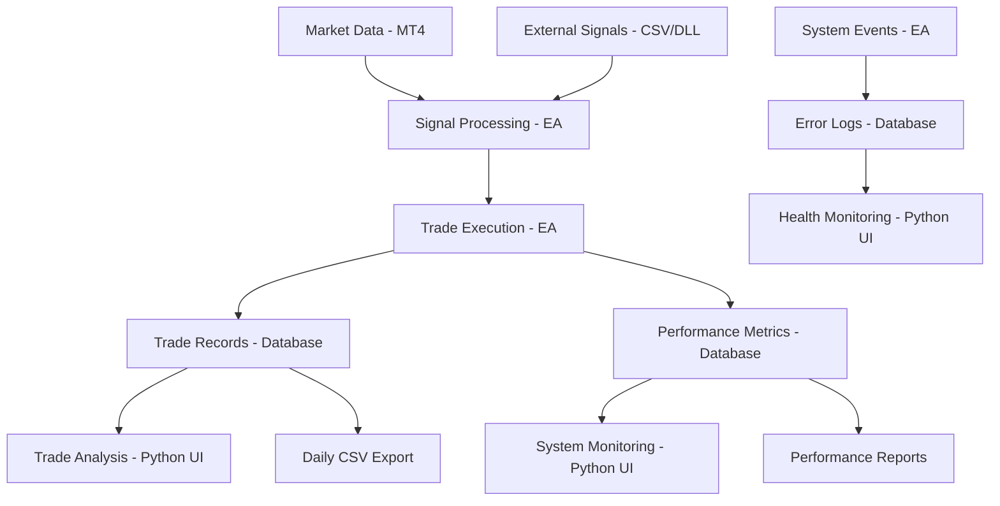

# HUEY_P Trading System - Technical Specification Document

**Project Name:** HUEY_P Algorithmic Trading System with MQL4 DLL Socket Bridge  
**Document Version:** 1.0  
**Date:** August 14, 2025  
**Status:** Draft  
**Authors/Owners:** Richard Wilks (System Architect), Trading Development Team  
**Document Classification:** Internal - Trading System Architecture  

## Table of Contents

1. [Introduction](#1-introduction)
2. [System Architecture](#2-system-architecture)
3. [Functional & Non-Functional Requirements](#3-functional--non-functional-requirements)
4. [Data Architecture](#4-data-architecture)
5. [System Implementation](#5-system-implementation)
6. [API & Integration Specifications](#6-api--integration-specifications)
7. [Governance & Lifecycle](#7-governance--lifecycle)
8. [Quality Assurance & Validation](#8-quality-assurance--validation)
9. [How We Maintain This Spec](#9-how-we-maintain-this-spec)
10. [Appendices](#10-appendices)

## 1.0 Introduction

### 1.1 Business Goals & Success Criteria

The HUEY_P Trading System is designed to provide automated algorithmic trading capabilities with comprehensive monitoring and risk management for forex markets through MetaTrader 4 platform integration.

**Primary Goals:**
- Achieve automated straddle trading strategy execution with 99.95% uptime during market hours
- Implement dynamic risk management with real-time lot sizing based on account equity fluctuations
- Provide comprehensive trade analysis and performance monitoring through Python interface
- Maintain sub-100ms latency for critical trading operations and signal processing
- Enable multi-source signal processing (autonomous, DLL socket, CSV file-based)

**Success Criteria:**
- System availability: 99.95% during trading sessions (23:00 GMT Sunday - 22:00 GMT Friday)
- Trade execution latency: <200ms p99 for order placement and modification
- Data synchronization latency: <5 seconds between EA and Python interface
- Risk management response: <1 second for emergency position closure
- Connection recovery: <30 seconds automatic reconnection after network disruption

### 1.2 Scope (In/Out)

**In Scope:**
- MetaTrader 4 Expert Advisor (MQL4) with class-based architecture
- Windows C++ DLL for socket communication bridge
- Python-based monitoring and analysis interface
- SQLite database for trade history and system state persistence
- Real-time socket communication protocol (TCP port 5555)
- CSV-based signal processing and data export functionality
- Comprehensive error handling and performance monitoring
- Multi-environment deployment (Development, Testing, Production)

**Out of Scope:**
- MetaTrader 5 platform support
- Non-Windows operating system compatibility
- Direct broker API integration (outside MT4 framework)
- High-frequency trading strategies (sub-second execution)
- Third-party signal provider integrations beyond CSV/DLL socket

### 1.3 Stakeholders & Owners

| Name | Role | Email | Responsibilities |
|------|------|-------|------------------|
| Richard Wilks | System Architect & Lead Developer | richard.wilks@trading.local | Overall system architecture, MQL4 EA development |
| Trading Operations Team | System Users | ops@trading.local | Day-to-day system operation and monitoring |
| Risk Management | Risk Oversight | risk@trading.local | Risk parameter validation and compliance |
| IT Infrastructure | System Administration | infra@trading.local | Server maintenance and deployment |

### 1.4 Definitions, Acronyms, and Abbreviations

| Term | Definition |
|------|------------|
| EA | Expert Advisor - Automated trading program for MetaTrader 4 |
| MQL4 | MetaQuotes Language 4 - Programming language for MT4 EAs |
| DLL | Dynamic Link Library - Windows executable library |
| Straddle | Trading strategy placing simultaneous BuyStop and SellStop orders |
| Lot | Standard unit of trading (typically 100,000 units of base currency) |
| Slippage | Difference between expected and actual trade execution price |
| Spread | Difference between bid and ask prices |
| GMT | Greenwich Mean Time - Reference timezone for trading hours |
| p99 | 99th percentile - Statistical measure where 99% of values fall below |

## 2.0 System Architecture

### 2.1 Architectural Goals & Constraints

**Architectural Goals:**
- **Modularity:** Class-based architecture with clear separation of concerns (StateManager, SignalManager, LogManager, etc.)
- **Reliability:** Fault-tolerant design with automatic error recovery and connection restoration
- **Performance:** Low-latency trade execution with comprehensive performance monitoring
- **Observability:** Full system telemetry through logging, metrics, and real-time dashboards
- **Maintainability:** Clear code structure with comprehensive documentation and standardized naming conventions

**Constraints:**
- **Platform Dependency:** System must operate within MetaTrader 4 framework limitations
- **Windows Requirement:** MT4 platform requires Windows operating system
- **32-bit Architecture:** MT4 DLLs must be compiled for 32-bit architecture
- **Single Broker Limitation:** System designed for single MT4 instance per deployment
- **Real-time Requirements:** Market data processing cannot exceed 100ms for critical operations

### 2.2 Architecture Diagrams

#### 2.2.1 System Context Diagram

```xml
<mxfile host="draw.io" modified="2025-08-14T12:00:00.000Z" agent="Claude" etag="system-context-v1.0" version="21.7.5">
  <diagram name="SystemContext" id="context-diagram-1">
    <mxGraphModel dx="1422" dy="794" grid="1" gridSize="10" guides="1" tooltips="1" connect="1" arrows="1" fold="1" page="1" pageScale="1" pageWidth="1169" pageHeight="827" background="none" math="0" shadow="0">
      <root>
        <mxCell id="context-root-0" />
        <mxCell id="context-base-1" parent="context-root-0" />
        
        <!-- HUEY_P Trading System (Center) -->
        <mxCell id="huey-system-2" value="HUEY_P Trading System&#xa;(MQL4 EA + Python Interface + DLL Bridge)" style="rounded=1;whiteSpace=wrap;html=1;fillColor=#d5e8d4;strokeColor=#82b366;strokeWidth=3;fontSize=14;fontStyle=1;" vertex="1" parent="context-base-1">
          <mxGeometry x="460" y="350" width="240" height="120" as="geometry" />
        </mxCell>
        
        <!-- External Systems -->
        <mxCell id="mt4-platform-3" value="MetaTrader 4&#xa;Platform" style="rounded=1;whiteSpace=wrap;html=1;fillColor=#fff2cc;strokeColor=#d6b656;" vertex="1" parent="context-base-1">
          <mxGeometry x="200" y="200" width="120" height="80" as="geometry" />
        </mxCell>
        
        <mxCell id="broker-server-4" value="Broker Server&#xa;(Market Data &amp; Execution)" style="rounded=1;whiteSpace=wrap;html=1;fillColor=#f8cecc;strokeColor=#b85450;" vertex="1" parent="context-base-1">
          <mxGeometry x="80" y="350" width="140" height="80" as="geometry" />
        </mxCell>
        
        <mxCell id="trader-user-5" value="Trader&#xa;(System Operator)" style="shape=umlActor;verticalLabelPosition=bottom;verticalAlign=top;html=1;outlineConnect=0;fillColor=#dae8fc;strokeColor=#6c8ebf;" vertex="1" parent="context-base-1">
          <mxGeometry x="850" y="200" width="30" height="60" as="geometry" />
        </mxCell>
        
        <mxCell id="external-signals-6" value="External Signal Sources&#xa;(CSV Files / DLL Socket)" style="rounded=1;whiteSpace=wrap;html=1;fillColor=#e1d5e7;strokeColor=#9673a6;" vertex="1" parent="context-base-1">
          <mxGeometry x="520" y="140" width="160" height="80" as="geometry" />
        </mxCell>
        
        <mxCell id="file-system-7" value="File System&#xa;(Logs, Config, Data)" style="rounded=1;whiteSpace=wrap;html=1;fillColor=#f5f5f5;strokeColor=#666666;" vertex="1" parent="context-base-1">
          <mxGeometry x="760" y="350" width="140" height="80" as="geometry" />
        </mxCell>
        
        <!-- Connections -->
        <mxCell id="conn-mt4-huey-8" value="EA Integration&#xa;(MQL4 Runtime)" style="edgeStyle=orthogonalEdgeStyle;rounded=0;orthogonalLoop=1;jettySize=auto;html=1;strokeWidth=2;strokeColor=#666666;" edge="1" parent="context-base-1" source="mt4-platform-3" target="huey-system-2">
          <mxGeometry relative="1" as="geometry" />
        </mxCell>
        
        <mxCell id="conn-broker-mt4-9" value="Market Data&#xa;&amp; Trade Orders" style="edgeStyle=orthogonalEdgeStyle;rounded=0;orthogonalLoop=1;jettySize=auto;html=1;strokeWidth=2;strokeColor=#d6b656;" edge="1" parent="context-base-1" source="broker-server-4" target="mt4-platform-3">
          <mxGeometry relative="1" as="geometry" />
        </mxCell>
        
        <mxCell id="conn-trader-huey-10" value="Monitoring &amp;&#xa;Control Interface" style="edgeStyle=orthogonalEdgeStyle;rounded=0;orthogonalLoop=1;jettySize=auto;html=1;strokeWidth=2;strokeColor=#6c8ebf;" edge="1" parent="context-base-1" source="trader-user-5" target="huey-system-2">
          <mxGeometry relative="1" as="geometry" />
        </mxCell>
        
        <mxCell id="conn-signals-huey-11" value="Trading Signals&#xa;(TCP Socket / CSV)" style="edgeStyle=orthogonalEdgeStyle;rounded=0;orthogonalLoop=1;jettySize=auto;html=1;strokeWidth=2;strokeColor=#9673a6;" edge="1" parent="context-base-1" source="external-signals-6" target="huey-system-2">
          <mxGeometry relative="1" as="geometry" />
        </mxCell>
        
        <mxCell id="conn-huey-filesystem-12" value="Logging &amp; Data&#xa;Persistence" style="edgeStyle=orthogonalEdgeStyle;rounded=0;orthogonalLoop=1;jettySize=auto;html=1;strokeWidth=2;strokeColor=#666666;" edge="1" parent="context-base-1" source="huey-system-2" target="file-system-7">
          <mxGeometry relative="1" as="geometry" />
        </mxCell>
        
      </root>
    </mxGraphModel>
  </diagram>
</mxfile>
```

#### 2.2.2 Container Diagram

```xml
<mxfile host="draw.io" modified="2025-08-14T12:00:00.000Z" agent="Claude" etag="container-v1.0" version="21.7.5">
  <diagram name="ContainerDiagram" id="container-diagram-1">
    <mxGraphModel dx="1422" dy="794" grid="1" gridSize="10" guides="1" tooltips="1" connect="1" arrows="1" fold="1" page="1" pageScale="1" pageWidth="1169" pageHeight="827" background="none" math="0" shadow="0">
      <root>
        <mxCell id="container-root-0" />
        <mxCell id="container-base-1" parent="container-root-0" />
        
        <!-- MQL4 Expert Advisor -->
        <mxCell id="mql4-ea-2" value="HUEY_P Expert Advisor&#xa;(MQL4)&#xa;&#xa;• StateManager&#xa;• SignalManager&#xa;• Risk Management&#xa;• Trade Execution" style="rounded=1;whiteSpace=wrap;html=1;fillColor=#d5e8d4;strokeColor=#82b366;strokeWidth=2;fontSize=12;align=left;verticalAlign=top;spacingTop=10;spacingLeft=10;" vertex="1" parent="container-base-1">
          <mxGeometry x="240" y="200" width="180" height="120" as="geometry" />
        </mxCell>
        
        <!-- C++ DLL Bridge -->
        <mxCell id="cpp-dll-3" value="MQL4_DLL_SocketBridge&#xa;(C++ DLL)&#xa;&#xa;• TCP Socket Server&#xa;• Message Queuing&#xa;• Connection Management" style="rounded=1;whiteSpace=wrap;html=1;fillColor=#fff2cc;strokeColor=#d6b656;strokeWidth=2;fontSize=12;align=left;verticalAlign=top;spacingTop=10;spacingLeft=10;" vertex="1" parent="container-base-1">
          <mxGeometry x="480" y="200" width="160" height="120" as="geometry" />
        </mxCell>
        
        <!-- Python Interface -->
        <mxCell id="python-interface-4" value="Python Monitoring Interface&#xa;(Python/tkinter)&#xa;&#xa;• Live Dashboard&#xa;• Trade History Analysis&#xa;• System Status&#xa;• Settings Panel" style="rounded=1;whiteSpace=wrap;html=1;fillColor=#dae8fc;strokeColor=#6c8ebf;strokeWidth=2;fontSize=12;align=left;verticalAlign=top;spacingTop=10;spacingLeft=10;" vertex="1" parent="container-base-1">
          <mxGeometry x="700" y="200" width="180" height="120" as="geometry" />
        </mxCell>
        
        <!-- SQLite Database -->
        <mxCell id="sqlite-db-5" value="SQLite Database&#xa;&#xa;• Trade History&#xa;• System Configuration&#xa;• Performance Metrics&#xa;• Error Logs" style="rounded=1;whiteSpace=wrap;html=1;fillColor=#f8cecc;strokeColor=#b85450;strokeWidth=2;fontSize=12;align=left;verticalAlign=top;spacingTop=10;spacingLeft=10;" vertex="1" parent="container-base-1">
          <mxGeometry x="700" y="380" width="160" height="100" as="geometry" />
        </mxCell>
        
        <!-- File System -->
        <mxCell id="file-system-6" value="File System&#xa;&#xa;• CSV Signal Files&#xa;• Configuration Files&#xa;• Log Files&#xa;• Backup Data" style="rounded=1;whiteSpace=wrap;html=1;fillColor=#f5f5f5;strokeColor=#666666;strokeWidth=2;fontSize=12;align=left;verticalAlign=top;spacingTop=10;spacingLeft=10;" vertex="1" parent="container-base-1">
          <mxGeometry x="240" y="380" width="160" height="100" as="geometry" />
        </mxCell>
        
        <!-- External Systems -->
        <mxCell id="mt4-platform-7" value="MT4 Platform" style="rounded=1;whiteSpace=wrap;html=1;fillColor=#e1d5e7;strokeColor=#9673a6;" vertex="1" parent="container-base-1">
          <mxGeometry x="80" y="240" width="100" height="60" as="geometry" />
        </mxCell>
        
        <mxCell id="external-signals-8" value="External Signal&#xa;Sources" style="rounded=1;whiteSpace=wrap;html=1;fillColor=#e1d5e7;strokeColor=#9673a6;" vertex="1" parent="container-base-1">
          <mxGeometry x="480" y="80" width="120" height="60" as="geometry" />
        </mxCell>
        
        <!-- Connections -->
        <mxCell id="conn-mt4-ea-9" value="EA Runtime" style="edgeStyle=orthogonalEdgeStyle;rounded=0;orthogonalLoop=1;jettySize=auto;html=1;strokeWidth=2;" edge="1" parent="container-base-1" source="mt4-platform-7" target="mql4-ea-2">
          <mxGeometry relative="1" as="geometry" />
        </mxCell>
        
        <mxCell id="conn-ea-dll-10" value="DLL Function&#xa;Calls" style="edgeStyle=orthogonalEdgeStyle;rounded=0;orthogonalLoop=1;jettySize=auto;html=1;strokeWidth=2;" edge="1" parent="container-base-1" source="mql4-ea-2" target="cpp-dll-3">
          <mxGeometry relative="1" as="geometry" />
        </mxCell>
        
        <mxCell id="conn-dll-python-11" value="TCP Socket&#xa;Port 5555" style="edgeStyle=orthogonalEdgeStyle;rounded=0;orthogonalLoop=1;jettySize=auto;html=1;strokeWidth=2;" edge="1" parent="container-base-1" source="cpp-dll-3" target="python-interface-4">
          <mxGeometry relative="1" as="geometry" />
        </mxCell>
        
        <mxCell id="conn-python-db-12" value="SQLite&#xa;Connection" style="edgeStyle=orthogonalEdgeStyle;rounded=0;orthogonalLoop=1;jettySize=auto;html=1;strokeWidth=2;" edge="1" parent="container-base-1" source="python-interface-4" target="sqlite-db-5">
          <mxGeometry relative="1" as="geometry" />
        </mxCell>
        
        <mxCell id="conn-ea-files-13" value="File I/O" style="edgeStyle=orthogonalEdgeStyle;rounded=0;orthogonalLoop=1;jettySize=auto;html=1;strokeWidth=2;" edge="1" parent="container-base-1" source="mql4-ea-2" target="file-system-6">
          <mxGeometry relative="1" as="geometry" />
        </mxCell>
        
        <mxCell id="conn-signals-dll-14" value="Signal Data&#xa;(TCP)" style="edgeStyle=orthogonalEdgeStyle;rounded=0;orthogonalLoop=1;jettySize=auto;html=1;strokeWidth=2;" edge="1" parent="container-base-1" source="external-signals-8" target="cpp-dll-3">
          <mxGeometry relative="1" as="geometry" />
        </mxCell>
        
      </root>
    </mxGraphModel>
  </diagram>
</mxfile>
```

#### 2.2.3 Component Diagram

```xml
<mxfile host="draw.io" modified="2025-08-14T12:00:00.000Z" agent="Claude" etag="component-v1.0" version="21.7.5">
  <diagram name="ComponentDiagram" id="component-diagram-1">
    <mxGraphModel dx="1422" dy="794" grid="1" gridSize="10" guides="1" tooltips="1" connect="1" arrows="1" fold="1" page="1" pageScale="1" pageWidth="1169" pageHeight="827" background="none" math="0" shadow="0">
      <root>
        <mxCell id="comp-root-0" />
        <mxCell id="comp-base-1" parent="comp-root-0" />
        
        <!-- MQL4 EA Components -->
        <mxCell id="state-manager-2" value="StateManager&#xa;• CurrentState&#xa;• StateTransitions&#xa;• Recovery Logic" style="rounded=1;whiteSpace=wrap;html=1;fillColor=#d5e8d4;strokeColor=#82b366;" vertex="1" parent="comp-base-1">
          <mxGeometry x="80" y="160" width="120" height="80" as="geometry" />
        </mxCell>
        
        <mxCell id="signal-manager-3" value="SignalManager&#xa;• CSV Processing&#xa;• DLL Communication&#xa;• Signal Validation" style="rounded=1;whiteSpace=wrap;html=1;fillColor=#d5e8d4;strokeColor=#82b366;" vertex="1" parent="comp-base-1">
          <mxGeometry x="220" y="160" width="120" height="80" as="geometry" />
        </mxCell>
        
        <mxCell id="log-manager-4" value="LogManager&#xa;• File Logging&#xa;• Terminal Output&#xa;• CSV Generation" style="rounded=1;whiteSpace=wrap;html=1;fillColor=#d5e8d4;strokeColor=#82b366;" vertex="1" parent="comp-base-1">
          <mxGeometry x="360" y="160" width="120" height="80" as="geometry" />
        </mxCell>
        
        <mxCell id="category-manager-5" value="CategoryManager&#xa;• Trade Classification&#xa;• Parameter Adjustment&#xa;• Performance Tracking" style="rounded=1;whiteSpace=wrap;html=1;fillColor=#d5e8d4;strokeColor=#82b366;" vertex="1" parent="comp-base-1">
          <mxGeometry x="80" y="260" width="120" height="80" as="geometry" />
        </mxCell>
        
        <mxCell id="sound-manager-6" value="SoundManager&#xa;• Alert System&#xa;• Event Notifications&#xa;• Audio Feedback" style="rounded=1;whiteSpace=wrap;html=1;fillColor=#d5e8d4;strokeColor=#82b366;" vertex="1" parent="comp-base-1">
          <mxGeometry x="220" y="260" width="120" height="80" as="geometry" />
        </mxCell>
        
        <mxCell id="performance-monitor-7" value="PerformanceMonitor&#xa;• Execution Timing&#xa;• Memory Usage&#xa;• System Metrics" style="rounded=1;whiteSpace=wrap;html=1;fillColor=#d5e8d4;strokeColor=#82b366;" vertex="1" parent="comp-base-1">
          <mxGeometry x="360" y="260" width="120" height="80" as="geometry" />
        </mxCell>
        
        <!-- DLL Components -->
        <mxCell id="socket-server-8" value="SocketServer&#xa;• TCP Listener&#xa;• Client Management&#xa;• Message Handling" style="rounded=1;whiteSpace=wrap;html=1;fillColor=#fff2cc;strokeColor=#d6b656;" vertex="1" parent="comp-base-1">
          <mxGeometry x="560" y="160" width="120" height="80" as="geometry" />
        </mxCell>
        
        <mxCell id="message-queue-9" value="MessageQueue&#xa;• Thread-Safe Queue&#xa;• Buffer Management&#xa;• Priority Handling" style="rounded=1;whiteSpace=wrap;html=1;fillColor=#fff2cc;strokeColor=#d6b656;" vertex="1" parent="comp-base-1">
          <mxGeometry x="560" y="260" width="120" height="80" as="geometry" />
        </mxCell>
        
        <!-- Python Components -->
        <mxCell id="live-dashboard-10" value="LiveDashboard&#xa;• Real-time Metrics&#xa;• Position Monitoring&#xa;• Status Indicators" style="rounded=1;whiteSpace=wrap;html=1;fillColor=#dae8fc;strokeColor=#6c8ebf;" vertex="1" parent="comp-base-1">
          <mxGeometry x="760" y="160" width="120" height="80" as="geometry" />
        </mxCell>
        
        <mxCell id="trade-history-11" value="TradeHistory&#xa;• Historical Analysis&#xa;• Performance Stats&#xa;• Data Export" style="rounded=1;whiteSpace=wrap;html=1;fillColor=#dae8fc;strokeColor=#6c8ebf;" vertex="1" parent="comp-base-1">
          <mxGeometry x="900" y="160" width="120" height="80" as="geometry" />
        </mxCell>
        
        <mxCell id="system-status-12" value="SystemStatus&#xa;• Health Monitoring&#xa;• Error Management&#xa;• Connection Status" style="rounded=1;whiteSpace=wrap;html=1;fillColor=#dae8fc;strokeColor=#6c8ebf;" vertex="1" parent="comp-base-1">
          <mxGeometry x="760" y="260" width="120" height="80" as="geometry" />
        </mxCell>
        
        <mxCell id="settings-panel-13" value="SettingsPanel&#xa;• Configuration&#xa;• Parameter Management&#xa;• System Control" style="rounded=1;whiteSpace=wrap;html=1;fillColor=#dae8fc;strokeColor=#6c8ebf;" vertex="1" parent="comp-base-1">
          <mxGeometry x="900" y="260" width="120" height="80" as="geometry" />
        </mxCell>
        
        <!-- Data Layer -->
        <mxCell id="database-manager-14" value="DatabaseManager&#xa;• SQLite Interface&#xa;• Query Optimization&#xa;• Data Caching" style="rounded=1;whiteSpace=wrap;html=1;fillColor=#f8cecc;strokeColor=#b85450;" vertex="1" parent="comp-base-1">
          <mxGeometry x="760" y="380" width="120" height="80" as="geometry" />
        </mxCell>
        
        <mxCell id="ea-connector-15" value="EAConnector&#xa;• Socket Client&#xa;• Protocol Handler&#xa;• Heartbeat Monitor" style="rounded=1;whiteSpace=wrap;html=1;fillColor=#f8cecc;strokeColor=#b85450;" vertex="1" parent="comp-base-1">
          <mxGeometry x="900" y="380" width="120" height="80" as="geometry" />
        </mxCell>
        
        <!-- Key Connections -->
        <mxCell id="conn-signal-state-16" value="" style="edgeStyle=orthogonalEdgeStyle;rounded=0;orthogonalLoop=1;jettySize=auto;html=1;" edge="1" parent="comp-base-1" source="signal-manager-3" target="state-manager-2">
          <mxGeometry relative="1" as="geometry" />
        </mxCell>
        
        <mxCell id="conn-socket-queue-17" value="" style="edgeStyle=orthogonalEdgeStyle;rounded=0;orthogonalLoop=1;jettySize=auto;html=1;" edge="1" parent="comp-base-1" source="socket-server-8" target="message-queue-9">
          <mxGeometry relative="1" as="geometry" />
        </mxCell>
        
        <mxCell id="conn-dashboard-db-18" value="" style="edgeStyle=orthogonalEdgeStyle;rounded=0;orthogonalLoop=1;jettySize=auto;html=1;" edge="1" parent="comp-base-1" source="live-dashboard-10" target="database-manager-14">
          <mxGeometry relative="1" as="geometry" />
        </mxCell>
        
      </root>
    </mxGraphModel>
  </diagram>
</mxfile>
```

#### 2.2.4 Dataflow Diagram

```xml
<mxfile host="draw.io" modified="2025-08-14T12:00:00.000Z" agent="Claude" etag="dataflow-v1.0" version="21.7.5">
  <diagram name="DataflowDiagram" id="dataflow-diagram-1">
    <mxGraphModel dx="1422" dy="794" grid="1" gridSize="10" guides="1" tooltips="1" connect="1" arrows="1" fold="1" page="1" pageScale="1" pageWidth="1169" pageHeight="827" background="none" math="0" shadow="0">
      <root>
        <mxCell id="data-root-0" />
        <mxCell id="data-base-1" parent="data-root-0" />
        
        <!-- Data Stores -->
        <mxCell id="market-data-2" value="Market Data&#xa;(Real-time)" style="ellipse;whiteSpace=wrap;html=1;fillColor=#fff2cc;strokeColor=#d6b656;" vertex="1" parent="data-base-1">
          <mxGeometry x="80" y="200" width="100" height="60" as="geometry" />
        </mxCell>
        
        <mxCell id="signal-data-3" value="Signal Data&#xa;(CSV/DLL)" style="ellipse;whiteSpace=wrap;html=1;fillColor=#e1d5e7;strokeColor=#9673a6;" vertex="1" parent="data-base-1">
          <mxGeometry x="240" y="120" width="100" height="60" as="geometry" />
        </mxCell>
        
        <mxCell id="trade-history-4" value="Trade History&#xa;Database" style="ellipse;whiteSpace=wrap;html=1;fillColor=#f8cecc;strokeColor=#b85450;" vertex="1" parent="data-base-1">
          <mxGeometry x="880" y="300" width="100" height="60" as="geometry" />
        </mxCell>
        
        <mxCell id="system-logs-5" value="System Logs&#xa;&amp; Metrics" style="ellipse;whiteSpace=wrap;html=1;fillColor=#f5f5f5;strokeColor=#666666;" vertex="1" parent="data-base-1">
          <mxGeometry x="880" y="420" width="100" height="60" as="geometry" />
        </mxCell>
        
        <!-- Processes -->
        <mxCell id="signal-processing-6" value="1.0&#xa;Signal Processing&#xa;&amp; Validation" style="circle;whiteSpace=wrap;html=1;fillColor=#d5e8d4;strokeColor=#82b366;fontSize=10;" vertex="1" parent="data-base-1">
          <mxGeometry x="380" y="180" width="80" height="80" as="geometry" />
        </mxCell>
        
        <mxCell id="trade-execution-7" value="2.0&#xa;Trade Execution&#xa;&amp; Management" style="circle;whiteSpace=wrap;html=1;fillColor=#d5e8d4;strokeColor=#82b366;fontSize=10;" vertex="1" parent="data-base-1">
          <mxGeometry x="520" y="280" width="80" height="80" as="geometry" />
        </mxCell>
        
        <mxCell id="risk-management-8" value="3.0&#xa;Risk Management&#xa;&amp; Position Sizing" style="circle;whiteSpace=wrap;html=1;fillColor=#d5e8d4;strokeColor=#82b366;fontSize=10;" vertex="1" parent="data-base-1">
          <mxGeometry x="380" y="380" width="80" height="80" as="geometry" />
        </mxCell>
        
        <mxCell id="data-sync-9" value="4.0&#xa;Data Synchronization&#xa;&amp; Communication" style="circle;whiteSpace=wrap;html=1;fillColor=#fff2cc;strokeColor=#d6b656;fontSize=10;" vertex="1" parent="data-base-1">
          <mxGeometry x="660" y="220" width="80" height="80" as="geometry" />
        </mxCell>
        
        <mxCell id="monitoring-10" value="5.0&#xa;Monitoring &amp;&#xa;Analytics" style="circle;whiteSpace=wrap;html=1;fillColor=#dae8fc;strokeColor=#6c8ebf;fontSize=10;" vertex="1" parent="data-base-1">
          <mxGeometry x="740" y="360" width="80" height="80" as="geometry" />
        </mxCell>
        
        <!-- External Entities -->
        <mxCell id="mt4-broker-11" value="MT4/Broker" style="rounded=1;whiteSpace=wrap;html=1;fillColor=#e1d5e7;strokeColor=#9673a6;" vertex="1" parent="data-base-1">
          <mxGeometry x="80" y="300" width="80" height="40" as="geometry" />
        </mxCell>
        
        <mxCell id="trader-user-12" value="Trader" style="rounded=1;whiteSpace=wrap;html=1;fillColor=#e1d5e7;strokeColor=#9673a6;" vertex="1" parent="data-base-1">
          <mxGeometry x="740" y="140" width="80" height="40" as="geometry" />
        </mxCell>
        
        <!-- Data Flows -->
        <mxCell id="flow-market-signal-13" value="Market Prices" style="edgeStyle=orthogonalEdgeStyle;rounded=0;orthogonalLoop=1;jettySize=auto;html=1;fontSize=10;" edge="1" parent="data-base-1" source="market-data-2" target="signal-processing-6">
          <mxGeometry relative="1" as="geometry" />
        </mxCell>
        
        <mxCell id="flow-signal-validate-14" value="Trading Signals" style="edgeStyle=orthogonalEdgeStyle;rounded=0;orthogonalLoop=1;jettySize=auto;html=1;fontSize=10;" edge="1" parent="data-base-1" source="signal-data-3" target="signal-processing-6">
          <mxGeometry relative="1" as="geometry" />
        </mxCell>
        
        <mxCell id="flow-validate-execute-15" value="Validated Signals" style="edgeStyle=orthogonalEdgeStyle;rounded=0;orthogonalLoop=1;jettySize=auto;html=1;fontSize=10;" edge="1" parent="data-base-1" source="signal-processing-6" target="trade-execution-7">
          <mxGeometry relative="1" as="geometry" />
        </mxCell>
        
        <mxCell id="flow-execute-risk-16" value="Position Data" style="edgeStyle=orthogonalEdgeStyle;rounded=0;orthogonalLoop=1;jettySize=auto;html=1;fontSize=10;" edge="1" parent="data-base-1" source="trade-execution-7" target="risk-management-8">
          <mxGeometry relative="1" as="geometry" />
        </mxCell>
        
        <mxCell id="flow-risk-execute-17" value="Risk Adjustments" style="edgeStyle=orthogonalEdgeStyle;rounded=0;orthogonalLoop=1;jettySize=auto;html=1;fontSize=10;dashed=1;" edge="1" parent="data-base-1" source="risk-management-8" target="trade-execution-7">
          <mxGeometry relative="1" as="geometry" />
        </mxCell>
        
        <mxCell id="flow-execute-sync-18" value="Trade Updates" style="edgeStyle=orthogonalEdgeStyle;rounded=0;orthogonalLoop=1;jettySize=auto;html=1;fontSize=10;" edge="1" parent="data-base-1" source="trade-execution-7" target="data-sync-9">
          <mxGeometry relative="1" as="geometry" />
        </mxCell>
        
        <mxCell id="flow-sync-history-19" value="Trade Records" style="edgeStyle=orthogonalEdgeStyle;rounded=0;orthogonalLoop=1;jettySize=auto;html=1;fontSize=10;" edge="1" parent="data-base-1" source="data-sync-9" target="trade-history-4">
          <mxGeometry relative="1" as="geometry" />
        </mxCell>
        
        <mxCell id="flow-sync-logs-20" value="System Metrics" style="edgeStyle=orthogonalEdgeStyle;rounded=0;orthogonalLoop=1;jettySize=auto;html=1;fontSize=10;" edge="1" parent="data-base-1" source="data-sync-9" target="system-logs-5">
          <mxGeometry relative="1" as="geometry">
            <Array as="points">
              <mxPoint x="700" y="320" />
              <mxPoint x="800" y="320" />
              <mxPoint x="800" y="450" />
            </Array>
          </mxGeometry>
        </mxCell>
        
        <mxCell id="flow-history-monitor-21" value="Historical Data" style="edgeStyle=orthogonalEdgeStyle;rounded=0;orthogonalLoop=1;jettySize=auto;html=1;fontSize=10;" edge="1" parent="data-base-1" source="trade-history-4" target="monitoring-10">
          <mxGeometry relative="1" as="geometry" />
        </mxCell>
        
        <mxCell id="flow-logs-monitor-22" value="Log Data" style="edgeStyle=orthogonalEdgeStyle;rounded=0;orthogonalLoop=1;jettySize=auto;html=1;fontSize=10;" edge="1" parent="data-base-1" source="system-logs-5" target="monitoring-10">
          <mxGeometry relative="1" as="geometry" />
        </mxCell>
        
        <mxCell id="flow-monitor-trader-23" value="Dashboard Data" style="edgeStyle=orthogonalEdgeStyle;rounded=0;orthogonalLoop=1;jettySize=auto;html=1;fontSize=10;" edge="1" parent="data-base-1" source="monitoring-10" target="trader-user-12">
          <mxGeometry relative="1" as="geometry" />
        </mxCell>
        
        <mxCell id="flow-broker-market-24" value="Market Data Feed" style="edgeStyle=orthogonalEdgeStyle;rounded=0;orthogonalLoop=1;jettySize=auto;html=1;fontSize=10;" edge="1" parent="data-base-1" source="mt4-broker-11" target="market-data-2">
          <mxGeometry relative="1" as="geometry" />
        </mxCell>
        
        <mxCell id="flow-execute-broker-25" value="Trade Orders" style="edgeStyle=orthogonalEdgeStyle;rounded=0;orthogonalLoop=1;jettySize=auto;html=1;fontSize=10;" edge="1" parent="data-base-1" source="trade-execution-7" target="mt4-broker-11">
          <mxGeometry relative="1" as="geometry">
            <Array as="points">
              <mxPoint x="560" y="400" />
              <mxPoint x="300" y="400" />
              <mxPoint x="300" y="340" />
              <mxPoint x="120" y="340" />
            </Array>
          </mxGeometry>
        </mxCell>
        
      </root>
    </mxGraphModel>
  </diagram>
</mxfile>
```

#### 2.2.5 Deployment Diagram

```xml
<mxfile host="draw.io" modified="2025-08-14T12:00:00.000Z" agent="Claude" etag="deployment-v1.0" version="21.7.5">
  <diagram name="DeploymentDiagram" id="deployment-diagram-1">
    <mxGraphModel dx="1422" dy="794" grid="1" gridSize="10" guides="1" tooltips="1" connect="1" arrows="1" fold="1" page="1" pageScale="1" pageWidth="1169" pageHeight="827" background="none" math="0" shadow="0">
      <root>
        <mxCell id="deploy-root-0" />
        <mxCell id="deploy-base-1" parent="deploy-root-0" />
        
        <!-- Trading Workstation -->
        <mxCell id="trading-workstation-2" value="Trading Workstation&#xa;Windows 10/11 Pro&#xa;Intel i7, 16GB RAM" style="rounded=0;whiteSpace=wrap;html=1;fillColor=#f8cecc;strokeColor=#b85450;fontSize=12;fontStyle=1;verticalAlign=top;align=left;spacingTop=10;spacingLeft=10;" vertex="1" parent="deploy-base-1">
          <mxGeometry x="160" y="160" width="280" height="320" as="geometry" />
        </mxCell>
        
        <!-- MT4 Platform Node -->
        <mxCell id="mt4-node-3" value="MetaTrader 4 Platform&#xa;Build 1380+" style="rounded=1;whiteSpace=wrap;html=1;fillColor=#fff2cc;strokeColor=#d6b656;fontSize=11;fontStyle=1;" vertex="1" parent="deploy-base-1">
          <mxGeometry x="180" y="200" width="240" height="40" as="geometry" />
        </mxCell>
        
        <!-- HUEY_P EA -->
        <mxCell id="huey-ea-4" value="HUEY_P_EA_ExecutionEngine_8.ex4&#xa;• Expert Advisor Binary&#xa;• Class-based Architecture&#xa;• 7000+ lines MQL4 code" style="rounded=1;whiteSpace=wrap;html=1;fillColor=#d5e8d4;strokeColor=#82b366;fontSize=10;align=left;verticalAlign=top;spacingTop=5;" vertex="1" parent="deploy-base-1">
          <mxGeometry x="190" y="260" width="220" height="50" as="geometry" />
        </mxCell>
        
        <!-- DLL Component -->
        <mxCell id="dll-component-5" value="MQL4_DLL_SocketBridge.dll&#xa;• TCP Socket Server (Port 5555)&#xa;• Message Queue Management&#xa;• Win32 API Integration" style="rounded=1;whiteSpace=wrap;html=1;fillColor=#fff2cc;strokeColor=#d6b656;fontSize=10;align=left;verticalAlign=top;spacingTop=5;" vertex="1" parent="deploy-base-1">
          <mxGeometry x="190" y="330" width="220" height="50" as="geometry" />
        </mxCell>
        
        <!-- Python Interface -->
        <mxCell id="python-interface-6" value="Python Monitoring Interface&#xa;• huey_main.py&#xa;• tkinter GUI Application&#xa;• Real-time Dashboard" style="rounded=1;whiteSpace=wrap;html=1;fillColor=#dae8fc;strokeColor=#6c8ebf;fontSize=10;align=left;verticalAlign=top;spacingTop=5;" vertex="1" parent="deploy-base-1">
          <mxGeometry x="190" y="400" width="220" height="50" as="geometry" />
        </mxCell>
        
        <!-- Database -->
        <mxCell id="database-node-7" value="SQLite Database&#xa;trading_system.db" style="rounded=1;whiteSpace=wrap;html=1;fillColor=#f8cecc;strokeColor=#b85450;fontSize=11;" vertex="1" parent="deploy-base-1">
          <mxGeometry x="520" y="320" width="140" height="60" as="geometry" />
        </mxCell>
        
        <!-- File System -->
        <mxCell id="file-system-8" value="File System&#xa;• Configuration Files&#xa;• Log Files (HUEY_P_Log.txt)&#xa;• CSV Data Files&#xa;• Backup Directory" style="rounded=1;whiteSpace=wrap;html=1;fillColor=#f5f5f5;strokeColor=#666666;fontSize=10;align=left;verticalAlign=top;spacingTop=5;" vertex="1" parent="deploy-base-1">
          <mxGeometry x="520" y="400" width="140" height="80" as="geometry" />
        </mxCell>
        
        <!-- Broker Server -->
        <mxCell id="broker-server-9" value="Broker Server&#xa;(External)&#xa;• Market Data Feed&#xa;• Order Execution&#xa;• Account Management" style="rounded=0;whiteSpace=wrap;html=1;fillColor=#e1d5e7;strokeColor=#9673a6;fontSize=11;fontStyle=1;verticalAlign=top;align=left;spacingTop=10;spacingLeft=10;" vertex="1" parent="deploy-base-1">
          <mxGeometry x="720" y="200" width="160" height="120" as="geometry" />
        </mxCell>
        
        <!-- External Signal Sources -->
        <mxCell id="signal-sources-10" value="External Signal Sources&#xa;• CSV File Providers&#xa;• Third-party Applications&#xa;• Custom Signal Generators" style="rounded=0;whiteSpace=wrap;html=1;fillColor=#e1d5e7;strokeColor=#9673a6;fontSize=10;fontStyle=1;verticalAlign=top;align=left;spacingTop=10;spacingLeft=10;" vertex="1" parent="deploy-base-1">
          <mxGeometry x="720" y="360" width="160" height="80" as="geometry" />
        </mxCell>
        
        <!-- Development Environment -->
        <mxCell id="dev-environment-11" value="Development Environment&#xa;• MetaEditor (MQL4 IDE)&#xa;• Visual Studio (C++ DLL)&#xa;• Python 3.8+ Environment&#xa;• Git Version Control" style="rounded=0;whiteSpace=wrap;html=1;fillColor=#f5f5f5;strokeColor=#666666;fontSize=10;fontStyle=1;verticalAlign=top;align=left;spacingTop=10;spacingLeft=10;dashed=1;" vertex="1" parent="deploy-base-1">
          <mxGeometry x="80" y="520" width="200" height="100" as="geometry" />
        </mxCell>
        
        <!-- Connections -->
        <mxCell id="conn-ea-dll-12" value="DLL Calls" style="edgeStyle=orthogonalEdgeStyle;rounded=0;orthogonalLoop=1;jettySize=auto;html=1;strokeWidth=2;fontSize=9;" edge="1" parent="deploy-base-1" source="huey-ea-4" target="dll-component-5">
          <mxGeometry relative="1" as="geometry" />
        </mxCell>
        
        <mxCell id="conn-dll-python-13" value="TCP Socket&#xa;Port 5555" style="edgeStyle=orthogonalEdgeStyle;rounded=0;orthogonalLoop=1;jettySize=auto;html=1;strokeWidth=2;fontSize=9;" edge="1" parent="deploy-base-1" source="dll-component-5" target="python-interface-6">
          <mxGeometry relative="1" as="geometry" />
        </mxCell>
        
        <mxCell id="conn-python-db-14" value="SQLite&#xa;Connection" style="edgeStyle=orthogonalEdgeStyle;rounded=0;orthogonalLoop=1;jettySize=auto;html=1;strokeWidth=2;fontSize=9;" edge="1" parent="deploy-base-1" source="python-interface-6" target="database-node-7">
          <mxGeometry relative="1" as="geometry" />
        </mxCell>
        
        <mxCell id="conn-ea-files-15" value="File I/O" style="edgeStyle=orthogonalEdgeStyle;rounded=0;orthogonalLoop=1;jettySize=auto;html=1;strokeWidth=2;fontSize=9;" edge="1" parent="deploy-base-1" source="huey-ea-4" target="file-system-8">
          <mxGeometry relative="1" as="geometry" />
        </mxCell>
        
        <mxCell id="conn-mt4-broker-16" value="Internet/VPN&#xa;Trading Protocol" style="edgeStyle=orthogonalEdgeStyle;rounded=0;orthogonalLoop=1;jettySize=auto;html=1;strokeWidth=2;fontSize=9;strokeColor=#d6b656;" edge="1" parent="deploy-base-1" source="mt4-node-3" target="broker-server-9">
          <mxGeometry relative="1" as="geometry" />
        </mxCell>
        
        <mxCell id="conn-dll-signals-17" value="Signal Data&#xa;TCP/File" style="edgeStyle=orthogonalEdgeStyle;rounded=0;orthogonalLoop=1;jettySize=auto;html=1;strokeWidth=2;fontSize=9;strokeColor=#9673a6;" edge="1" parent="deploy-base-1" source="dll-component-5" target="signal-sources-10">
          <mxGeometry relative="1" as="geometry" />
        </mxCell>
        
        <!-- Deployment Details -->
        <mxCell id="deployment-notes-18" value="Deployment Configuration:&#xa;• OS: Windows 10/11 Professional&#xa;• Architecture: x86 (32-bit) for MT4 compatibility&#xa;• Network: Stable internet connection required&#xa;• Security: Windows Firewall configured for port 5555&#xa;• Monitoring: 24/7 system monitoring during trading hours&#xa;• Backup: Daily automated backup of database and logs" style="rounded=1;whiteSpace=wrap;html=1;fillColor=#f0f0f0;strokeColor=#666666;fontSize=9;align=left;verticalAlign=top;spacingTop=10;spacingLeft=10;fontStyle=2;" vertex="1" parent="deploy-base-1">
          <mxGeometry x="320" y="520" width="360" height="100" as="geometry" />
        </mxCell>
        
      </root>
    </mxGraphModel>
  </diagram>
</mxfile>
```

## 3.0 Functional & Non-Functional Requirements

### 3.1 Functional Requirements

**FR-001: Automated Straddle Trading Strategy**
- **Priority**: High
- **Description**: The system shall execute straddle trading strategy by placing simultaneous BuyStop and SellStop orders around current market price
- **Acceptance Criteria**:
  - Orders placed within 200ms of signal generation
  - Stop loss and take profit levels calculated dynamically based on market volatility
  - Only one straddle active per symbol at any time
  - Automatic cancellation of opposite order when one order triggers

**FR-002: Multi-Source Signal Processing**
- **Priority**: High
- **Description**: The system shall process trading signals from three sources: autonomous EA logic, DLL socket connection, and CSV files
- **Acceptance Criteria**:
  - CSV signal files processed every 30 seconds during trading hours
  - DLL socket signals processed within 100ms of receipt
  - Signal validation includes syntax, market hours, and risk checks
  - Invalid signals logged with specific error codes

**FR-003: Dynamic Risk Management**
- **Priority**: High
- **Description**: The system shall adjust position sizes and risk parameters based on account performance and market conditions
- **Acceptance Criteria**:
  - Lot size calculation based on configurable risk percentage (default 2% per trade)
  - Maximum daily loss limit enforcement (default 5% of account balance)
  - Consecutive loss streak handling with automatic lot size reduction
  - Emergency trading halt capability for critical account protection

**FR-004: Real-time Monitoring Interface**
- **Priority**: Medium
- **Description**: The Python interface shall provide comprehensive real-time monitoring of EA status, positions, and performance
- **Acceptance Criteria**:
  - Dashboard updates every 5 seconds via socket connection
  - Display current positions, unrealized P&L, and account metrics
  - Historical trade analysis with filtering by date, symbol, and result
  - System health indicators for all components (EA, DLL, database, broker)

**FR-005: Comprehensive Logging and Audit Trail**
- **Priority**: Medium
- **Description**: The system shall maintain detailed logs of all operations, errors, and trading activities
- **Acceptance Criteria**:
  - All trades logged to database with timestamp, symbol, size, price, and result
  - Error events classified and stored with context information
  - Daily CSV file generation for external analysis
  - Log rotation with 30-day retention policy

### 3.2 Performance & Reliability

**Service Level Objectives (SLOs):**

| Metric | Target | Measurement |
|--------|--------|-------------|
| System Availability | 99.95% during trading hours | Uptime monitoring via heartbeat |
| Trade Execution Latency | <200ms p99 | Order placement to broker acknowledgment |
| Signal Processing Latency | <100ms p95 | Signal receipt to validation completion |
| Database Response Time | <50ms p95 | Query execution for standard operations |
| Socket Communication | <5s recovery time | Automatic reconnection after disconnection |
| Memory Usage | <500MB steady state | Process monitor during continuous operation |

**Performance Targets:**

| Component | CPU Usage | Memory Usage | Network Bandwidth |
|-----------|-----------|--------------|-------------------|
| MQL4 EA | <10% average | <50MB | <1 KB/s steady state |
| C++ DLL | <5% average | <20MB | <10 KB/s during active communication |
| Python Interface | <15% average | <100MB | <5 KB/s for UI updates |
| SQLite Database | <5% average | <50MB | N/A (local file access) |

### 3.3 Scalability & Capacity Planning

**Current System Capacity:**
- Maximum concurrent positions: 10 per symbol, 50 total across all symbols
- Trade history retention: 1 million records (approximately 2 years of active trading)
- Log file storage: 10GB total with automatic rotation
- Socket connections: 1 Python client per EA instance

**Scaling Strategy:**
- **Vertical Scaling**: System designed for single-threaded operation within MT4 constraints
- **Data Management**: Automated database cleanup and archival after 2 years
- **Performance Monitoring**: Continuous monitoring with alerts at 80% capacity thresholds
- **Future Horizontal Scaling**: Multi-EA deployment across different MT4 instances for different symbols

**Capacity Projections (Next 12 Months):**

| Resource | Current Usage | 6 Month Projection | 12 Month Projection |
|----------|---------------|-------------------|---------------------|
| Database Size | 100MB | 300MB | 600MB |
| Daily Trades | 50 | 100 | 150 |
| Log Files | 1GB | 3GB | 6GB |
| Network Usage | 1GB/month | 2GB/month | 4GB/month |

### 3.4 Security Architecture

**Threat Model (STRIDE Analysis):**

| Threat | Risk Level | Mitigation |
|--------|------------|------------|
| **Spoofing** - Malicious signal injection | High | Signal source validation, encrypted DLL communication |
| **Tampering** - Trade parameter modification | High | Read-only configuration files, parameter validation |
| **Repudiation** - Trade execution denial | Medium | Comprehensive audit logging, broker confirmation |
| **Information Disclosure** - Trading data exposure | Medium | Local-only database, encrypted socket communication |
| **Denial of Service** - System availability attacks | Medium | Connection rate limiting, automatic reconnection |
| **Elevation of Privilege** - Unauthorized system access | Low | Windows user access controls, file permissions |

**Data Protection:**
- **At Rest**: SQLite database uses file-system level encryption (BitLocker)
- **In Transit**: Socket communication uses custom protocol with message integrity checks
- **Access Control**: Windows NTFS permissions restrict file access to system user account
- **Secrets Management**: Trading account credentials stored in encrypted MT4 configuration

**Authentication & Authorization:**
- **System Access**: Windows user authentication required for application execution
- **Broker Access**: MT4 platform handles broker authentication and session management
- **Python Interface**: Local-only access via localhost socket connection
- **File Access**: NTFS permissions prevent unauthorized configuration changes

### 3.5 Accessibility & Localization

**Accessibility Requirements (WCAG 2.1 Level A Compliance):**
- **Visual**: High contrast mode support in Python interface, configurable font sizes
- **Motor**: Keyboard navigation support for all interface functions
- **Cognitive**: Clear status indicators, error messages in plain language
- **Screen Reader**: Proper labeling of all interface elements

**Localization Strategy:**
- **Primary Language**: English (en-US) for all system messages and interfaces
- **Time Zones**: Configurable timezone support with GMT/UTC default for trading hours
- **Number Formats**: Decimal precision configurable for different currency pairs
- **Future Support**: Framework prepared for multi-language support via resource files

### 3.6 Observability

**Logging Requirements:**

| Log Level | Content | Destination |
|-----------|---------|-------------|
| ERROR | System failures, trade execution errors | HUEY_P_Log.txt, Windows Event Log |
| WARN | Risk limit approaches, connection issues | HUEY_P_Log.txt, Python interface |
| INFO | Trade executions, state changes | HUEY_P_Log.txt, SQLite database |
| DEBUG | Signal processing, performance metrics | HUEY_P_Log.txt (when enabled) |

**Metrics Collection:**

| Metric Category | Examples | Collection Method |
|-----------------|----------|-------------------|
| Trading Performance | Win rate, profit factor, drawdown | Database aggregation |
| System Performance | CPU, memory, execution time | Built-in performance monitor |
| Connection Health | Socket status, broker connectivity | Heartbeat mechanism |
| Error Rates | Error count by category, recovery time | Error classification system |

**Monitoring Dashboards:**

**Primary Dashboard - Live Trading Status:**
- Real-time P&L and account equity
- Active positions with unrealized gains/losses  
- Current EA state and next action
- Connection status indicators (green/yellow/red)
- Recent trades table (last 20 transactions)

**System Health Dashboard:**
- CPU and memory usage graphs
- Error count trends (last 24 hours)
- Database connection status
- Log file growth monitoring
- Performance metrics (average execution times)

**Trade Analysis Dashboard:**
- Daily/weekly/monthly performance charts
- Win rate and profit factor trends
- Drawdown analysis and recovery periods
- Symbol-specific performance breakdown
- Risk metrics and position size history

## 4.0 Data Architecture

### 4.1 Data Models

**Core Entity Relationship Diagram:**

```sql
-- Primary Trading Entities
CREATE TABLE trades (
    trade_id INTEGER PRIMARY KEY AUTOINCREMENT,
    order_ticket INTEGER UNIQUE NOT NULL,
    symbol VARCHAR(10) NOT NULL,
    trade_type INTEGER NOT NULL, -- 0=buy, 1=sell
    lot_size DECIMAL(10,2) NOT NULL,
    open_price DECIMAL(10,5) NOT NULL,
    close_price DECIMAL(10,5),
    stop_loss DECIMAL(10,5),
    take_profit DECIMAL(10,5),
    open_time DATETIME NOT NULL,
    close_time DATETIME,
    profit DECIMAL(10,2),
    commission DECIMAL(10,2),
    swap DECIMAL(10,2),
    magic_number INTEGER,
    comment TEXT,
    created_at DATETIME DEFAULT CURRENT_TIMESTAMP,
    updated_at DATETIME DEFAULT CURRENT_TIMESTAMP
);

-- System State Management
CREATE TABLE system_state (
    state_id INTEGER PRIMARY KEY AUTOINCREMENT,
    current_state INTEGER NOT NULL, -- Enum: IDLE=0, ORDERS_PLACED=1, etc.
    recovery_state INTEGER DEFAULT 0,
    dynamic_risk_percent DECIMAL(5,2) DEFAULT 2.0,
    consecutive_losses INTEGER DEFAULT 0,
    daily_loss_amount DECIMAL(10,2) DEFAULT 0.0,
    last_trade_time DATETIME,
    emergency_stop BOOLEAN DEFAULT 0,
    state_data TEXT, -- JSON for additional state parameters
    created_at DATETIME DEFAULT CURRENT_TIMESTAMP,
    updated_at DATETIME DEFAULT CURRENT_TIMESTAMP
);

-- Performance Metrics
CREATE TABLE performance_metrics (
    metric_id INTEGER PRIMARY KEY AUTOINCREMENT,
    function_name VARCHAR(100) NOT NULL,
    call_count INTEGER DEFAULT 0,
    total_execution_time_ms INTEGER DEFAULT 0,
    min_execution_time_ms INTEGER DEFAULT 0,
    max_execution_time_ms INTEGER DEFAULT 0,
    last_execution_time_ms INTEGER DEFAULT 0,
    last_call_time DATETIME,
    date_recorded DATE NOT NULL,
    created_at DATETIME DEFAULT CURRENT_TIMESTAMP
);

-- Error and Event Logging
CREATE TABLE error_logs (
    log_id INTEGER PRIMARY KEY AUTOINCREMENT,
    error_code INTEGER NOT NULL,
    severity INTEGER NOT NULL, -- 1=INFO, 2=WARN, 3=ERROR, 4=CRITICAL
    message TEXT NOT NULL,
    context VARCHAR(200),
    function_name VARCHAR(100),
    additional_data TEXT, -- JSON for extra context
    resolved BOOLEAN DEFAULT 0,
    resolution_notes TEXT,
    created_at DATETIME DEFAULT CURRENT_TIMESTAMP
);

-- Signal Processing History
CREATE TABLE signal_history (
    signal_id INTEGER PRIMARY KEY AUTOINCREMENT,
    signal_source INTEGER NOT NULL, -- 0=autonomous, 1=dll, 2=csv
    signal_type VARCHAR(50) NOT NULL,
    symbol VARCHAR(10) NOT NULL,
    direction INTEGER, -- 1=buy, -1=sell, 0=close
    entry_price DECIMAL(10,5),
    stop_loss DECIMAL(10,5),
    take_profit DECIMAL(10,5),
    lot_size DECIMAL(10,2),
    processed BOOLEAN DEFAULT 0,
    execution_result TEXT,
    received_at DATETIME NOT NULL,
    processed_at DATETIME,
    created_at DATETIME DEFAULT CURRENT_TIMESTAMP
);

-- Configuration Management
CREATE TABLE configuration (
    config_id INTEGER PRIMARY KEY AUTOINCREMENT,
    config_key VARCHAR(100) UNIQUE NOT NULL,
    config_value TEXT NOT NULL,
    data_type VARCHAR(20) NOT NULL, -- string, integer, decimal, boolean, json
    description TEXT,
    is_sensitive BOOLEAN DEFAULT 0,
    last_modified DATETIME DEFAULT CURRENT_TIMESTAMP,
    modified_by VARCHAR(100) DEFAULT 'system'
);
```

### 4.2 Data Governance

**Data Classification Levels:**

| Level | Description | Examples | Access Control |
|-------|-------------|----------|----------------|
| **Public** | Non-sensitive system information | Error codes, system status | All system components |
| **Internal** | Business operational data | Trade statistics, performance metrics | Authenticated system users |
| **Confidential** | Trading-sensitive information | Position sizes, profit/loss data | Trading system only |
| **Restricted** | Account credentials and sensitive configs | Broker passwords, API keys | Encrypted storage only |

**Data Retention Policies:**

| Data Type | Retention Period | Archival Method | Deletion Policy |
|-----------|------------------|-----------------|-----------------|
| Trade Records | 7 years | Annual database export to compressed CSV | Legal compliance requirement |
| Error Logs | 2 years | Monthly log rotation | Automated cleanup job |
| Performance Metrics | 1 year | Quarterly aggregation | Keep summary statistics only |
| Signal History | 6 months | Export to CSV before deletion | Required for strategy analysis |
| System State | Current + 30 days backup | Daily state snapshots | Keep recovery checkpoints |

**PII/PHI Handling:**
- **No Personal Information**: System does not collect or store personal user data
- **Account Information**: Broker account numbers stored in hashed format only
- **Access Logging**: All database access logged with timestamp and operation type
- **Data Anonymization**: Export functions remove sensitive account identifiers

### 4.3 Data Lineage

**Data Flow Mapping:**



**Critical Data Dependencies:**

| Source System | Target System | Data Type | Update Frequency | Criticality |
|---------------|---------------|-----------|------------------|-------------|
| MT4 Market Data | EA Signal Processing | Price feeds | Real-time | Critical |
| EA Trade Execution | SQLite Database | Trade records | Per transaction | Critical |
| EA Performance Monitor | SQLite Database | Execution metrics | Every 5 minutes | High |
| Database | Python Interface | All trading data | Every 5 seconds | High |
| EA State Manager | SQLite Database | System state | On state change | Critical |

**Data Quality Assurance:**

| Check Type | Implementation | Frequency | Action on Failure |
|------------|----------------|-----------|-------------------|
| Trade Record Completeness | Required field validation | Per insert | Log error, retry operation |
| Price Data Validity | Range and sanity checks | Real-time | Reject invalid data, alert |
| Database Integrity | Foreign key constraints | Continuous | Transaction rollback |
| Performance Metric Accuracy | Execution time validation | Per measurement | Log anomaly, investigate |
| State Consistency | State transition validation | On each change | Revert to last known good state |

## 5.0 System Implementation

### 5.1 System Files and Codebase Structure

| File Name | Path | Role/Description |
|-----------|------|------------------|
| `HUEY_P_EA_ExecutionEngine_8.mq4` | `/MQL4/Experts/` | Main Expert Advisor source code with class-based architecture |
| `HUEY_P_EA_ExecutionEngine_8.ex4` | `/MQL4/Experts/` | Compiled Expert Advisor binary for MT4 execution |
| `MQL4_DLL_SocketBridge.dll` | `/MQL4/Libraries/` | C++ DLL for TCP socket communication with Python interface |
| `MQL4_DLL_SocketBridge.h` | `/MQL4_DLL_SocketBridge/` | C++ header file defining DLL interface and data structures |
| `MQL4_DLL_SocketBridge.cpp` | `/MQL4_DLL_SocketBridge/` | C++ implementation of socket server and message handling |
| `huey_main.py` | `/Python/` | Main Python application entry point and UI initialization |
| `core/app_controller.py` | `/Python/core/` | Application controller managing system coordination |
| `core/database_manager.py` | `/Python/core/` | SQLite database interface with connection pooling |
| `core/ea_connector.py` | `/Python/core/` | Socket client for EA communication via DLL bridge |
| `core/data_models.py` | `/Python/core/` | Data models and type definitions for system entities |
| `tabs/live_dashboard.py` | `/Python/tabs/` | Real-time trading dashboard UI implementation |
| `tabs/trade_history.py` | `/Python/tabs/` | Historical trade analysis and reporting interface |
| `tabs/system_status.py` | `/Python/tabs/` | System health monitoring and diagnostics display |
| `tabs/settings_panel.py` | `/Python/tabs/` | Configuration management and system control panel |
| `widgets/status_indicators.py` | `/Python/widgets/` | Visual status indicators for system health display |
| `widgets/metrics_display.py` | `/Python/widgets/` | Trading performance metrics visualization components |
| `build_dll.bat` | `/MQL4_DLL_SocketBridge/` | Windows batch script for automated DLL compilation |
| `CMakeLists.txt` | `/MQL4_DLL_SocketBridge/` | CMake configuration for C++ DLL build process |
| `HUEY_P_Log.txt` | `/MQL4/Experts/Files/` | Main system log file with EA events and errors |
| `trading_system.db` | `/Database/` | SQLite database containing trade history and system state |
| `huey_config.txt` | `/Config/` | EA configuration parameters and trading settings |
| `HUEY_PPYTH_config.yaml` | `/Config/` | Python interface configuration and connection settings |
| `TimeFilters.csv` | `/MQL4/Experts/Files/` | Trading time restrictions and blackout periods |
| `merged_mql4_enhancement_guide.md` | `/Documentation/` | Comprehensive implementation and enhancement guide |

### 5.2 Dependency Map

| Component | Depends On |
|-----------|------------|
| **MQL4 EA** | MT4 Runtime, MQL4_DLL_SocketBridge.dll, huey_config.txt, TimeFilters.csv |
| **C++ DLL** | Windows Socket Libraries (ws2_32.dll, wsock32.dll), Windows API |
| **Python Interface** | Python 3.8+, tkinter, sqlite3, socket, threading, datetime |
| **Live Dashboard** | app_controller, ea_connector, database_manager, data_models |
| **Trade History** | database_manager, data_models, matplotlib (optional for charts) |
| **System Status** | app_controller, ea_connector, system performance libraries |
| **Database Manager** | SQLite3, threading (for connection pooling) |
| **EA Connector** | socket, threading, json, logging |
| **App Controller** | All core modules, all UI tab modules |
| **Build System** | Visual Studio 2019+, CMake 3.10+, Windows SDK |
| **Configuration** | YAML parser, file system access, validation libraries |

### 5.3 Build and Deployment Process

**MQL4 Expert Advisor Build:**
```bash
# Step 1: Open MetaEditor (included with MT4)
# Step 2: Load HUEY_P_EA_ExecutionEngine_8.mq4
# Step 3: Compile using Ctrl+F7 or Compile button
# Result: HUEY_P_EA_ExecutionEngine_8.ex4 created in /MQL4/Experts/
```

**C++ DLL Build Process:**
```batch
# Prerequisites: Visual Studio 2019+, CMake 3.10+
cd MQL4_DLL_SocketBridge
mkdir build
cd build
cmake .. -G "Visual Studio 16 2019" -A Win32
cmake --build . --config Release

# Alternative: Use automated build script
cd MQL4_DLL_SocketBridge
build_dll.bat
```

**Python Environment Setup:**
```bash
# Create virtual environment
python -m venv venv
venv\Scripts\activate  # Windows

# Install dependencies
pip install -r HUEY_PPYTH_requirements.txt

# Run application
python huey_main.py
```

**Deployment Checklist:**
1. **MT4 Setup**: Install MT4 platform, enable DLL imports in Tools → Options → Expert Advisors
2. **File Deployment**: Copy .ex4 to /MQL4/Experts/, .dll to /MQL4/Libraries/
3. **Configuration**: Place config files in designated directories, verify file permissions
4. **Database Setup**: Initialize SQLite database, verify table structure
5. **Python Environment**: Set up virtual environment, install dependencies
6. **Network Configuration**: Configure Windows firewall for port 5555, test socket communication
7. **Testing**: Run connection diagnostics, verify all components communicate properly

### 5.4 Configuration Management

**Environment Variables:**

| Variable | Default Value | Description |
|----------|---------------|-------------|
| `HUEY_DATABASE_PATH` | `./Database/trading_system.db` | SQLite database file location |
| `HUEY_LOG_LEVEL` | `INFO` | Logging verbosity (DEBUG, INFO, WARN, ERROR) |
| `HUEY_SOCKET_PORT` | `5555` | TCP port for DLL-Python communication |
| `HUEY_CONFIG_PATH` | `./Config/huey_config.txt` | EA configuration file path |
| `HUEY_BACKUP_DIR` | `./Backup/` | Directory for automated backups |

**Secrets Management:**

| Secret Type | Storage Method | Access Control |
|-------------|----------------|----------------|
| **Broker Account Credentials** | MT4 encrypted configuration | MT4 platform security |
| **Database Encryption Key** | Windows Data Protection API (DPAPI) | System user only |
| **Socket Communication Keys** | Embedded in DLL binary | Read-only file permissions |
| **Configuration File Encryption** | Windows file system encryption | NTFS permissions |

**Configuration Validation:**

```python
# Configuration validation schema (Python)
CONFIG_SCHEMA = {
    'database': {
        'path': {'type': 'string', 'required': True},
        'timeout': {'type': 'integer', 'default': 30}
    },
    'ea_bridge': {
        'host': {'type': 'string', 'default': 'localhost'},
        'port': {'type': 'integer', 'default': 5555, 'range': [1024, 65535]},
        'reconnect_interval': {'type': 'integer', 'default': 10}
    },
    'trading': {
        'max_positions': {'type': 'integer', 'default': 10, 'range': [1, 50]},
        'risk_percent': {'type': 'float', 'default': 2.0, 'range': [0.1, 10.0]}
    }
}
```

**Configuration Change Process:**
1. **Development**: Modify configuration files in development environment
2. **Validation**: Run automated validation scripts to verify syntax and ranges
3. **Testing**: Deploy to test environment, verify system functionality
4. **Backup**: Create backup of current production configuration
5. **Deployment**: Copy validated configuration to production system
6. **Verification**: Monitor system behavior for 30 minutes after deployment
7. **Rollback**: Automated rollback procedure if validation fails

## 6.0 API & Integration Specifications

### 6.1 API Contracts

**DLL-Python Socket Communication Protocol:**

```yaml
openapi: 3.0.0
info:
  title: HUEY_P Socket Communication API
  version: 1.0.0
  description: TCP socket communication protocol between MQL4 DLL and Python interface

components:
  schemas:
    HeartbeatMessage:
      type: object
      required: [type, timestamp]
      properties:
        type:
          type: string
          enum: [HEARTBEAT]
        timestamp:
          type: string
          format: date-time
        data:
          type: object
          properties:
            ea_state: {type: integer}
            account_balance: {type: number}
            error_count: {type: integer}
    
    StatusRequest:
      type: object
      required: [type, request_id]
      properties:
        type:
          type: string
          enum: [STATUS_REQUEST]
        request_id:
          type: string
        requested_data:
          type: array
          items:
            type: string
            enum: [positions, trades, performance, system_health]
    
    StatusResponse:
      type: object
      required: [type, request_id, data]
      properties:
        type:
          type: string
          enum: [STATUS_RESPONSE]
        request_id:
          type: string
        data:
          type: object
          properties:
            positions:
              type: array
              items:
                $ref: '#/components/schemas/Position'
            system_status:
              $ref: '#/components/schemas/SystemStatus'
    
    TradeUpdate:
      type: object
      required: [type, trade_data]
      properties:
        type:
          type: string
          enum: [TRADE_UPDATE]
        trade_data:
          $ref: '#/components/schemas/Trade'
    
    ErrorMessage:
      type: object
      required: [type, error_code, message]
      properties:
        type:
          type: string
          enum: [ERROR]
        error_code:
          type: integer
        message:
          type: string
        severity:
          type: integer
          enum: [1, 2, 3, 4] # INFO, WARN, ERROR, CRITICAL
        context:
          type: string
    
    Position:
      type: object
      properties:
        ticket: {type: integer}
        symbol: {type: string}
        type: {type: integer} # 0=buy, 1=sell
        lots: {type: number}
        open_price: {type: number}
        stop_loss: {type: number}
        take_profit: {type: number}
        unrealized_pl: {type: number}
        open_time: {type: string, format: date-time}
    
    Trade:
      type: object
      properties:
        ticket: {type: integer}
        symbol: {type: string}
        type: {type: integer}
        lots: {type: number}
        open_price: {type: number}
        close_price: {type: number}
        profit: {type: number}
        commission: {type: number}
        swap: {type: number}
        open_time: {type: string, format: date-time}
        close_time: {type: string, format: date-time}
    
    SystemStatus:
      type: object
      properties:
        ea_state: {type: integer}
        recovery_state: {type: integer}
        last_error_code: {type: integer}
        consecutive_losses: {type: integer}
        daily_pnl: {type: number}
        account_equity: {type: number}
        connection_status: {type: boolean}
        uptime_seconds: {type: integer}

paths:
  /socket:
    description: TCP socket endpoint for bidirectional communication
    servers:
      - url: tcp://localhost:5555
    
    subscribe:
      description: Messages sent from EA to Python interface
      message:
        oneOf:
          - $ref: '#/components/schemas/HeartbeatMessage'
          - $ref: '#/components/schemas/StatusResponse'
          - $ref: '#/components/schemas/TradeUpdate'
          - $ref: '#/components/schemas/ErrorMessage'
    
    publish:
      description: Messages sent from Python interface to EA
      message:
        oneOf:
          - $ref: '#/components/schemas/StatusRequest'
```

**CSV Signal File Format:**

```yaml
# CSV Signal Processing Specification
signal_file_format:
  file_name_pattern: "signals_YYYYMMDD_HHMMSS.csv"
  encoding: "UTF-8"
  delimiter: ","
  headers_required: true
  
  columns:
    timestamp:
      type: datetime
      format: "YYYY-MM-DD HH:MM:SS"
      required: true
      description: "Signal generation time in GMT"
    
    symbol:
      type: string
      pattern: "^[A-Z]{6}$"
      required: true
      description: "Currency pair (e.g., EURUSD, GBPJPY)"
    
    signal_type:
      type: string
      enum: ["BUY", "SELL", "CLOSE", "STRADDLE"]
      required: true
      description: "Trading action to execute"
    
    entry_price:
      type: decimal
      precision: 5
      required: false
      description: "Target entry price (optional, uses market if omitted)"
    
    stop_loss:
      type: decimal
      precision: 5
      required: false
      description: "Stop loss price in pips from entry"
    
    take_profit:
      type: decimal
      precision: 5
      required: false
      description: "Take profit price in pips from entry"
    
    lot_size:
      type: decimal
      precision: 2
      range: [0.01, 100.0]
      required: false
      description: "Position size (uses risk management if omitted)"
    
    comment:
      type: string
      max_length: 100
      required: false
      description: "Trade comment for identification"
    
    expiry_time:
      type: datetime
      format: "YYYY-MM-DD HH:MM:SS"
      required: false
      description: "Signal expiry time (auto-expires in 1 hour if omitted)"

# Example CSV content:
example_records:
  - "timestamp,symbol,signal_type,entry_price,stop_loss,take_profit,lot_size,comment,expiry_time"
  - "2025-08-14 14:30:00,EURUSD,STRADDLE,,20,40,0.10,Morning straddle,2025-08-14 18:00:00"
  - "2025-08-14 15:45:00,GBPJPY,BUY,185.250,15,30,0.05,Breakout signal,2025-08-14 20:00:00"
```

### 6.2 Rate Limiting and Throttling Policies

**Socket Communication Rate Limits:**

| Message Type | Rate Limit | Burst Allowance | Enforcement |
|--------------|------------|-----------------|-------------|
| HEARTBEAT | 1 per 30 seconds | N/A | EA controlled |
| STATUS_REQUEST | 10 per minute | 5 messages | Python client |
| TRADE_UPDATE | Unlimited | N/A | Event-driven |
| ERROR | 60 per minute | 10 messages | DLL buffer |

**CSV Signal Processing Throttling:**

| Parameter | Limit | Behavior on Exceed |
|-----------|-------|-------------------|
| File Size | 1 MB maximum | Log error, skip processing |
| Records per File | 1000 maximum | Process first 1000, log warning |
| Processing Frequency | Every 30 seconds | Configurable, minimum 15 seconds |
| Concurrent Files | 1 at a time | Queue additional files |

**Database Operation Limits:**

| Operation | Rate Limit | Timeout | Recovery Action |
|-----------|------------|---------|-----------------|
| Trade Inserts | 100 per minute | 5 seconds | Queue for retry |
| Status Updates | 20 per minute | 2 seconds | Use last known state |
| Query Operations | 1000 per minute | 10 seconds | Return cached data |
| Bulk Exports | 1 per hour | 300 seconds | Schedule for off-peak |

### 6.3 API Versioning Strategy

**Version Numbering Scheme:**
- **Format**: MAJOR.MINOR.PATCH (e.g., 1.2.3)
- **MAJOR**: Breaking changes to message format or protocol
- **MINOR**: New features, backward compatible
- **PATCH**: Bug fixes, no interface changes

**Current API Versions:**

| Component | Version | Release Date | Support Status |
|-----------|---------|--------------|----------------|
| Socket Protocol | 1.0.0 | 2025-08-14 | Current/Active |
| CSV Signal Format | 1.1.0 | 2025-07-15 | Current/Active |
| Database Schema | 2.0.0 | 2025-06-01 | Current/Active |
| DLL Interface | 1.0.0 | 2025-08-14 | Current/Active |

**Backward Compatibility:**
- **Socket Protocol**: Support previous version for 6 months after new release
- **CSV Format**: Support legacy formats indefinitely with deprecation warnings
- **Database Schema**: Automatic migration scripts for schema updates
- **DLL Interface**: Maintain ABI compatibility within major version

**Deprecation Process:**
1. **Announcement**: Notify of deprecation 3 months in advance
2. **Warning Phase**: Add deprecation warnings to logs and responses
3. **Migration Period**: Provide tools and documentation for migration
4. **End of Support**: Remove deprecated functionality after support period
5. **Documentation**: Update all documentation to reflect changes

**Version Header Requirements:**

```cpp
// DLL Function Calls - Version Header
typedef struct {
    int major_version;
    int minor_version;
    int patch_version;
    char build_info[64];
} VersionInfo;

extern "C" DLL_EXPORT VersionInfo* GetAPIVersion();
```

```python
# Python Socket Communication - Version Negotiation
version_handshake = {
    "type": "VERSION_HANDSHAKE",
    "client_version": "1.0.0",
    "supported_versions": ["1.0.0", "0.9.0"],
    "required_features": ["heartbeat", "trade_updates"]
}
```

## 7.0 Governance & Lifecycle

### 7.1 Traceability Matrix

| Requirement ID | Description | Linked Component(s) | Test Case ID(s) | Owner |
|----------------|-------------|---------------------|-----------------|-------|
| FR-001 | Automated Straddle Trading Strategy | StateManager, SignalManager, Trade Execution | TC-001, TC-002, TC-015 | Richard Wilks |
| FR-002 | Multi-Source Signal Processing | SignalManager, CSV Parser, DLL Socket | TC-003, TC-004, TC-005 | Trading Ops Team |
| FR-003 | Dynamic Risk Management | CategoryManager, Lot Calculation | TC-006, TC-007, TC-008 | Risk Management |
| FR-004 | Real-time Monitoring Interface | Python Dashboard, Socket Communication | TC-009, TC-010, TC-011 | Richard Wilks |
| FR-005 | Comprehensive Logging | LogManager, Error Handling | TC-012, TC-013, TC-014 | IT Infrastructure |
| NFR-001 | System Availability 99.95% | All Components, Heartbeat Monitor | TC-016, TC-017 | System Admin |
| NFR-002 | Trade Execution Latency <200ms | EA Core, DLL Communication | TC-018, TC-019 | Performance Team |
| NFR-003 | Socket Recovery <30s | DLL Bridge, Python Connector | TC-020, TC-021 | Network Team |
| NFR-004 | Memory Usage <500MB | All Components | TC-022, TC-023 | Performance Team |
| SEC-001 | Signal Source Validation | SignalManager, Input Validation | TC-024, TC-025 | Security Team |
| SEC-002 | Data Encryption at Rest | Database, File System | TC-026, TC-027 | Security Team |
| OBS-001 | Performance Monitoring | PerformanceMonitor, Metrics Collection | TC-028, TC-029 | Monitoring Team |
| OBS-002 | Error Classification System | ErrorManager, Log Analysis | TC-030, TC-031 | Support Team |

### 7.2 Change Management

**Architecture Decision Records (ADR) Process:**

**ADR Template:**
```markdown
# ADR-XXX: [Decision Title]

**Status:** [Proposed/Accepted/Deprecated/Superseded]
**Date:** YYYY-MM-DD
**Deciders:** [List of decision makers]

## Context and Problem Statement
[Describe the context and problem statement]

## Decision Drivers
- [driver 1, e.g., a force, facing concern, …]
- [driver 2, e.g., a force, facing concern, …]

## Considered Options
- [option 1]
- [option 2]
- [option 3]

## Decision Outcome
Chosen option: "[option 1]", because [justification].

### Positive Consequences
- [e.g., improvement of quality attribute satisfaction, follow-up decisions required]

### Negative Consequences
- [e.g., compromising quality attribute, follow-up decisions required]

## Implementation Notes
- [implementation detail 1]
- [implementation detail 2]
```

**Recent Architecture Decisions:**

| ADR ID | Title | Status | Impact Level | Decision Date |
|--------|-------|--------|--------------|---------------|
| ADR-001 | Socket-based EA-Python Communication | Accepted | High | 2025-06-15 |
| ADR-002 | SQLite vs Embedded Database Choice | Accepted | Medium | 2025-07-01 |
| ADR-003 | Class-based MQL4 Architecture | Accepted | High | 2025-07-15 |
| ADR-004 | CSV vs JSON Signal Format | Accepted | Medium | 2025-08-01 |
| ADR-005 | Single vs Multi-threaded DLL Design | Accepted | High | 2025-08-10 |

**Deprecation Policy:**

**Phase 1 - Deprecation Notice (Month 1-3):**
- Add deprecation warnings to affected components
- Update documentation with migration guidance
- Notify all stakeholders via email and system alerts
- Begin development of replacement functionality

**Phase 2 - Migration Support (Month 4-6):**
- Provide migration tools and automated scripts
- Conduct training sessions for development team
- Offer parallel operation of old and new systems
- Monitor usage metrics to track migration progress

**Phase 3 - End of Support (Month 7-9):**
- Remove deprecated functionality from new releases
- Maintain security patches only for legacy versions
- Final migration assistance for remaining users
- Archive documentation and mark as obsolete

**Phase 4 - Complete Removal (Month 10+):**
- Remove all deprecated code from codebase
- Clean up configuration references
- Update test suites to remove deprecated test cases
- Final documentation cleanup

### 7.3 Disaster Recovery

**Recovery Time Objective (RTO) and Recovery Point Objective (RPO):**

| Component | RTO | RPO | Backup Method | Recovery Procedure |
|-----------|-----|-----|---------------|-------------------|
| **SQLite Database** | 15 minutes | 1 hour | Hourly automated backup | Restore from latest backup, replay transaction logs |
| **EA Configuration** | 5 minutes | 24 hours | Daily backup + version control | Restore config files, restart EA |
| **Python Interface** | 10 minutes | 24 hours | Version control + environment export | Reinstall dependencies, restore configuration |
| **C++ DLL** | 30 minutes | 24 hours | Binary backup + source control | Recompile from source or restore binary |
| **System State** | 5 minutes | 15 minutes | Real-time state persistence | Load last known state, validate consistency |
| **Trade History** | 2 hours | 4 hours | Daily export + cloud backup | Import from CSV backup, reconcile with broker |

**Backup Strategy:**

**Automated Daily Backups:**
```batch
@echo off
REM Daily backup script - runs at 23:00 GMT
SET BACKUP_DIR=D:\HUEY_Backup\%DATE:~-4,4%-%DATE:~-10,2%-%DATE:~-7,2%
mkdir %BACKUP_DIR%

REM Database backup with compression
7z a %BACKUP_DIR%\database.7z C:\Trading\Database\trading_system.db

REM Configuration backup
xcopy C:\Trading\Config %BACKUP_DIR%\Config\ /s /i

REM Log files (last 7 days)
forfiles /p C:\MT4\MQL4\Experts\Files /m HUEY_P_Log*.txt /d -7 /c "cmd /c copy @path %BACKUP_DIR%\"

REM System state snapshot
python C:\Trading\Python\backup_system_state.py --output %BACKUP_DIR%\system_state.json

echo Backup completed at %DATE% %TIME% >> %BACKUP_DIR%\backup.log
```

**Disaster Recovery Procedures:**

**Scenario 1 - Database Corruption:**
1. **Detection**: Database connection errors, data consistency check failures
2. **Immediate Action**: Stop EA trading, switch to emergency mode
3. **Assessment**: Run database integrity check, identify corruption extent
4. **Recovery**: Restore from latest backup, replay transaction logs
5. **Validation**: Verify data integrity, reconcile with broker records
6. **Resumption**: Restart trading with reduced risk parameters
7. **Post-mortem**: Analyze root cause, implement preventive measures

**Scenario 2 - Complete System Failure:**
1. **Preparation**: Maintain standby workstation with identical configuration
2. **Activation**: Transfer backup files to standby system
3. **Restoration**: Install software, restore configurations and database
4. **Validation**: Run system diagnostics, verify all connections
5. **Synchronization**: Sync with broker, validate open positions
6. **Monitoring**: Enhanced monitoring for first 24 hours
7. **Documentation**: Update recovery logs, refine procedures

**Failover Procedures:**
- **Automatic