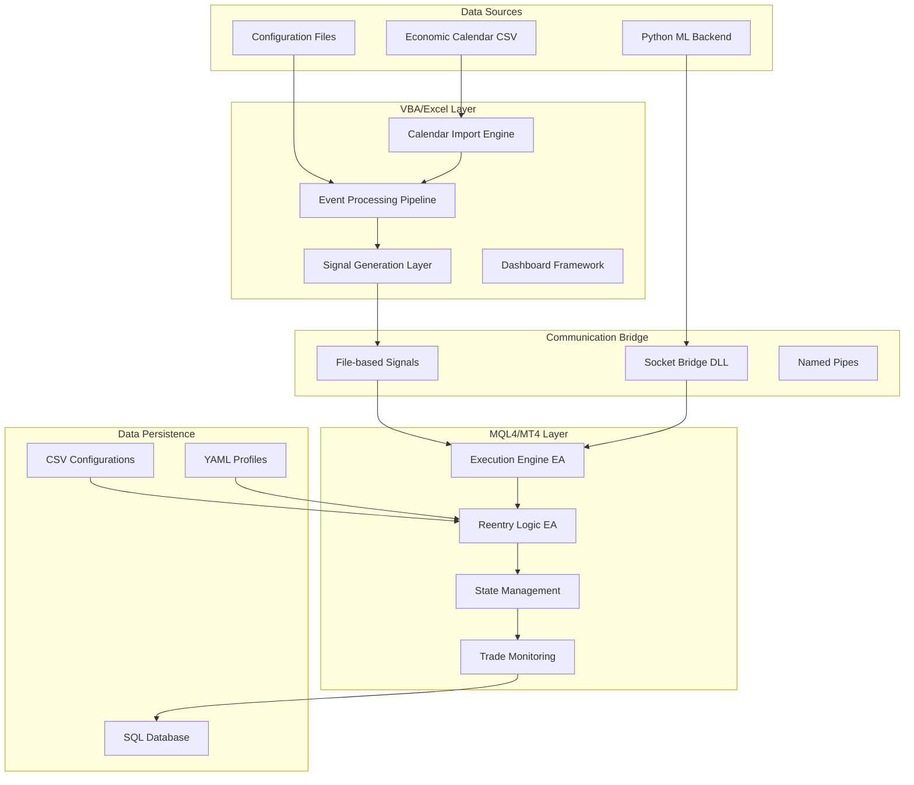
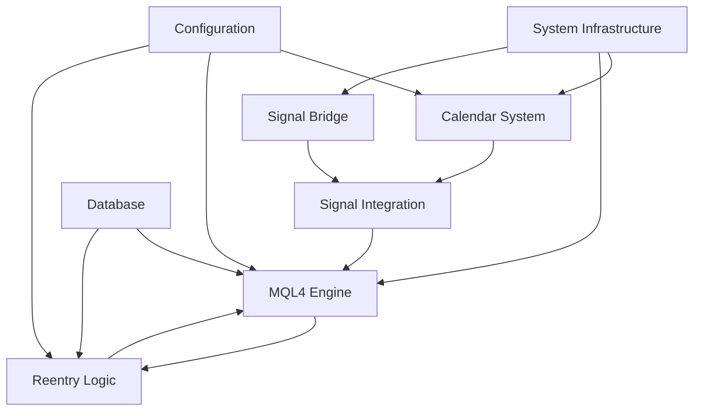
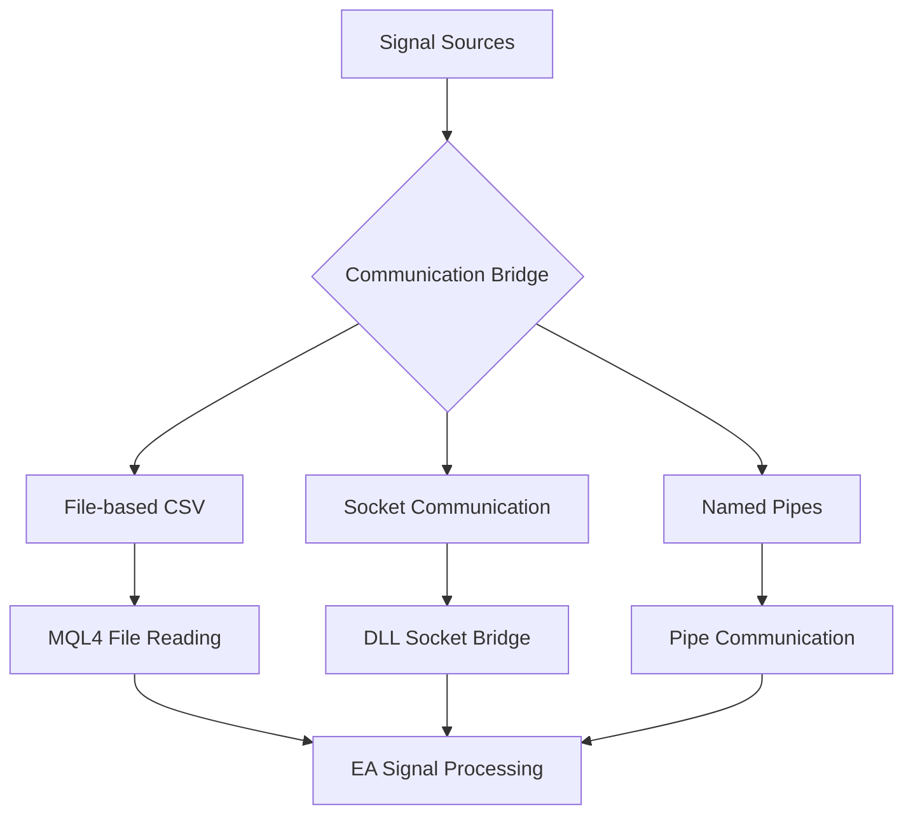
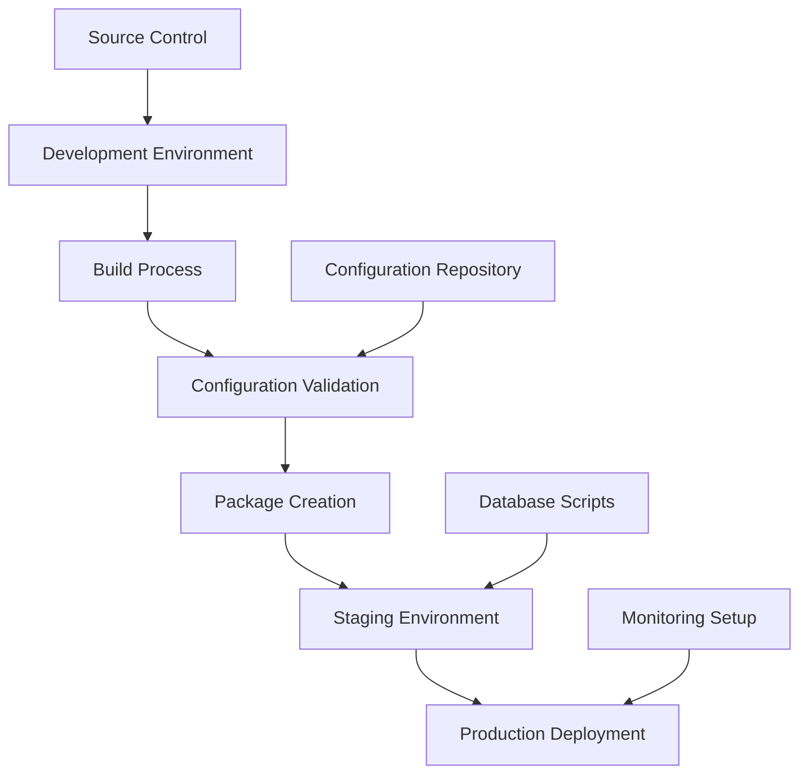

# HUEY_P_ClaudeCentric Trading System
## Technical Manual v1.0
### Authoritative Developer Documentation

---

## Table of Contents

1. [System Overview & Architecture](#1-system-overview--architecture)
2. [Core Components](#2-core-components)
3. [MQL4 Execution Engine](#3-mql4-execution-engine)
4. [Reentry Logic System](#4-reentry-logic-system)
5. [Economic Calendar System](#5-economic-calendar-system)
6. [Signal Processing & Communication](#6-signal-processing--communication)
7. [Configuration Management](#7-configuration-management)
8. [Database Schema & Analytics](#8-database-schema--analytics)
9. [Development Patterns & Standards](#9-development-patterns--standards)
10. [Deployment & Operations](#10-deployment--operations)
11. [Troubleshooting & Maintenance](#11-troubleshooting--maintenance)
12. [Appendices](#12-appendices)

---

## 1. System Overview & Architecture

### 1.1 System Philosophy

The **HUEY_P_ClaudeCentric Trading System** is a sophisticated, multi-component hybrid trading system designed for automated execution on MetaTrader 4 (MT4). Its core philosophy fuses two distinct but complementary strategies:

1. **Proactive Event-Based Trading**: Automated system that analyzes economic calendar data to generate anticipatory trading signals
2. **Reactive Outcome-Based Reentry**: Dynamic trade management that analyzes trade outcomes and determines strategic reentry actions

This hybrid approach provides strategic advantage by not just trading the news, but learning from market responses to adapt behavior dynamically.

### 1.2 High-Level Architecture



### 1.3 Core Technologies

| Layer | Technology | Purpose |
|-------|------------|---------|
| Data Processing | Excel/VBA | Calendar import, transformation, signal staging |
| Execution Engine | MQL4 | Real-time trade execution, state management |
| Communication | C++ DLL | Low-latency signal transmission |
| Configuration | YAML/CSV | Human-readable parameter management |
| Persistence | SQL | Trade logging, analytics, performance tracking |
| External Integration | Python | ML backends, advanced analytics |

### 1.4 Data Flow Overview

```
Calendar CSV → VBA Processing → Signal Integration → MQL4 Execution → Trade Outcome → Reentry Analysis → New Signal
```

---

## 2. Core Components

### 2.1 Component Architecture

#### **2.1.1 Economic Calendar System**
- **Purpose**: Converts raw economic calendar data into actionable trading signals
- **Components**: Import engine, data processor, anticipation generator, trigger engine
- **Language**: VBA/Excel
- **Dependencies**: None (standalone)

#### **2.1.2 MQL4 Execution Engine**
- **Purpose**: Real-time trade execution with sophisticated risk management
- **Components**: State machine, order management, error handling, dashboard
- **Language**: MQL4
- **Dependencies**: Calendar system signals, configuration files

#### **2.1.3 Reentry Logic System**
- **Purpose**: Adaptive trade management based on outcome analysis
- **Components**: Outcome classifier, action executor, configuration manager
- **Language**: MQL4
- **Dependencies**: Execution engine, CSV configuration profiles

#### **2.1.4 Signal Processing Bridge**
- **Purpose**: Multi-protocol communication between components
- **Components**: File watchers, socket bridges, named pipes
- **Language**: C++/Python
- **Dependencies**: All system components

### 2.2 System Dependencies



---

## 3. MQL4 Execution Engine

### 3.1 Core Architecture

The execution engine operates as a sophisticated state machine with multiple operational modes and comprehensive error handling.

#### **3.1.1 State Machine Design**

```cpp
enum EAState {
    STATE_IDLE,              // Waiting for signals/conditions
    STATE_ORDERS_PLACED,     // Pending straddle orders active
    STATE_TRADE_TRIGGERED,   // Active market position
    STATE_PAUSED             // Trading halted
};

enum ENUM_RECOVERY_STATE {
    RECOVERY_STATE_NORMAL,    // Normal operation
    RECOVERY_STATE_DEGRADED,  // Reduced functionality
    RECOVERY_STATE_EMERGENCY  // Emergency halt
};
```

#### **3.1.2 Core Data Structures**

```cpp
struct StateManager {
    EAState CurrentState;
    int ActiveTradeTicket;
    datetime OrdersPlacedTime;
    double DynamicRiskPercent;
    double DynamicStopLossPips;
    double DynamicTakeProfitPips;
    int ConsecutiveWins;
    int ConsecutiveLosses;
    int TradingCycles;
};

struct SoundManager {
    bool UseSoundAlerts;
    string SoundInitialization;
    string SoundOrderTriggered;
    string SoundTakeProfit;
    string SoundStopLossProfit;
    string SoundStopLossLoss;
    string SoundError;
    string SoundCriticalError;
};
```

### 3.2 Trading Logic Implementation

#### **3.2.1 Straddle Order Placement**

```cpp
void PlaceStraddleOrders() {
    DBG_PRINT(PlaceStraddleOrders, "Attempting to place new straddle.");
    
    double stopLossPoints = g_stateManager.DynamicStopLossPips * Point;
    double lotSize = CalculateLotSize(stopLossPoints);
    
    if(lotSize <= 0) {
        Print("Error: Calculated lot size is zero or negative.");
        return;
    }
    
    double buyDistance = BuyDistancePips * Point;
    double sellDistance = SellDistancePips * Point;
    
    RefreshRates();
    
    double buyStopPrice = Ask + buyDistance;
    double sellStopPrice = Bid - sellDistance;
    
    double buyStopLoss = buyStopPrice - stopLossPoints;
    double buyTakeProfit = buyStopPrice + (g_stateManager.DynamicTakeProfitPips * Point);
    double sellStopLoss = sellStopPrice + stopLossPoints;
    double sellTakeProfit = sellStopPrice - (g_stateManager.DynamicTakeProfitPips * Point);
    
    // Validate stops before placement
    if(!ValidateStopLevels(buyStopPrice, buyStopLoss, buyTakeProfit, OP_BUYSTOP) ||
       !ValidateStopLevels(sellStopPrice, sellStopLoss, sellTakeProfit, OP_SELLSTOP)) {
        return;
    }
    
    // Place buy stop order
    int buyTicket = SafeOrderSend(Symbol(), OP_BUYSTOP, lotSize, buyStopPrice, 
                                  Slippage, buyStopLoss, buyTakeProfit, 
                                  EAIdentifier + " Buy", MagicNumber);
    
    // Place sell stop order
    int sellTicket = SafeOrderSend(Symbol(), OP_SELLSTOP, lotSize, sellStopPrice, 
                                   Slippage, sellStopLoss, sellTakeProfit, 
                                   EAIdentifier + " Sell", MagicNumber);
    
    if(buyTicket > 0 && sellTicket > 0) {
        g_stateManager.CurrentState = STATE_ORDERS_PLACED;
        g_stateManager.OrdersPlacedTime = TimeCurrent();
        g_stateManager.SaveState();
        
        DBG_PRINT(PlaceStraddleOrders, "Straddle placed successfully");
        g_soundManager.PlayTriggerSound();
    }
}
```

#### **3.2.2 Dynamic Lot Sizing**

```cpp
double CalculateLotSize(double stopLossPoints) {
    double riskAmount = AccountEquity() * g_stateManager.DynamicRiskPercent / 100.0;
    double tickValue = MarketInfo(Symbol(), MODE_TICKVALUE);
    double tickSize = MarketInfo(Symbol(), MODE_TICKSIZE);
    double pipValuePerLot = (tickValue / tickSize) * Point;
    double stopLossPips = stopLossPoints / Point;
    
    double calculatedLots = riskAmount / (stopLossPips * pipValuePerLot);
    
    // Apply constraints
    double minLot = MarketInfo(Symbol(), MODE_MINLOT);
    double maxLot = MarketInfo(Symbol(), MODE_MAXLOT);
    double lotStep = MarketInfo(Symbol(), MODE_LOTSTEP);
    
    calculatedLots = MathMax(calculatedLots, minLot);
    calculatedLots = MathMin(calculatedLots, MaxLotSize);
    calculatedLots = MathMin(calculatedLots, maxLot);
    
    // Round to lot step
    calculatedLots = MathFloor(calculatedLots / lotStep) * lotStep;
    
    // Margin safety check
    double requiredMargin = MarketInfo(Symbol(), MODE_MARGINREQUIRED) * calculatedLots;
    double availableMargin = AccountFreeMargin();
    double safeMargin = availableMargin * SafeMarginPercentage / 100.0;
    
    if(requiredMargin > safeMargin) {
        calculatedLots = safeMargin / MarketInfo(Symbol(), MODE_MARGINREQUIRED);
        calculatedLots = MathFloor(calculatedLots / lotStep) * lotStep;
    }
    
    return MathMax(calculatedLots, minLot);
}
```

### 3.3 Signal Processing Integration

#### **3.3.1 External Signal Reception**

```cpp
void ProcessJsonSignal(string json) {
    string p_symbol     = ParseJsonValue(json, "symbol");
    string p_type       = ParseJsonValue(json, "order_type");
    double p_lots       = StrToDouble(ParseJsonValue(json, "lot_size"));
    double p_sl         = StrToDouble(ParseJsonValue(json, "stop_loss"));
    double p_tp         = StrToDouble(ParseJsonValue(json, "take_profit"));
    int    p_magic      = StringToInteger(ParseJsonValue(json, "magic_number"));
    string p_comment    = ParseJsonValue(json, "comment");

    if (p_symbol != Symbol()) {
       Print("Signal ignored. Symbol mismatch: ", p_symbol);
       return;
    }
    
    int cmd = -1;
    if (p_type == "buy") cmd = OP_BUY;
    if (p_type == "sell") cmd = OP_SELL;
    
    if (cmd != -1 && p_lots > 0) {
        if(IsTradingAllowedNow()) {
            RefreshRates();
            SafeOrderSend(p_symbol, cmd, p_lots, 
                         (cmd == OP_BUY ? Ask : Bid), 
                         Slippage, p_sl, p_tp, p_comment, p_magic);
        }
    }
}
```

#### **3.3.2 Multi-Source Signal Handling**

The system supports six signal input modes:

1. **Manual Input**: Direct user-triggered signals
2. **Indicator-Based**: Signals from internal indicators
3. **External Feed**: API-based or online signals
4. **Internal Logic**: Built-in EA strategies
5. **CSV Input**: File-based signal reading
6. **Time-Slot Activation**: Scheduled trading windows

```cpp
void ProcessSignalSources() {
    // Manual input processing
    if(ManualInputEnabled) {
        ProcessManualSignals();
    }
    
    // Indicator-based signals
    if(IndicatorBasedEnabled) {
        ProcessIndicatorSignals();
    }
    
    // External feed processing
    if(ExternalFeedEnabled) {
        ProcessExternalSignals();
    }
    
    // CSV file monitoring
    if(CsvInputEnabled) {
        ProcessCsvSignals();
    }
    
    // Time-slot activation
    if(TimeSlotActivationEnabled) {
        ProcessTimeSlotSignals();
    }
}
```

### 3.4 Risk Management Systems

#### **3.4.1 Circuit Breaker Implementation**

```cpp
void CheckEmergencyConditions() {
    // Daily drawdown check
    double dailyDrawdown = CalculateDailyDrawdown();
    if(dailyDrawdown >= MaxDailyDrawdownPercent) {
        TriggerEmergencyStop("Daily drawdown limit exceeded");
        return;
    }
    
    // Equity protection
    if(AccountEquity() <= MinEquityStopLevel) {
        TriggerEmergencyStop("Minimum equity level breached");
        return;
    }
    
    // Consecutive error monitoring
    if(g_consecutiveErrors >= 5) {
        g_recoveryState = RECOVERY_STATE_EMERGENCY;
        g_circuitBreakerTrippedTime = TimeCurrent();
        TriggerEmergencyStop("Consecutive error limit exceeded");
    }
}

void TriggerEmergencyStop(string reason) {
    g_stateManager.CurrentState = STATE_PAUSED;
    g_recoveryState = RECOVERY_STATE_EMERGENCY;
    
    CloseAllOpenTrades();
    DeleteAllPendingOrders();
    
    g_soundManager.PlayCriticalErrorSound();
    
    Print("EMERGENCY STOP TRIGGERED: ", reason);
    Alert("EMERGENCY STOP: ", reason);
}
```

---

## 4. Reentry Logic System

### 4.1 Six-Sided Die Framework

The reentry system treats every trade outcome as a roll of a six-sided die, where each outcome triggers a specific pre-configured action.

#### **4.1.1 Outcome Classification Logic**

```cpp
int DetermineNextAction(double R, double ML, double MG, double B) {
    const double TOLERANCE = 0.01;  // Floating point precision tolerance
    
    // Action 1: Trade closed at stop loss
    if (MathAbs(R - ML) < TOLERANCE) {
        return 1;
    }
    // Action 2: Trade closed between stop loss and breakeven
    else if (ML < R && R < B) {
        return 2;
    }
    // Action 3: Trade closed at breakeven
    else if (MathAbs(R - B) < TOLERANCE) {
        return 3;
    }
    // Action 4: Trade closed between breakeven and take profit
    else if (B < R && R < MG) {
        return 4;
    }
    // Action 5: Trade closed at take profit
    else if (MathAbs(R - MG) < TOLERANCE) {
        return 5;
    }
    // Action 6: Trade closed beyond take profit
    else if (R > MG) {
        return 6;
    }
    // Error state
    else {
        return 0;
    }
}
```

Where:
- **R**: Actual trade result (profit/loss in dollars)
- **ML**: Maximum Loss (dollar amount at original stop loss)
- **B**: Breakeven point (typically $0.00)
- **MG**: Maximum Gain (dollar amount at original take profit)

#### **4.1.2 Reentry Action Configuration**

```cpp
struct ReentryAction {
    string action_type;      // NO_REENTRY, SAME_TRADE, INCREASE_SIZE, REDUCE_SIZE, REVERSE, AGGRESSIVE
    double size_multiplier;  // Lot size adjustment multiplier
    int delay_seconds;       // Delay before executing reentry
    double confidence_adj;   // Confidence score adjustment
    string parameters;       // Human-readable description
};
```

### 4.2 Configuration Profiles

#### **4.2.1 Conservative Profile**

```csv
Action,Type,SizeMultiplier,DelaySeconds,ConfidenceAdjustment,Parameters
1,NO_REENTRY,0.0,0,1.0,"Stop loss - wait for better setup"
2,WAIT_SIGNAL,0.0,300,1.0,"Partial loss - wait 5 minutes"
3,REDUCE_SIZE,0.5,60,0.9,"Breakeven - smaller position"
4,SAME_TRADE,0.8,30,1.0,"Partial profit - slightly smaller"
5,SAME_TRADE,1.0,15,1.0,"Take profit - repeat"
6,INCREASE_SIZE,1.2,10,1.1,"Beyond TP - modest increase"
```

#### **4.2.2 Aggressive Profile**

```csv
Action,Type,SizeMultiplier,DelaySeconds,ConfidenceAdjustment,Parameters
1,REVERSE,0.5,60,0.8,"Stop loss - try opposite direction"
2,SAME_TRADE,1.0,15,0.9,"Partial loss - immediate retry"
3,INCREASE_SIZE,1.5,5,1.1,"Breakeven - more aggressive"
4,INCREASE_SIZE,2.0,0,1.2,"Partial profit - double down"
5,INCREASE_SIZE,1.5,0,1.1,"Take profit - ride momentum"
6,AGGRESSIVE,3.0,0,1.5,"Beyond TP - maximum aggression"
```

### 4.3 Implementation Architecture

#### **4.3.1 CReentryLogic Class**

```cpp
class CReentryLogic {
private:
    ReentryAction m_actions[7];  // Actions 1-6 (index 0 unused)
    bool m_enabled;
    string m_pair;
    int m_maxGenerations;
    double m_dailyLossLimit;
    
public:
    bool Initialize(string pair, string config_file);
    int DetermineNextAction(double R, double ML, double MG, double B);
    bool ExecuteReentryAction(int action_number, TradeResult &closed_trade);
    void LoadReentryConfiguration(string config_file);
    void LogReentryDecision(int action, TradeResult &trade, string reason);
    bool IsReentryAllowed(TradeResult &trade);
    void UpdatePerformanceMetrics(int action, double pnl);
};
```

#### **4.3.2 Reentry Execution Logic**

```cpp
bool CReentryLogic::ExecuteReentryAction(int action_number, TradeResult &closed_trade) {
    if(action_number < 1 || action_number > 6) {
        Print("Invalid action number: ", action_number);
        return false;
    }
    
    if(!IsReentryAllowed(closed_trade)) {
        Print("Reentry not allowed due to safety constraints");
        return false;
    }
    
    ReentryAction action = m_actions[action_number];
    
    // Log the reentry decision
    LogReentryDecision(action_number, closed_trade, "Trade outcome triggered reentry");
    
    // Check if reentry should happen
    if(action.action_type == "NO_REENTRY" || action.size_multiplier <= 0) {
        Print("Action ", action_number, ": No reentry configured");
        return true;
    }
    
    // Wait for delay period
    if(action.delay_seconds > 0) {
        Print("Waiting ", action.delay_seconds, " seconds before reentry...");
        Sleep(action.delay_seconds * 1000);
    }
    
    // Calculate new trade parameters
    double new_lot_size = closed_trade.lot_size * action.size_multiplier;
    string new_direction = closed_trade.direction;
    
    // Modify direction based on action type
    if(action.action_type == "REVERSE") {
        new_direction = (closed_trade.direction == "BUY") ? "SELL" : "BUY";
    }
    
    // Apply safety constraints
    if(new_lot_size > MaxPositionSize) {
        new_lot_size = MaxPositionSize;
    }
    
    // Create reentry signal
    SignalData reentry_signal;
    reentry_signal.symbol = closed_trade.symbol;
    reentry_signal.direction = new_direction;
    reentry_signal.lot_size = new_lot_size;
    reentry_signal.confidence = closed_trade.confidence * action.confidence_adj;
    reentry_signal.signal_type = "REENTRY";
    reentry_signal.source_trade_id = closed_trade.trade_id;
    reentry_signal.reentry_action = action_number;
    
    // Execute the reentry trade
    TradeResult reentry_result = g_core.ExecuteTrade(reentry_signal, 
                                                     MagicNumber + 1000); // Different magic for reentries
    
    if(reentry_result.success) {
        Print("Reentry Action ", action_number, " executed successfully. New trade ID: ", 
              reentry_result.trade_id);
        
        // Log to database for tracking
        LogReentryExecution(closed_trade.trade_id, reentry_result.trade_id, action_number);
        
        // Update performance metrics
        UpdatePerformanceMetrics(action_number, reentry_result.expected_pnl);
        
        return true;
    } else {
        Print("Reentry Action ", action_number, " failed: ", reentry_result.error_message);
        return false;
    }
}
```

### 4.4 Safety Mechanisms

#### **4.4.1 Reentry Safety Constraints**

```cpp
bool CReentryLogic::IsReentryAllowed(TradeResult &trade) {
    // Check maximum generations
    if(trade.reentry_generation >= m_maxGenerations) {
        Print("Reentry blocked: Maximum generation limit reached");
        return false;
    }
    
    // Check daily loss limit
    double dailyLoss = CalculateDailyReentryLoss();
    if(dailyLoss >= m_dailyLossLimit) {
        Print("Reentry blocked: Daily loss limit exceeded");
        return false;
    }
    
    // Check consecutive losses
    int consecutiveLosses = GetConsecutiveReentryLosses();
    if(consecutiveLosses >= MaxConsecutiveLosses) {
        Print("Reentry blocked: Too many consecutive losses");
        return false;
    }
    
    // Check minimum confidence threshold
    if(trade.confidence < MinConfidenceThreshold) {
        Print("Reentry blocked: Confidence below threshold");
        return false;
    }
    
    return true;
}
```

---

## 5. Economic Calendar System

### 5.1 System Architecture

The Economic Calendar System is a sophisticated VBA-based data processing pipeline that converts raw economic calendar data into actionable trading signals.

#### **5.1.1 Module Architecture**

```
system_infrastructure.bas          [CRITICAL] → Core timers, file access, MT4 validation
├── data_store_manager.bas         [HIGH]     → Centralized data repository
├── error_handling_system.bas      [CRITICAL] → Error management and logging
├── dashboard_framework.bas        [HIGH]     → Base dashboard functionality
├── calendar_import_engine.bas     [HIGH]     → File detection and CSV parsing
├── calendar_data_processor.bas    [HIGH]     → Data transformation pipeline
├── parameter_set_manager.bas      [MEDIUM]   → 4-parameter set management
├── event_trigger_engine.bas       [HIGH]     → Real-time event monitoring
├── anticipation_generator.bas     [MEDIUM]   → Anticipation event creation
└── calendar_validation.bas        [MEDIUM]   → Data quality assurance
```

### 5.2 Calendar Import Engine

#### **5.2.1 Automated Import Logic**

```vba
Public Function ExecuteCalendarImport(manualTrigger As Boolean) As Boolean
    On Error GoTo ErrorHandler
    
    Dim startTime As Date
    startTime = Now
    
    LogInfo "ExecuteCalendarImport", "Starting calendar import", IIf(manualTrigger, "MANUAL", "AUTOMATIC")
    
    ' Find best calendar file
    Dim filePath As String
    filePath = FindBestCalendarFile()
    
    If filePath = "" Then
        HandleImportFailure "No valid calendar file found", manualTrigger
        Exit Function
    End If
    
    ' Validate file before processing
    If Not ValidateCalendarFile(filePath) Then
        HandleImportFailure "File validation failed", manualTrigger
        Exit Function
    End If
    
    ' Parse CSV data
    Dim rawData As Variant
    rawData = ParseCalendarCSV(filePath)
    
    If IsEmpty(rawData) Then
        HandleImportFailure "CSV parsing failed", manualTrigger
        Exit Function
    End If
    
    ' Process and enhance data
    Dim processedData As Variant
    processedData = ProcessCalendarData(rawData, filePath)
    
    ' Update data store
    Call UpdateCalendarData(processedData)
    
    ' Archive source file
    Call ArchiveCalendarFile(filePath)
    
    ' Success handling
    Call HandleImportSuccess(filePath, startTime, manualTrigger)
    
    ExecuteCalendarImport = True
    Exit Function
    
ErrorHandler:
    LogVBAError "ExecuteCalendarImport", Err.Number, Err.Description
    HandleImportFailure Err.Description, manualTrigger
    ExecuteCalendarImport = False
End Function
```

#### **5.2.2 File Detection Pattern**

```vba
Private Function FindBestCalendarFile() As String
    Dim searchPatterns As Variant
    searchPatterns = Array( _
        "ff_calendar*.csv", _
        "*calendar*thisweek*.csv", _
        "*economic*calendar*.csv", _
        "*calendar*.csv", _
        "*forex*.csv" _
    )
    
    Dim downloadsPath As String
    downloadsPath = GetDownloadsPath()
    
    Dim i As Integer
    For i = 0 To UBound(searchPatterns)
        Dim files As Variant
        files = FindFilesByPattern(downloadsPath, searchPatterns(i))
        
        If Not IsEmpty(files) Then
            ' Return most recent valid file
            FindBestCalendarFile = SelectMostRecentFile(files)
            Exit Function
        End If
    Next i
    
    FindBestCalendarFile = ""
End Function
```

### 5.3 Data Processing Pipeline

#### **5.3.1 Event Transformation**

```vba
Public Function ProcessCalendarData(rawData As Variant, sourceFile As String) As Variant
    On Error GoTo ErrorHandler
    
    LogInfo "ProcessCalendarData", "Starting data processing", "File: " & sourceFile
    
    ' Initialize processing statistics
    Call InitializeProcessingStatistics()
    
    ' Transform raw data to structured events
    Dim structuredEvents As Variant
    structuredEvents = TransformRawData(rawData)
    
    ' Validate and filter events
    Dim validatedEvents As Variant
    validatedEvents = ValidateAndFilterEvents(structuredEvents)
    
    ' Generate anticipation events
    If GetAnticipationEnabled() Then
        Dim enhancedEvents As Variant
        enhancedEvents = GenerateAnticipationEvents(validatedEvents)
        validatedEvents = enhancedEvents
    End If
    
    ' Add equity market events
    Call AddEquityMarketEvents(validatedEvents)
    
    ' Final processing and sorting
    Dim finalEvents As Variant
    finalEvents = ApplyFinalProcessing(validatedEvents)
    
    ' Calculate processing statistics
    Call CalculateFinalStatistics()
    
    ProcessCalendarData = finalEvents
    Exit Function
    
ErrorHandler:
    LogVBAError "ProcessCalendarData", Err.Number, Err.Description
    ProcessCalendarData = Empty
End Function
```

#### **5.3.2 Time Zone Conversion**

```vba
Private Function ConvertToCST(eventDate As Date, eventTime As Date) As Date
    Dim combinedDateTime As Date
    combinedDateTime = eventDate + TimeValue(eventTime)
    
    ' Check if date falls within DST period
    If IsDateInDST(eventDate) Then
        ' Adjust for Daylight Saving Time
        combinedDateTime = combinedDateTime - TimeSerial(1, 0, 0)
    End If
    
    ConvertToCST = combinedDateTime
End Function

Private Function IsDateInDST(checkDate As Date) As Boolean
    Dim year As Integer
    year = year(checkDate)
    
    ' Calculate DST start (2nd Sunday in March)
    Dim dstStart As Date
    dstStart = GetNthSundayOfMonth(year, 3, 2)
    
    ' Calculate DST end (1st Sunday in November)
    Dim dstEnd As Date
    dstEnd = GetNthSundayOfMonth(year, 11, 1)
    
    IsDateInDST = (checkDate >= dstStart And checkDate < dstEnd)
End Function
```

### 5.4 Anticipation Event Generation

#### **5.4.1 Anticipation Logic**

```vba
Public Function GenerateAnticipationEvents(originalEvents As Variant) As Variant
    On Error GoTo ErrorHandler
    
    Dim anticipationHours As Variant
    anticipationHours = GetAnticipationHours()  ' Default: [1, 2, 4]
    
    Dim allEvents As Object
    Set allEvents = CreateObject("System.Collections.ArrayList")
    
    ' Add original events
    Dim i As Long, j As Integer
    For i = 1 To UBound(originalEvents, 1)
        allEvents.Add originalEvents(i, 0) ' Add entire row
    Next i
    
    ' Generate anticipation events
    For i = 1 To UBound(originalEvents, 1)
        Dim originalEvent As Variant
        originalEvent = Application.Index(originalEvents, i, 0)
        
        ' Only create anticipation for high/medium impact events
        If originalEvent(4) = "High" Or originalEvent(4) = "Medium" Then
            For j = 0 To UBound(anticipationHours)
                Dim anticipationEvent As Variant
                anticipationEvent = CreateAnticipationEvent(originalEvent, anticipationHours(j))
                allEvents.Add anticipationEvent
            Next j
        End If
    Next i
    
    ' Convert back to array and sort chronologically
    GenerateAnticipationEvents = SortEventsChronologically(allEvents.ToArray())
    
    Exit Function
    
ErrorHandler:
    LogVBAError "GenerateAnticipationEvents", Err.Number, Err.Description
    GenerateAnticipationEvents = originalEvents
End Function

Private Function CreateAnticipationEvent(originalEvent As Variant, hoursOffset As Integer) As Variant
    Dim anticipationEvent(12) As Variant
    
    ' Calculate anticipation time
    Dim originalDateTime As Date
    originalDateTime = originalEvent(8) ' Combined DateTime field
    Dim anticipationDateTime As Date
    anticipationDateTime = originalDateTime - TimeSerial(hoursOffset, 0, 0)
    
    ' Format anticipation event
    anticipationEvent(0) = "#{hoursOffset}H Before " & originalEvent(0) & " Anticipation - " & originalEvent(1) & " - " & originalEvent(4)
    anticipationEvent(1) = originalEvent(1)  ' Country (currency)
    anticipationEvent(2) = Int(anticipationDateTime)  ' Date
    anticipationEvent(3) = anticipationDateTime - Int(anticipationDateTime)  ' Time
    anticipationEvent(4) = originalEvent(4)  ' Impact (inherited)
    anticipationEvent(5) = ""  ' Forecast (empty for anticipation)
    anticipationEvent(6) = ""  ' Previous (empty for anticipation)
    anticipationEvent(7) = ""  ' URL (empty for anticipation)
    anticipationEvent(8) = anticipationDateTime  ' Combined DateTime
    anticipationEvent(9) = "ANTICIPATION"  ' ImpactCode
    anticipationEvent(10) = 85  ' QualityScore (fixed for anticipation)
    anticipationEvent(11) = "ANTICIPATION"  ' EventType
    anticipationEvent(12) = "Generated from: " & originalEvent(0)  ' ProcessingNotes
    
    CreateAnticipationEvent = anticipationEvent
End Function
```

### 5.5 Real-Time Event Monitoring

#### **5.5.1 Trigger Engine Implementation**

```vba
Public Sub MonitorActiveEvents()
    On Error GoTo ErrorHandler
    
    Static lastCheck As Date
    Dim currentTime As Date
    currentTime = Now
    
    ' Skip if called too frequently
    If DateDiff("s", lastCheck, currentTime) < 10 Then Exit Sub
    lastCheck = currentTime
    
    Dim activeEvents As Variant
    activeEvents = GetActiveEvents()
    
    If IsEmpty(activeEvents) Then Exit Sub
    
    Dim i As Long
    For i = 1 To UBound(activeEvents, 1)
        Dim eventData As Variant
        eventData = Application.Index(activeEvents, i, 0)
        
        If IsEventReadyToTrigger(eventData) Then
            Call ProcessEventTrigger(eventData)
        End If
    Next i
    
    Exit Sub
    
ErrorHandler:
    LogVBAError "MonitorActiveEvents", Err.Number, Err.Description
End Sub

Private Function IsEventReadyToTrigger(eventData As Variant) As Boolean
    Dim eventDateTime As Date
    eventDateTime = eventData(8)  ' Combined DateTime
    
    Dim triggerOffset As Integer
    triggerOffset = GetTriggerOffset(eventData(9))  ' Based on ImpactCode
    
    Dim triggerTime As Date
    triggerTime = eventDateTime - TimeSerial(0, Abs(triggerOffset), 0)
    
    Dim currentTime As Date
    currentTime = Now
    
    ' Check if within trigger window (±30 seconds)
    Dim timeDiff As Long
    timeDiff = DateDiff("s", triggerTime, currentTime)
    
    IsEventReadyToTrigger = (Abs(timeDiff) <= 30)
End Function
```

### 5.6 Signal Integration

#### **5.6.1 Signal Generation**

```vba
Private Sub ProcessEventTrigger(eventData As Variant)
    On Error GoTo ErrorHandler
    
    LogInfo "ProcessEventTrigger", "Processing event trigger", eventData(0)
    
    ' Select parameter set
    Dim parameterSet As Integer
    parameterSet = GetNextParameterSetID()
    
    ' Generate signal data
    Dim signalData As Object
    Set signalData = CreateObject("Scripting.Dictionary")
    
    With signalData
        .Item("symbol") = DetermineCurrencyPair(eventData)
        .Item("buy_distance") = GetParameterValue(parameterSet, "buy_distance")
        .Item("sell_distance") = GetParameterValue(parameterSet, "sell_distance")
        .Item("stop_loss") = GetParameterValue(parameterSet, "stop_loss")
        .Item("take_profit") = GetParameterValue(parameterSet, "take_profit")
        .Item("lot_size") = GetParameterValue(parameterSet, "lot_size")
        .Item("expire_hours") = GetParameterValue(parameterSet, "expire_hours")
        .Item("trailing_stop") = GetParameterValue(parameterSet, "trailing_stop")
        .Item("comment") = "Calendar: " & Left(eventData(0), 20)
        .Item("strategy_id") = 301  ' Calendar-based strategy
        .Item("pset_id") = parameterSet
        .Item("event_type") = eventData(9)
        .Item("trigger_time") = Now
    End With
    
    ' Send to signal entry system
    Call SendSignalToSignalEntry(signalData)
    
    ' Update event status
    Call UpdateEventStatus(eventData, "TRIGGERED")
    
    LogInfo "ProcessEventTrigger", "Signal generated successfully", signalData("symbol")
    
    Exit Sub
    
ErrorHandler:
    LogVBAError "ProcessEventTrigger", Err.Number, Err.Description
End Sub
```

---

## 6. Signal Processing & Communication

### 6.1 Multi-Protocol Communication

The system supports multiple communication protocols for maximum flexibility and reliability.

#### **6.1.1 Communication Channels**



#### **6.1.2 File-Based Signal Protocol**

```cpp
// Signal CSV Format
// symbol,buy_distance,sell_distance,stop_loss,take_profit,lot_size,expire_hours,trailing_stop,comment,strategy_id,pset_id
string ReadSignalFile() {
    string signal_file_path = SignalPath + TradingPair + "_signals.csv";
    
    int file_handle = FileOpen(signal_file_path, FILE_READ|FILE_CSV, ";");
    
    if(file_handle < 0) {
        int error_code = GetLastError();
        Print("ERROR: Cannot open signal file: ", signal_file_path, " Error: ", error_code);
        return("");
    }
    
    string signal_data = "";
    
    // Read header line for validation
    if(!FileIsEnding(file_handle)) {
        string header_line = FileReadString(file_handle);
        
        if(StringFind(header_line, "symbol") == -1) {
            Print("ERROR: Invalid signal file header format");
            FileClose(file_handle);
            return("");
        }
    } else {
        Print("ERROR: Signal file is empty");
        FileClose(file_handle);
        return("");
    }
    
    // Read data line
    if(!FileIsEnding(file_handle)) {
        signal_data = FileReadString(file_handle);
    }
    
    FileClose(file_handle);
    
    return(signal_data);
}
```

#### **6.1.3 Socket Communication Bridge**

```cpp
// DLL Bridge Implementation
#import "MQL4SocketBridge.dll"
   int  StartServer(int port, int hWnd, int messageId);
   void StopServer();
   int  GetLastMessage(char &buffer[], int maxSize);
#import

// Socket message processing
void OnChartEvent(const int id, const long &lparam, const double &dparam, const string &sparam) {
   if (id == CHARTEVENT_CUSTOM+1) {
      char buffer[4096];
      if (GetLastMessage(buffer, ArraySize(buffer)) > 0) {
         string msg = CharArrayToString(buffer, 0, StringLen(CharArrayToString(buffer)));
         DBG_PRINT(OnChartEvent, "Received signal: " + msg);
         ProcessJsonSignal(msg);
      }
   }
}
```

### 6.2 Signal Validation & Processing

#### **6.2.1 Signal Validation Framework**

```cpp
bool ValidateSignal(const SignalData &signal) {
    // Symbol validation
    if(signal.symbol != Symbol()) {
        Print("Signal validation failed: Symbol mismatch");
        return false;
    }
    
    // Lot size validation
    double minLot = MarketInfo(Symbol(), MODE_MINLOT);
    double maxLot = MarketInfo(Symbol(), MODE_MAXLOT);
    
    if(signal.lot_size < minLot || signal.lot_size > maxLot) {
        Print("Signal validation failed: Invalid lot size");
        return false;
    }
    
    // Stop levels validation
    double minStopLevel = MarketInfo(Symbol(), MODE_STOPLEVEL) * Point;
    
    if(signal.stop_loss > 0 && signal.stop_loss < minStopLevel) {
        Print("Signal validation failed: Stop loss too close");
        return false;
    }
    
    if(signal.take_profit > 0 && signal.take_profit < minStopLevel) {
        Print("Signal validation failed: Take profit too close");
        return false;
    }
    
    // Market hours validation
    if(!IsMarketOpen()) {
        Print("Signal validation failed: Market closed");
        return false;
    }
    
    // Risk validation
    if(!ValidateRiskLimits(signal)) {
        Print("Signal validation failed: Risk limits exceeded");
        return false;
    }
    
    return true;
}
```

#### **6.2.2 Signal Queue Management**

```cpp
class CSignalQueue {
private:
    struct QueuedSignal {
        SignalData signal;
        datetime received_time;
        int retry_count;
        string source;
    };
    
    QueuedSignal m_queue[100];
    int m_queue_size;
    int m_max_queue_size;
    
public:
    bool AddSignal(const SignalData &signal, string source);
    bool ProcessNextSignal();
    void ClearExpiredSignals();
    int GetQueueSize() { return m_queue_size; }
    void FlushQueue();
};

bool CSignalQueue::AddSignal(const SignalData &signal, string source) {
    if(m_queue_size >= m_max_queue_size) {
        Print("Signal queue full, dropping oldest signal");
        // Remove oldest signal
        for(int i = 0; i < m_queue_size - 1; i++) {
            m_queue[i] = m_queue[i + 1];
        }
        m_queue_size--;
    }
    
    QueuedSignal queued;
    queued.signal = signal;
    queued.received_time = TimeCurrent();
    queued.retry_count = 0;
    queued.source = source;
    
    m_queue[m_queue_size] = queued;
    m_queue_size++;
    
    Print("Signal queued from ", source, ". Queue size: ", m_queue_size);
    return true;
}
```

---

## 7. Configuration Management

### 7.1 Configuration Architecture

The system uses a hierarchical configuration approach with YAML for high-level settings and CSV for detailed parameters.

#### **7.1.1 Configuration Hierarchy**

```
Configuration Root
├── System Configuration (YAML)
│   ├── Base Settings
│   ├── Risk Parameters
│   ├── Communication Settings
│   └── Safety Limits
├── Trading Profiles (CSV)
│   ├── Conservative Profile
│   ├── Moderate Profile
│   ├── Aggressive Profile
│   └── Custom Profiles
├── Reentry Configuration (CSV)
│   ├── Action Definitions
│   ├── Size Multipliers
│   ├── Delay Settings
│   └── Safety Constraints
└── Symbol-Specific Settings (CSV)
    ├── Spread Filters
    ├── Trading Hours
    ├── News Filters
    └── Risk Adjustments
```

#### **7.1.2 YAML Configuration Structure**

```yaml
# EURUSD.yaml - Master Configuration
trading_system:
  version: "1.0"
  symbol: "EURUSD"
  base_currency: "EUR"
  quote_currency: "USD"
  
execution_engine:
  enabled: true
  mode: "AUTONOMOUS"  # AUTONOMOUS, SIGNAL_CLIENT
  magic_number_base: 12345
  slippage: 3
  max_spread: 3.0
  
risk_management:
  risk_percent: 2.0
  max_lot_size: 1.0
  max_daily_drawdown_percent: 5.0
  min_equity_stop_level: 1000.0
  max_total_lots_open: 5.0
  max_open_trades_total: 10
  safe_margin_percentage: 80.0
  
reentry_system:
  enabled: true
  profile: "moderate"  # conservative, moderate, aggressive, custom
  max_reentry_generations: 3
  min_delay_between_reentries: 10
  max_daily_reentries: 20
  daily_loss_limit: 1000.0
  
  safety:
    max_position_size: 5.0
    min_confidence_threshold: 0.6
    blackout_after_losses: 3
    
calendar_system:
  enabled: true
  import_schedule: "SUNDAY_12PM"
  anticipation_hours: [1, 2, 4]
  trigger_offsets:
    high_impact: -3
    medium_impact: -2
    equity_open: -5
    anticipation: -1
    
communication:
  signal_file_path: "signals/"
  response_file_path: "responses/"
  socket_port: 5555
  socket_enabled: false
  file_monitoring_enabled: true
  
logging:
  level: "INFO"  # DEBUG, INFO, WARNING, ERROR, CRITICAL
  log_trades: true
  log_reentries: true
  log_signals: true
  log_calendar_events: true
```

#### **7.1.3 CSV Profile Management**

```csv
# EURUSD_trading_moderate.csv
Parameter,Value,Description,Category
lot_size,0.02,Base lot size,TRADING
stop_loss,20,Stop loss in pips,TRADING
take_profit,40,Take profit in pips,TRADING
buy_distance,10,Buy stop distance in pips,TRADING
sell_distance,10,Sell stop distance in pips,TRADING
trailing_stop,0,Trailing stop in pips (0=disabled),TRADING
expire_hours,24,Order expiration in hours,TRADING
max_spread,3,Maximum allowed spread in pips,FILTERS
min_equity,1000,Minimum equity to trade,RISK
risk_percent,2.0,Risk percentage per trade,RISK
```

### 7.2 Dynamic Configuration Loading

#### **7.2.1 Configuration Manager Class**

```cpp
class CConfigurationManager {
private:
    string m_config_file;
    string m_profile_name;
    bool m_config_loaded;
    datetime m_last_update;
    
    struct SystemConfig {
        bool enabled;
        string mode;
        int magic_number;
        double risk_percent;
        double max_lot_size;
        double max_spread;
    } m_system_config;
    
    struct TradingProfile {
        double lot_size;
        int stop_loss;
        int take_profit;
        int buy_distance;
        int sell_distance;
        int trailing_stop;
        int expire_hours;
    } m_trading_profile;
    
public:
    bool LoadConfiguration(string config_file);
    bool LoadTradingProfile(string profile_name);
    bool ReloadIfChanged();
    
    // Getters
    SystemConfig GetSystemConfig() { return m_system_config; }
    TradingProfile GetTradingProfile() { return m_trading_profile; }
    
    // Configuration validation
    bool ValidateConfiguration();
    string GetConfigurationHash();
};
```

#### **7.2.2 Hot Configuration Reloading**

```cpp
bool CConfigurationManager::ReloadIfChanged() {
    string config_path = "config/" + m_config_file;
    datetime file_time = FileGetTimestamp(config_path);
    
    if(file_time > m_last_update) {
        Print("Configuration file changed, reloading...");
        
        if(LoadConfiguration(m_config_file)) {
            m_last_update = file_time;
            Print("Configuration reloaded successfully");
            return true;
        } else {
            Print("Failed to reload configuration, keeping current settings");
            return false;
        }
    }
    
    return false; // No change
}
```

### 7.3 Profile Deployment System

#### **7.3.1 PowerShell Deployment Script**

```powershell
# Deploy_Reentry_Profiles.ps1
function Deploy-ReentryProfiles {
    param(
        [Parameter(Mandatory=$true)]
        [string]$PairSymbol,
        
        [Parameter(Mandatory=$false)]
        [ValidateSet("conservative", "moderate", "aggressive", "custom")]
        [string]$Profile = "moderate",
        
        [Parameter(Mandatory=$false)]
        [string]$ConfigPath = ".\config\reentry_profiles",
        
        [Parameter(Mandatory=$false)]
        [string]$TargetPath = ".\MT4\Files\config"
    )
    
    $profileFiles = @{
        "conservative" = "$PairSymbol" + "_reentry_conservative.csv"
        "moderate" = "$PairSymbol" + "_reentry_moderate.csv"
        "aggressive" = "$PairSymbol" + "_reentry_aggressive.csv"
        "custom" = "$PairSymbol" + "_reentry_custom.csv"
    }
    
    if (-not $profileFiles.ContainsKey($Profile)) {
        Write-Error "Unknown reentry profile: $Profile"
        return $false
    }
    
    $sourceFile = Join-Path $ConfigPath $profileFiles[$Profile]
    $targetFile = Join-Path $TargetPath "$PairSymbol" + "_reentry.csv"
    
    if (-not (Test-Path $sourceFile)) {
        Write-Error "Source profile file not found: $sourceFile"
        return $false
    }
    
    try {
        Copy-Item $sourceFile $targetFile -Force
        Write-Host "✓ Deployed $Profile reentry profile for $PairSymbol" -ForegroundColor Green
        
        # Validate deployed file
        if (Test-Path $targetFile) {
            $fileSize = (Get-Item $targetFile).Length
            Write-Host "  File size: $fileSize bytes" -ForegroundColor Gray
            return $true
        } else {
            Write-Error "Failed to create target file: $targetFile"
            return $false
        }
    }
    catch {
        Write-Error "Failed to deploy profile: $($_.Exception.Message)"
        return $false
    }
}

# Deploy all profiles for multiple pairs
function Deploy-AllProfiles {
    param(
        [string[]]$Pairs = @("EURUSD", "GBPUSD", "USDJPY", "USDCHF"),
        [string]$Profile = "moderate"
    )
    
    foreach ($pair in $Pairs) {
        Deploy-ReentryProfiles -PairSymbol $pair -Profile $Profile
    }
}

# Example usage
Deploy-ReentryProfiles -PairSymbol "EURUSD" -Profile "aggressive"
Deploy-AllProfiles -Profile "conservative"
```

---

## 8. Database Schema & Analytics

### 8.1 Database Architecture

The system uses a comprehensive SQL database schema to track all trading activities, reentry chains, and performance metrics.

#### **8.1.1 Core Tables Schema**

```sql
-- Main trades table (enhanced for reentry tracking)
CREATE TABLE IF NOT EXISTS trades_EURUSD (
    id INTEGER PRIMARY KEY AUTOINCREMENT,
    trade_id TEXT NOT NULL UNIQUE,
    symbol TEXT NOT NULL,
    direction TEXT NOT NULL, -- BUY, SELL
    lot_size REAL NOT NULL,
    open_price REAL NOT NULL,
    close_price REAL,
    stop_loss REAL,
    take_profit REAL,
    open_time DATETIME NOT NULL,
    close_time DATETIME,
    profit_loss REAL,
    swap REAL DEFAULT 0.0,
    commission REAL DEFAULT 0.0,
    net_profit REAL,
    
    -- Reentry tracking fields
    is_reentry BOOLEAN DEFAULT FALSE,
    source_trade_id TEXT,
    reentry_action INTEGER, -- 1-6 corresponding to die roll
    reentry_generation INTEGER DEFAULT 0,
    
    -- Signal tracking
    signal_source TEXT, -- CALENDAR, MANUAL, INDICATOR, EXTERNAL
    strategy_id INTEGER,
    parameter_set_id INTEGER,
    confidence_score REAL,
    
    -- Metadata
    ea_version TEXT,
    created_at DATETIME DEFAULT CURRENT_TIMESTAMP,
    updated_at DATETIME DEFAULT CURRENT_TIMESTAMP,
    
    FOREIGN KEY (source_trade_id) REFERENCES trades_EURUSD(trade_id)
);

-- Reentry chains tracking
CREATE TABLE IF NOT EXISTS reentry_chains_EURUSD (
    id INTEGER PRIMARY KEY AUTOINCREMENT,
    chain_id TEXT NOT NULL UNIQUE,
    original_trade_id TEXT NOT NULL,
    chain_trades TEXT, -- JSON array of trade IDs in sequence
    total_pnl REAL DEFAULT 0.0,
    chain_status TEXT, -- ACTIVE, COMPLETED, STOPPED
    max_generation INTEGER DEFAULT 0,
    stop_reason TEXT, -- MAX_GENERATIONS, DAILY_LIMIT, USER_STOP, etc.
    created_at DATETIME DEFAULT CURRENT_TIMESTAMP,
    updated_at DATETIME DEFAULT CURRENT_TIMESTAMP,
    
    FOREIGN KEY (original_trade_id) REFERENCES trades_EURUSD(trade_id)
);

-- Reentry performance analytics
CREATE TABLE IF NOT EXISTS reentry_performance_EURUSD (
    id INTEGER PRIMARY KEY AUTOINCREMENT,
    action_number INTEGER NOT NULL, -- 1-6
    action_type TEXT NOT NULL, -- NO_REENTRY, SAME_TRADE, etc.
    total_executions INTEGER DEFAULT 0,
    successful_executions INTEGER DEFAULT 0,
    total_pnl REAL DEFAULT 0.0,
    avg_pnl REAL DEFAULT 0.0,
    max_pnl REAL DEFAULT 0.0,
    min_pnl REAL DEFAULT 0.0,
    success_rate REAL DEFAULT 0.0,
    avg_holding_time_minutes INTEGER DEFAULT 0,
    last_execution DATETIME,
    created_at DATETIME DEFAULT CURRENT_TIMESTAMP,
    updated_at DATETIME DEFAULT CURRENT_TIMESTAMP,
    
    UNIQUE(action_number)
);

-- Calendar events tracking
CREATE TABLE IF NOT EXISTS calendar_events_EURUSD (
    id INTEGER PRIMARY KEY AUTOINCREMENT,
    event_id TEXT NOT NULL UNIQUE,
    event_title TEXT NOT NULL,
    event_date DATE NOT NULL,
    event_time TIME NOT NULL,
    currency TEXT NOT NULL,
    impact TEXT NOT NULL, -- HIGH, MEDIUM, LOW
    event_type TEXT NOT NULL, -- ECONOMIC, ANTICIPATION, EQUITY
    forecast TEXT,
    previous TEXT,
    actual TEXT,
    
    -- Signal generation tracking
    signal_generated BOOLEAN DEFAULT FALSE,
    signal_time DATETIME,
    parameter_set_used INTEGER,
    trades_generated INTEGER DEFAULT 0,
    
    -- Processing metadata
    source_file TEXT,
    quality_score INTEGER,
    created_at DATETIME DEFAULT CURRENT_TIMESTAMP
);

-- System performance metrics
CREATE TABLE IF NOT EXISTS system_metrics_EURUSD (
    id INTEGER PRIMARY KEY AUTOINCREMENT,
    metric_date DATE NOT NULL,
    metric_type TEXT NOT NULL, -- DAILY, WEEKLY, MONTHLY
    
    -- Trading metrics
    total_trades INTEGER DEFAULT 0,
    winning_trades INTEGER DEFAULT 0,
    losing_trades INTEGER DEFAULT 0,
    win_rate REAL DEFAULT 0.0,
    total_pnl REAL DEFAULT 0.0,
    max_drawdown REAL DEFAULT 0.0,
    profit_factor REAL DEFAULT 0.0,
    
    -- Reentry metrics
    total_reentries INTEGER DEFAULT 0,
    successful_reentries INTEGER DEFAULT 0,
    reentry_success_rate REAL DEFAULT 0.0,
    reentry_contribution REAL DEFAULT 0.0,
    
    -- Calendar metrics
    calendar_signals INTEGER DEFAULT 0,
    calendar_trades INTEGER DEFAULT 0,
    calendar_success_rate REAL DEFAULT 0.0,
    
    created_at DATETIME DEFAULT CURRENT_TIMESTAMP,
    
    UNIQUE(metric_date, metric_type)
);
```

### 8.2 Analytics & Reporting

#### **8.2.1 Performance Analysis Queries**

```sql
-- Reentry Action Performance Analysis
SELECT 
    action_number,
    action_type,
    total_executions,
    success_rate * 100 as success_rate_percent,
    avg_pnl,
    total_pnl,
    avg_holding_time_minutes / 60.0 as avg_holding_time_hours
FROM reentry_performance_EURUSD
ORDER BY total_pnl DESC;

-- Chain Performance Analysis
WITH chain_analysis AS (
    SELECT 
        c.chain_id,
        c.original_trade_id,
        c.total_pnl,
        c.max_generation,
        c.chain_status,
        t.direction as original_direction,
        t.signal_source,
        JSON_ARRAY_LENGTH(c.chain_trades) as chain_length
    FROM reentry_chains_EURUSD c
    JOIN trades_EURUSD t ON c.original_trade_id = t.trade_id
)
SELECT 
    max_generation,
    COUNT(*) as chain_count,
    AVG(total_pnl) as avg_chain_pnl,
    SUM(total_pnl) as total_chain_pnl,
    AVG(chain_length) as avg_chain_length,
    COUNT(CASE WHEN total_pnl > 0 THEN 1 END) * 100.0 / COUNT(*) as profitable_chains_percent
FROM chain_analysis
GROUP BY max_generation
ORDER BY max_generation;

-- Calendar Event Effectiveness
SELECT 
    ce.impact,
    ce.event_type,
    COUNT(*) as total_events,
    SUM(CASE WHEN ce.signal_generated THEN 1 ELSE 0 END) as signals_generated,
    SUM(ce.trades_generated) as total_trades,
    AVG(t.net_profit) as avg_trade_profit
FROM calendar_events_EURUSD ce
LEFT JOIN trades_EURUSD t ON t.signal_source = 'CALENDAR' 
    AND DATE(t.open_time) = ce.event_date
WHERE ce.event_date >= DATE('now', '-30 days')
GROUP BY ce.impact, ce.event_type
ORDER BY avg_trade_profit DESC;
```

#### **8.2.2 Real-Time Dashboard Queries**

```sql
-- Today's Performance Summary
SELECT 
    COUNT(*) as trades_today,
    COUNT(CASE WHEN net_profit > 0 THEN 1 END) as winning_trades,
    COUNT(CASE WHEN net_profit < 0 THEN 1 END) as losing_trades,
    ROUND(COUNT(CASE WHEN net_profit > 0 THEN 1 END) * 100.0 / COUNT(*), 2) as win_rate_percent,
    ROUND(SUM(net_profit), 2) as total_pnl_today,
    ROUND(AVG(net_profit), 2) as avg_pnl_per_trade,
    COUNT(CASE WHEN is_reentry = 1 THEN 1 END) as reentry_trades
FROM trades_EURUSD
WHERE DATE(open_time) = DATE('now');

-- Active Reentry Chains
SELECT 
    c.chain_id,
    c.original_trade_id,
    c.max_generation,
    c.total_pnl,
    JSON_ARRAY_LENGTH(c.chain_trades) as current_length,
    t.direction as original_direction,
    t.open_time as chain_start_time
FROM reentry_chains_EURUSD c
JOIN trades_EURUSD t ON c.original_trade_id = t.trade_id
WHERE c.chain_status = 'ACTIVE'
ORDER BY c.created_at DESC;

-- Upcoming Calendar Events
SELECT 
    event_title,
    event_date,
    event_time,
    currency,
    impact,
    event_type,
    CASE 
        WHEN signal_generated THEN 'Signal Generated'
        ELSE 'Pending'
    END as status
FROM calendar_events_EURUSD
WHERE DATETIME(event_date || ' ' || event_time) > DATETIME('now')
    AND DATETIME(event_date || ' ' || event_time) <= DATETIME('now', '+24 hours')
ORDER BY DATETIME(event_date || ' ' || event_time);
```

### 8.3 Data Logging Implementation

#### **8.3.1 Trade Logging Function**

```cpp
void LogTradeToDatabase(int ticket, string action) {
    if(!OrderSelect(ticket, SELECT_BY_TICKET)) {
        Print("Failed to select order for logging: ", ticket);
        return;
    }
    
    string sql = "";
    
    if(action == "OPEN") {
        sql = StringConcatenate(
            "INSERT INTO trades_", Symbol(), " (",
            "trade_id, symbol, direction, lot_size, open_price, stop_loss, take_profit, ",
            "open_time, is_reentry, source_trade_id, reentry_action, reentry_generation, ",
            "signal_source, strategy_id, parameter_set_id, confidence_score, ea_version",
            ") VALUES (",
            "'", IntegerToString(ticket), "', ",
            "'", Symbol(), "', ",
            "'", (OrderType() == OP_BUY ? "BUY" : "SELL"), "', ",
            DoubleToString(OrderLots(), 2), ", ",
            DoubleToString(OrderOpenPrice(), 5), ", ",
            DoubleToString(OrderStopLoss(), 5), ", ",
            DoubleToString(OrderTakeProfit(), 5), ", ",
            "'", TimeToString(OrderOpenTime(), TIME_DATE|TIME_SECONDS), "', ",
            (IsReentryTrade(ticket) ? "1" : "0"), ", ",
            "'", GetSourceTradeId(ticket), "', ",
            IntegerToString(GetReentryAction(ticket)), ", ",
            IntegerToString(GetReentryGeneration(ticket)), ", ",
            "'", GetSignalSource(ticket), "', ",
            IntegerToString(GetStrategyId(ticket)), ", ",
            IntegerToString(GetParameterSetId(ticket)), ", ",
            DoubleToString(GetConfidenceScore(ticket), 2), ", ",
            "'", GetEAVersion(), "'",
            ");"
        );
    }
    else if(action == "CLOSE") {
        double netProfit = OrderProfit() + OrderSwap() + OrderCommission();
        
        sql = StringConcatenate(
            "UPDATE trades_", Symbol(), " SET ",
            "close_price = ", DoubleToString(OrderClosePrice(), 5), ", ",
            "close_time = '", TimeToString(OrderCloseTime(), TIME_DATE|TIME_SECONDS), "', ",
            "profit_loss = ", DoubleToString(OrderProfit(), 2), ", ",
            "swap = ", DoubleToString(OrderSwap(), 2), ", ",
            "commission = ", DoubleToString(OrderCommission(), 2), ", ",
            "net_profit = ", DoubleToString(netProfit, 2), ", ",
            "updated_at = CURRENT_TIMESTAMP ",
            "WHERE trade_id = '", IntegerToString(ticket), "';"
        );
    }
    
    // Execute SQL (implementation depends on database connector)
    if(!ExecuteSQL(sql)) {
        Print("Failed to log trade to database: ", GetLastError());
    }
}
```

---

## 9. Development Patterns & Standards

### 9.1 MQL4 Coding Standards

#### **9.1.1 Naming Conventions**

```cpp
// Global variables: g_camelCase
StateManager g_stateManager;
SoundManager g_soundManager;
int g_consecutiveErrors;

// Local variables: l_snake_case or camelCase
double lotSize = 0.01;
string signalData = "";
int errorCode = 0;

// Constants: UPPER_SNAKE_CASE
#define MAX_RETRY_ATTEMPTS 3
#define DEFAULT_SLIPPAGE 3
const string EA_VERSION = "5.1";

// Functions: PascalCase for public, camelCase for private
void PlaceStraddleOrders();
bool validateStopLevels(double price, double sl, double tp, int orderType);

// Enums: ENUM_PascalCase
enum ENUM_RECOVERY_STATE {
    RECOVERY_STATE_NORMAL,
    RECOVERY_STATE_DEGRADED,
    RECOVERY_STATE_EMERGENCY
};
```

#### **9.1.2 Error Handling Pattern**

```cpp
bool SafeOrderSend(string symbol, int cmd, double volume, double price, 
                   int slippage, double stoploss, double takeprofit, 
                   string comment, int magic) {
    
    int maxRetries = 3;
    int retryDelay = 1000; // milliseconds
    
    for(int attempt = 1; attempt <= maxRetries; attempt++) {
        ResetLastError();
        
        int ticket = OrderSend(symbol, cmd, volume, price, slippage, 
                              stoploss, takeprofit, comment, magic);
        
        if(ticket > 0) {
            Print("Order placed successfully. Ticket: ", ticket);
            return true;
        }
        
        int error = GetLastError();
        
        switch(error) {
            case ERR_INVALID_STOPS:
                Print("Invalid stops. Adjusting and retrying...");
                stoploss = AdjustStopLoss(symbol, cmd, price, stoploss);
                takeprofit = AdjustTakeProfit(symbol, cmd, price, takeprofit);
                break;
                
            case ERR_NOT_ENOUGH_MONEY:
                Print("Not enough money. Reducing lot size...");
                volume = volume * 0.5;
                if(volume < MarketInfo(symbol, MODE_MINLOT)) {
                    Print("Cannot reduce lot size further. Aborting.");
                    return false;
                }
                break;
                
            case ERR_TRADE_CONTEXT_BUSY:
            case ERR_BROKER_BUSY:
                Print("Server busy. Waiting before retry...");
                Sleep(retryDelay);
                retryDelay *= 2; // Exponential backoff
                break;
                
            case ERR_MARKET_CLOSED:
                Print("Market closed. Cannot place order.");
                return false;
                
            default:
                Print("Order failed. Error: ", error, " - ", ErrorDescription(error));
                if(attempt == maxRetries) {
                    Print("Max retries reached. Order placement failed.");
                    return false;
                }
                Sleep(retryDelay);
                break;
        }
    }
    
    return false;
}
```

#### **9.1.3 State Management Pattern**

```cpp
struct StateManager {
    EAState CurrentState;
    int ActiveTradeTicket;
    datetime OrdersPlacedTime;
    double DynamicRiskPercent;
    double DynamicStopLossPips;
    double DynamicTakeProfitPips;
    int ConsecutiveWins;
    int ConsecutiveLosses;
    int TradingCycles;
    
    void SaveState() {
        GlobalVariableSet("HUEY_P_State", (double)CurrentState);
        GlobalVariableSet("HUEY_P_ActiveTicket", (double)ActiveTradeTicket);
        GlobalVariableSet("HUEY_P_OrdersTime", (double)OrdersPlacedTime);
        GlobalVariableSet("HUEY_P_RiskPercent", DynamicRiskPercent);
        GlobalVariableSet("HUEY_P_StopLoss", DynamicStopLossPips);
        GlobalVariableSet("HUEY_P_TakeProfit", DynamicTakeProfitPips);
        GlobalVariableSet("HUEY_P_ConsWins", (double)ConsecutiveWins);
        GlobalVariableSet("HUEY_P_ConsLosses", (double)ConsecutiveLosses);
        GlobalVariableSet("HUEY_P_Cycles", (double)TradingCycles);
    }
    
    void LoadState() {
        if(GlobalVariableCheck("HUEY_P_State")) {
            CurrentState = (EAState)GlobalVariableGet("HUEY_P_State");
            ActiveTradeTicket = (int)GlobalVariableGet("HUEY_P_ActiveTicket");
            OrdersPlacedTime = (datetime)GlobalVariableGet("HUEY_P_OrdersTime");
            DynamicRiskPercent = GlobalVariableGet("HUEY_P_RiskPercent");
            DynamicStopLossPips = GlobalVariableGet("HUEY_P_StopLoss");
            DynamicTakeProfitPips = GlobalVariableGet("HUEY_P_TakeProfit");
            ConsecutiveWins = (int)GlobalVariableGet("HUEY_P_ConsWins");
            ConsecutiveLosses = (int)GlobalVariableGet("HUEY_P_ConsLosses");
            TradingCycles = (int)GlobalVariableGet("HUEY_P_Cycles");
        } else {
            // Initialize with defaults
            CurrentState = STATE_IDLE;
            ActiveTradeTicket = 0;
            OrdersPlacedTime = 0;
            DynamicRiskPercent = 2.0;
            DynamicStopLossPips = 20.0;
            DynamicTakeProfitPips = 40.0;
            ConsecutiveWins = 0;
            ConsecutiveLosses = 0;
            TradingCycles = 0;
        }
    }
};
```

### 9.2 VBA Development Standards

#### **9.2.1 Module Structure Pattern**

```vba
' ========================================
' module_name.bas - Purpose Description
' Role: Detailed role in system
' Dependencies: List of required modules
' Priority: CRITICAL/HIGH/MEDIUM/LOW
' ========================================

Option Explicit

' Module Constants
Public Const MODULE_TIMEOUT_SECONDS As Integer = 30
Public Const MODULE_MAX_ITEMS As Integer = 100

' Module State Variables
Private g_ModuleInitialized As Boolean
Private g_ModuleConfiguration As Dictionary
Private g_LastModuleUpdate As Date

' Module Statistics
Private Type ModuleStatistics
    TotalOperations As Long
    SuccessfulOperations As Long
    FailedOperations As Long
    AverageProcessingTime As Double
    LastError As String
End Type

Private g_ModuleStats As ModuleStatistics

' ========================================
' MODULE INITIALIZATION
' ========================================

Public Function InitializeModule() As Boolean
    On Error GoTo ErrorHandler
    
    ' Verify prerequisites
    If Not IsSystemInitialized() Then
        LogCategorized SEVERITY_ERROR, CAT_SYSTEM, "InitializeModule", "System not initialized"
        Exit Function
    End If
    
    ' Initialize module configuration
    Set g_ModuleConfiguration = New Dictionary
    Call LoadModuleConfiguration()
    
    ' Setup module state
    Call InitializeModuleState()
    
    g_ModuleInitialized = True
    
    LogCategorized SEVERITY_INFO, CAT_SYSTEM, "InitializeModule", "Module initialized successfully"
    InitializeModule = True
    
    Exit Function
    
ErrorHandler:
    LogVBAError "InitializeModule", Err.Number, Err.Description
    InitializeModule = False
End Function
```

#### **9.2.2 Error Handling Standards**

```vba
' Centralized error handling pattern
Function ProcessData(inputData As Variant) As Boolean
    On Error GoTo ErrorHandler
    
    Dim startTime As Date
    startTime = Now
    
    ' Update statistics
    g_ModuleStats.TotalOperations = g_ModuleStats.TotalOperations + 1
    
    ' Log operation start
    LogCategorized SEVERITY_INFO, CAT_PROCESSING, "ProcessData", "Processing started"
    
    ' Validate input
    If IsEmpty(inputData) Then
        LogCategorized SEVERITY_WARNING, CAT_PROCESSING, "ProcessData", "Empty input data"
        ProcessData = False
        Exit Function
    End If
    
    ' Main processing logic
    ' [Processing steps with validation]
    
    ' Success handling
    g_ModuleStats.SuccessfulOperations = g_ModuleStats.SuccessfulOperations + 1
    
    ' Update timing statistics
    Dim processingTime As Double
    processingTime = (Now - startTime) * 24 * 60 * 60
    g_ModuleStats.AverageProcessingTime = _
        ((g_ModuleStats.AverageProcessingTime * (g_ModuleStats.SuccessfulOperations - 1)) + processingTime) / _
        g_ModuleStats.SuccessfulOperations
    
    LogCategorized SEVERITY_INFO, CAT_PROCESSING, "ProcessData", "Processing completed successfully"
    ProcessData = True
    
    Exit Function
    
ErrorHandler:
    g_ModuleStats.FailedOperations = g_ModuleStats.FailedOperations + 1
    g_ModuleStats.LastError = Err.Description
    
    LogVBAError "ProcessData", Err.Number, Err.Description
    ProcessData = False
End Function
```

### 9.3 Configuration Management Standards

#### **9.3.1 Configuration File Standards**

```yaml
# Configuration file header standard
# File: SYMBOL_component_profile.yaml
# Purpose: Brief description of configuration purpose
# Version: 1.0
# Last Updated: YYYY-MM-DD
# Dependencies: List of dependent configurations

configuration:
  metadata:
    version: "1.0"
    created_date: "2025-01-15"
    last_modified: "2025-01-15"
    created_by: "System"
    description: "Configuration description"
    
  # Group related settings
  group_name:
    setting1: value1
    setting2: value2
    
  # Include validation rules
  validation:
    required_fields: ["field1", "field2"]
    value_ranges:
      numeric_field: [0, 100]
      string_field: ["option1", "option2", "option3"]
      
  # Include defaults
  defaults:
    fallback_value: "default"
    timeout_seconds: 30
```

### 9.4 Testing Standards

#### **9.4.1 Unit Testing Pattern**

```cpp
// MQL4 Unit Testing Framework
class CTestFramework {
private:
    int m_totalTests;
    int m_passedTests;
    int m_failedTests;
    
public:
    void StartTest(string testName);
    void Assert(bool condition, string message);
    void AssertEquals(double expected, double actual, string message, double tolerance = 0.001);
    void AssertNotNull(void* pointer, string message);
    void EndTest();
    void PrintResults();
};

// Example test implementation
void TestDetermineNextAction() {
    CTestFramework test;
    test.StartTest("DetermineNextAction Tests");
    
    // Test Action 1: Full stop loss
    test.AssertEquals(1, DetermineNextAction(-20.0, -20.0, 40.0, 0.0), "Full stop loss should return action 1");
    
    // Test Action 2: Partial loss
    test.AssertEquals(2, DetermineNextAction(-10.0, -20.0, 40.0, 0.0), "Partial loss should return action 2");
    
    // Test Action 3: Breakeven
    test.AssertEquals(3, DetermineNextAction(0.0, -20.0, 40.0, 0.0), "Breakeven should return action 3");
    
    // Test Action 4: Partial profit
    test.AssertEquals(4, DetermineNextAction(20.0, -20.0, 40.0, 0.0), "Partial profit should return action 4");
    
    // Test Action 5: Full take profit
    test.AssertEquals(5, DetermineNextAction(40.0, -20.0, 40.0, 0.0), "Full take profit should return action 5");
    
    // Test Action 6: Beyond take profit
    test.AssertEquals(6, DetermineNextAction(50.0, -20.0, 40.0, 0.0), "Beyond TP should return action 6");
    
    test.EndTest();
    test.PrintResults();
}
```

---

## 10. Deployment & Operations

### 10.1 System Deployment

#### **10.1.1 Deployment Architecture**



#### **10.1.2 Automated Deployment Script**

```powershell
# Deploy_HUEY_P_System.ps1
param(
    [Parameter(Mandatory=$true)]
    [ValidateSet("Development", "Staging", "Production")]
    [string]$Environment,
    
    [Parameter(Mandatory=$true)]
    [string]$Version,
    
    [Parameter(Mandatory=$false)]
    [string[]]$Symbols = @("EURUSD", "GBPUSD", "USDJPY"),
    
    [Parameter(Mandatory=$false)]
    [switch]$SkipValidation,
    
    [Parameter(Mandatory=$false)]
    [switch]$BackupExisting
)

# Configuration
$config = @{
    "Development" = @{
        "MT4Path" = "C:\Program Files (x86)\FOREX.com US"
        "DataPath" = "C:\Users\$env:USERNAME\AppData\Roaming\MetaQuotes\Terminal\F2262CFAFF47C27887389DAB2852351A"
        "BackupPath" = ".\Backups\Development"
        "DatabasePath" = ".\Database\Development"
        "LogLevel" = "DEBUG"
    }
    "Staging" = @{
        "MT4Path" = "C:\Program Files (x86)\FOREX.com US"
        "DataPath" = "C:\Users\$env:USERNAME\AppData\Roaming\MetaQuotes\Terminal\F2262CFAFF47C27887389DAB2852351A"
        "BackupPath" = ".\Backups\Staging"
        "DatabasePath" = ".\Database\Staging"
        "LogLevel" = "INFO"
    }
    "Production" = @{
        "MT4Path" = "C:\Program Files (x86)\FOREX.com US"
        "DataPath" = "C:\Users\$env:USERNAME\AppData\Roaming\MetaQuotes\Terminal\F2262CFAFF47C27887389DAB2852351A"
        "BackupPath" = ".\Backups\Production"
        "DatabasePath" = ".\Database\Production"
        "LogLevel" = "WARNING"
    }
}

function Deploy-HUEY-P-System {
    Write-Host "Starting HUEY_P_ClaudeCentric System Deployment" -ForegroundColor Green
    Write-Host "Environment: $Environment" -ForegroundColor Yellow
    Write-Host "Version: $Version" -ForegroundColor Yellow
    Write-Host "Symbols: $($Symbols -join ', ')" -ForegroundColor Yellow
    
    $envConfig = $config[$Environment]
    
    try {
        # Step 1: Validation
        if (-not $SkipValidation) {
            Write-Host "`n[1/8] Validating Environment..." -ForegroundColor Cyan
            Validate-Environment -Config $envConfig
        }
        
        # Step 2: Backup existing system
        if ($BackupExisting) {
            Write-Host "`n[2/8] Backing up existing system..." -ForegroundColor Cyan
            Backup-ExistingSystem -Config $envConfig -Version $Version
        }
        
        # Step 3: Deploy MQL4 components
        Write-Host "`n[3/8] Deploying MQL4 components..." -ForegroundColor Cyan
        Deploy-MQL4Components -Config $envConfig -Symbols $Symbols
        
        # Step 4: Deploy VBA components
        Write-Host "`n[4/8] Deploying VBA components..." -ForegroundColor Cyan
        Deploy-VBAComponents -Config $envConfig
        
        # Step 5: Deploy configuration files
        Write-Host "`n[5/8] Deploying configuration files..." -ForegroundColor Cyan
        Deploy-ConfigurationFiles -Config $envConfig -Symbols $Symbols -Environment $Environment
        
        # Step 6: Setup database
        Write-Host "`n[6/8] Setting up database..." -ForegroundColor Cyan
        Setup-Database -Config $envConfig -Symbols $Symbols
        
        # Step 7: Deploy support files
        Write-Host "`n[7/8] Deploying support files..." -ForegroundColor Cyan
        Deploy-SupportFiles -Config $envConfig
        
        # Step 8: Validation and testing
        Write-Host "`n[8/8] Running post-deployment validation..." -ForegroundColor Cyan
        Test-Deployment -Config $envConfig -Symbols $Symbols
        
        Write-Host "`nDeployment completed successfully!" -ForegroundColor Green
        Write-Host "System Version: $Version" -ForegroundColor Yellow
        Write-Host "Environment: $Environment" -ForegroundColor Yellow
        
    } catch {
        Write-Error "Deployment failed: $($_.Exception.Message)"
        Write-Host "Rolling back changes..." -ForegroundColor Red
        Rollback-Deployment -Config $envConfig -Version $Version
        throw
    }
}

function Deploy-MQL4Components {
    param($Config, $Symbols)
    
    $mql4Path = Join-Path $Config.DataPath "MQL4"
    
    # Deploy Expert Advisors
    $expertsPath = Join-Path $mql4Path "Experts"
    Copy-Item ".\Source\MQL4\Experts\*.mq4" $expertsPath -Force
    Copy-Item ".\Source\MQL4\Experts\*.ex4" $expertsPath -Force
    
    # Deploy Include files
    $includePath = Join-Path $mql4Path "Include"
    Copy-Item ".\Source\MQL4\Include\*.mqh" $includePath -Force
    
    # Deploy Libraries
    $librariesPath = Join-Path $mql4Path "Libraries"
    Copy-Item ".\Source\MQL4\Libraries\*.ex4" $librariesPath -Force
    
    # Deploy DLL files
    $librariesPath = Join-Path $mql4Path "Libraries"
    Copy-Item ".\Source\DLL\*.dll" $librariesPath -Force
    
    Write-Host "  ✓ MQL4 components deployed successfully" -ForegroundColor Green
}

function Deploy-ConfigurationFiles {
    param($Config, $Symbols, $Environment)
    
    $configPath = Join-Path $Config.DataPath "MQL4\Files\config"
    if (-not (Test-Path $configPath)) {
        New-Item -Path $configPath -ItemType Directory -Force
    }
    
    foreach ($symbol in $Symbols) {
        # Deploy main configuration
        $sourceConfig = ".\Config\$symbol.yaml"
        $targetConfig = Join-Path $configPath "$symbol.yaml"
        Copy-Item $sourceConfig $targetConfig -Force
        
        # Deploy reentry profiles
        $reentrySource = ".\Config\reentry_profiles\$symbol" + "_reentry_moderate.csv"
        $reentryTarget = Join-Path $configPath "$symbol" + "_reentry.csv"
        Copy-Item $reentrySource $reentryTarget -Force
        
        # Deploy trading profiles
        $tradingSource = ".\Config\trading_profiles\$symbol" + "_trading_moderate.csv"
        $tradingTarget = Join-Path $configPath "$symbol" + "_trading.csv"
        Copy-Item $tradingSource $tradingTarget -Force
    }
    
    Write-Host "  ✓ Configuration files deployed for $($Symbols.Count) symbols" -ForegroundColor Green
}

function Setup-Database {
    param($Config, $Symbols)
    
    $databasePath = $Config.DatabasePath
    if (-not (Test-Path $databasePath)) {
        New-Item -Path $databasePath -ItemType Directory -Force
    }
    
    foreach ($symbol in $Symbols) {
        $dbFile = Join-Path $databasePath "$symbol.db"
        
        # Create database schema
        $schemaScript = ".\Database\Scripts\create_schema.sql"
        $schema = Get-Content $schemaScript -Raw
        $schema = $schema -replace "SYMBOL", $symbol
        
        # Execute schema creation (using sqlite3 or similar)
        $tempScript = [System.IO.Path]::GetTempFileName() + ".sql"
        $schema | Out-File -FilePath $tempScript -Encoding UTF8
        
        # Execute SQL (requires sqlite3.exe in PATH)
        & sqlite3 $dbFile ".read $tempScript"
        Remove-Item $tempScript
        
        Write-Host "  ✓ Database setup completed for $symbol" -ForegroundColor Green
    }
}

function Test-Deployment {
    param($Config, $Symbols)
    
    $allTestsPassed = $true
    
    # Test MQL4 files
    $mql4Path = Join-Path $Config.DataPath "MQL4"
    $requiredFiles = @(
        "Experts\HUEY_P_EA_ExecutionEngine.ex4",
        "Include\TradingEACore.mqh",
        "Include\BridgeInterface.mqh",
        "Libraries\MQL4SocketBridge.dll"
    )
    
    foreach ($file in $requiredFiles) {
        $fullPath = Join-Path $mql4Path $file
        if (-not (Test-Path $fullPath)) {
            Write-Warning "Missing required file: $file"
            $allTestsPassed = $false
        }
    }
    
    # Test configuration files
    foreach ($symbol in $Symbols) {
        $configFile = Join-Path $Config.DataPath "MQL4\Files\config\$symbol.yaml"
        if (-not (Test-Path $configFile)) {
            Write-Warning "Missing configuration file: $symbol.yaml"
            $allTestsPassed = $false
        }
    }
    
    # Test database files
    foreach ($symbol in $Symbols) {
        $dbFile = Join-Path $Config.DatabasePath "$symbol.db"
        if (-not (Test-Path $dbFile)) {
            Write-Warning "Missing database file: $symbol.db"
            $allTestsPassed = $false
        }
    }
    
    if ($allTestsPassed) {
        Write-Host "  ✓ All deployment tests passed" -ForegroundColor Green
    } else {
        throw "Deployment validation failed. Check warnings above."
    }
}

# Execute deployment
Deploy-HUEY-P-System
```

### 10.2 Monitoring & Maintenance

#### **10.2.1 System Health Monitoring**

```cpp
// Health monitoring implementation
class CSystemHealthMonitor {
private:
    datetime m_lastHealthCheck;
    double m_healthScore;
    string m_healthStatus;
    
    struct HealthMetrics {
        bool ea_running;
        bool database_connected;
        bool config_loaded;
        bool signal_processing;
        double memory_usage;
        int active_trades;
        datetime last_signal;
        double daily_pnl;
    } m_metrics;
    
public:
    void PerformHealthCheck();
    double CalculateHealthScore();
    string GetHealthStatus();
    void SendHealthReport();
    bool IsSystemHealthy();
};

void CSystemHealthMonitor::PerformHealthCheck() {
    // EA Status
    m_metrics.ea_running = (IsStopped() == false);
    
    // Database connectivity
    m_metrics.database_connected = TestDatabaseConnection();
    
    // Configuration status
    m_metrics.config_loaded = IsConfigurationLoaded();
    
    // Signal processing status
    m_metrics.signal_processing = (TimeCurrent() - m_metrics.last_signal) < 3600; // Within last hour
    
    // Memory usage
    m_metrics.memory_usage = GetMemoryUsage();
    
    // Active trades count
    m_metrics.active_trades = GetActiveTradesCount();
    
    // Daily P&L
    m_metrics.daily_pnl = GetDailyPnL();
    
    // Calculate overall health score
    m_healthScore = CalculateHealthScore();
    m_healthStatus = GetHealthStatus();
    
    // Log health metrics
    LogHealthMetrics();
    
    // Send alerts if necessary
    if(m_healthScore < 70) {
        SendHealthAlert();
    }
    
    m_lastHealthCheck = TimeCurrent();
}

double CSystemHealthMonitor::CalculateHealthScore() {
    double score = 0.0;
    
    // Component health (40 points total)
    if(m_metrics.ea_running) score += 10;
    if(m_metrics.database_connected) score += 10;
    if(m_metrics.config_loaded) score += 10;
    if(m_metrics.signal_processing) score += 10;
    
    // Performance health (30 points total)
    if(m_metrics.memory_usage < 50) score += 10; // Memory under 50%
    if(m_metrics.active_trades <= 10) score += 10; // Reasonable trade count
    if(m_metrics.daily_pnl > -1000) score += 10; // Daily loss under limit
    
    // System responsiveness (30 points total)
    datetime timeSinceLastCheck = TimeCurrent() - m_lastHealthCheck;
    if(timeSinceLastCheck < 300) score += 10; // Last check within 5 minutes
    if(TimeCurrent() - m_metrics.last_signal < 1800) score += 10; // Signal within 30 minutes
    if(IsTradingAllowedNow()) score += 10; // Trading conditions OK
    
    return MathMin(score, 100.0);
}
```

#### **10.2.2 Log Management System**

```cpp
// Centralized logging system
class CLogManager {
private:
    string m_logDirectory;
    string m_currentLogFile;
    int m_logLevel;
    bool m_logToFile;
    bool m_logToConsole;
    
public:
    bool Initialize(string logDir, int logLevel);
    void LogMessage(int level, string category, string function, string message);
    void RotateLogFiles();
    void CleanupOldLogs(int daysToKeep);
    string GetLogFileName(datetime timestamp);
};

void CLogManager::LogMessage(int level, string category, string function, string message) {
    if(level < m_logLevel) return;
    
    string timestamp = TimeToString(TimeCurrent(), TIME_DATE|TIME_SECONDS);
    string levelStr = LogLevelToString(level);
    
    string logEntry = StringConcatenate(
        timestamp, " [", levelStr, "] [", category, "] ", function, "() - ", message
    );
    
    // Log to console if enabled
    if(m_logToConsole) {
        Print(logEntry);
    }
    
    // Log to file if enabled
    if(m_logToFile) {
        WriteToLogFile(logEntry);
    }
}

void CLogManager::WriteToLogFile(string entry) {
    string logFile = GetLogFileName(TimeCurrent());
    
    int handle = FileOpen(logFile, FILE_WRITE|FILE_READ|FILE_TXT);
    if(handle != INVALID_HANDLE) {
        FileSeek(handle, 0, SEEK_END);
        FileWriteString(handle, entry + "\n");
        FileClose(handle);
    }
}

void CLogManager::RotateLogFiles() {
    // Implement daily log rotation
    string currentDate = TimeToString(TimeCurrent(), TIME_DATE);
    string expectedLogFile = m_logDirectory + "\\HUEY_P_" + currentDate + ".log";
    
    if(m_currentLogFile != expectedLogFile) {
        m_currentLogFile = expectedLogFile;
        Print("Log rotated to: ", m_currentLogFile);
    }
}
```

### 10.3 Performance Optimization

#### **10.3.1 Memory Management**

```cpp
// Memory optimization patterns
class CMemoryManager {
private:
    int m_maxArraySize;
    int m_currentMemoryUsage;
    
public:
    void OptimizeArrays();
    void ClearUnusedData();
    double GetMemoryUsage();
    void SetMemoryLimits(int maxArraySize);
};

// Efficient array management
void ManageTradeHistory() {
    static int lastHistorySize = 0;
    int currentHistorySize = OrdersHistoryTotal();
    
    // Only process new history entries
    if(currentHistorySize > lastHistorySize) {
        for(int i = lastHistorySize; i < currentHistorySize; i++) {
            if(OrderSelect(i, SELECT_BY_POS, MODE_HISTORY)) {
                ProcessHistoryOrder(i);
            }
        }
        lastHistorySize = currentHistorySize;
    }
}

// Efficient string operations
string BuildSignalString(const SignalData &signal) {
    // Pre-allocate approximate string size
    string result = "";
    StringReserve(result, 200);
    
    result = StringConcatenate(
        signal.symbol, ",",
        DoubleToString(signal.buy_distance, 1), ",",
        DoubleToString(signal.sell_distance, 1), ",",
        DoubleToString(signal.stop_loss, 1), ",",
        DoubleToString(signal.take_profit, 1), ",",
        DoubleToString(signal.lot_size, 2), ",",
        IntegerToString(signal.expire_hours), ",",
        IntegerToString(signal.trailing_stop), ",",
        signal.comment, ",",
        IntegerToString(signal.strategy_id), ",",
        IntegerToString(signal.pset_id)
    );
    
    return result;
}
```

#### **10.3.2 Database Optimization**

```sql
-- Index creation for performance
CREATE INDEX IF NOT EXISTS idx_trades_symbol_date ON trades_EURUSD(symbol, open_time);
CREATE INDEX IF NOT EXISTS idx_trades_reentry ON trades_EURUSD(is_reentry, source_trade_id);
CREATE INDEX IF NOT EXISTS idx_trades_signal_source ON trades_EURUSD(signal_source, strategy_id);
CREATE INDEX IF NOT EXISTS idx_chains_status ON reentry_chains_EURUSD(chain_status, created_at);
CREATE INDEX IF NOT EXISTS idx_calendar_events_date ON calendar_events_EURUSD(event_date, event_time);

-- Optimized queries with proper indexing
-- Daily performance summary (optimized)
SELECT 
    DATE(open_time) as trade_date,
    COUNT(*) as total_trades,
    SUM(CASE WHEN net_profit > 0 THEN 1 ELSE 0 END) as winning_trades,
    ROUND(SUM(net_profit), 2) as daily_pnl,
    ROUND(AVG(net_profit), 2) as avg_trade_pnl,
    COUNT(CASE WHEN is_reentry = 1 THEN 1 END) as reentry_trades
FROM trades_EURUSD 
WHERE open_time >= DATE('now', '-30 days')
GROUP BY DATE(open_time)
ORDER BY trade_date DESC;

-- Database maintenance procedures
-- Vacuum and analyze for SQLite optimization
PRAGMA optimize;
VACUUM;
ANALYZE;

-- Archive old data (older than 1 year)
CREATE TABLE IF NOT EXISTS trades_EURUSD_archive AS 
SELECT * FROM trades_EURUSD 
WHERE open_time < DATE('now', '-1 year');

DELETE FROM trades_EURUSD 
WHERE open_time < DATE('now', '-1 year');
```

#### **10.3.3 VBA Performance Optimization**

```vba
' Optimized array processing
Public Function ProcessLargeDataSet(rawData As Variant) As Variant
    ' Disable screen updating for performance
    Application.ScreenUpdating = False
    Application.Calculation = xlCalculationManual
    Application.EnableEvents = False
    
    On Error GoTo Cleanup
    
    ' Pre-allocate result array
    Dim resultData() As Variant
    Dim dataRows As Long
    dataRows = UBound(rawData, 1)
    ReDim resultData(1 To dataRows, 1 To 13)
    
    ' Batch process in chunks to avoid memory issues
    Const CHUNK_SIZE As Long = 1000
    Dim i As Long, chunkStart As Long, chunkEnd As Long
    
    For chunkStart = 1 To dataRows Step CHUNK_SIZE
        chunkEnd = Application.Min(chunkStart + CHUNK_SIZE - 1, dataRows)
        
        For i = chunkStart To chunkEnd
            ' Process individual row
            resultData(i, 1) = ProcessDataRow(rawData, i)
        Next i
        
        ' Yield control periodically
        DoEvents
    Next chunkStart
    
    ProcessLargeDataSet = resultData
    
Cleanup:
    Application.ScreenUpdating = True
    Application.Calculation = xlCalculationAutomatic
    Application.EnableEvents = True
    
    If Err.Number <> 0 Then
        LogVBAError "ProcessLargeDataSet", Err.Number, Err.Description
        ProcessLargeDataSet = Empty
    End If
End Function

' Optimized dictionary operations
Private Function CreateOptimizedLookup(sourceData As Variant) As Object
    Dim lookup As Object
    Set lookup = CreateObject("Scripting.Dictionary")
    
    ' Set optimal dictionary properties
    lookup.CompareMode = vbTextCompare
    
    ' Batch insert for better performance
    Dim i As Long
    For i = 1 To UBound(sourceData, 1)
        If Not lookup.Exists(sourceData(i, 1)) Then
            lookup.Add sourceData(i, 1), sourceData(i, 2)
        End If
    Next i
    
    Set CreateOptimizedLookup = lookup
End Function
```

---

## 11. Troubleshooting & Maintenance

### 11.1 Common Issues & Solutions

#### **11.1.1 Trading Issues**

| Issue | Symptoms | Root Cause | Solution |
|-------|----------|------------|----------|
| **Orders Not Placing** | EA shows idle state, no pending orders | Invalid stops, insufficient margin, market closed | Check `ValidateStopLevels()`, verify account balance, confirm market hours |
| **Excessive Slippage** | Orders fill far from expected price | High volatility, low liquidity | Increase slippage tolerance, adjust trigger timing |
| **Reentry Not Triggering** | Trades close but no reentry occurs | Safety constraints triggered, configuration error | Check `IsReentryAllowed()`, verify CSV configuration |
| **State Machine Stuck** | EA remains in same state indefinitely | State transition logic error, external interference | Reset state via `g_stateManager.LoadState()`, check for manual intervention |

#### **11.1.2 Calendar System Issues**

| Issue | Symptoms | Root Cause | Solution |
|-------|----------|------------|----------|
| **Import Failures** | No calendar data, empty events list | File access denied, corrupted CSV, wrong format | Check Downloads folder permissions, verify CSV format, manual import |
| **Missing Events** | Expected events not appearing | Filtering too restrictive, time zone errors | Review impact filtering, verify CST conversion |
| **Trigger Timing Off** | Signals fire at wrong times | Offset configuration error, system clock drift | Verify trigger offsets, synchronize system clock |
| **Anticipation Conflicts** | Events overlap or missing | Conflict resolution failed, insufficient gap | Adjust `MinimumGapMinutes`, review anticipation hours |

#### **11.1.3 Communication Issues**

| Issue | Symptoms | Root Cause | Solution |
|-------|----------|------------|----------|
| **Signal File Not Found** | EA reports file access errors | Path configuration error, permissions | Verify `SignalPath` variable, check folder permissions |
| **Socket Connection Failed** | DLL errors, no external signals | Port conflicts, firewall blocking | Check port availability, configure firewall exceptions |
| **JSON Parsing Errors** | Malformed signal messages | Invalid JSON format, encoding issues | Validate JSON structure, check character encoding |

### 11.2 Diagnostic Tools

#### **11.2.1 System Diagnostic Function**

```cpp
void RunSystemDiagnostics() {
    Print("=== HUEY_P System Diagnostics ===");
    
    // 1. EA Status
    Print("EA Status:");
    Print("  Version: ", GetEAVersion());
    Print("  State: ", StateToString(g_stateManager.CurrentState));
    Print("  Recovery State: ", RecoveryToString(g_recoveryState));
    Print("  Magic Number: ", MagicNumber);
    Print("  Symbol: ", Symbol());
    
    // 2. Account Information
    Print("Account Information:");
    Print("  Balance: $", DoubleToString(AccountBalance(), 2));
    Print("  Equity: $", DoubleToString(AccountEquity(), 2));
    Print("  Free Margin: $", DoubleToString(AccountFreeMargin(), 2));
    Print("  Leverage: 1:", IntegerToString(AccountLeverage()));
    
    // 3. Market Conditions
    Print("Market Conditions:");
    Print("  Current Bid: ", DoubleToString(Bid, 5));
    Print("  Current Ask: ", DoubleToString(Ask, 5));
    Print("  Spread: ", DoubleToString((Ask - Bid) / Point, 1), " pips");
    Print("  Market Open: ", (IsMarketOpen() ? "Yes" : "No"));
    
    // 4. Configuration Status
    Print("Configuration Status:");
    Print("  Config Loaded: ", (IsConfigurationLoaded() ? "Yes" : "No"));
    Print("  Risk Percent: ", DoubleToString(g_stateManager.DynamicRiskPercent, 2), "%");
    Print("  Max Lot Size: ", DoubleToString(MaxLotSize, 2));
    Print("  Stop Loss: ", DoubleToString(g_stateManager.DynamicStopLossPips, 1), " pips");
    Print("  Take Profit: ", DoubleToString(g_stateManager.DynamicTakeProfitPips, 1), " pips");
    
    // 5. Active Trades
    Print("Active Trades:");
    int totalOrders = OrdersTotal();
    Print("  Total Orders: ", IntegerToString(totalOrders));
    
    int buyOrders = 0, sellOrders = 0, pendingOrders = 0;
    for(int i = 0; i < totalOrders; i++) {
        if(OrderSelect(i, SELECT_BY_POS, MODE_TRADES)) {
            if(OrderMagicNumber() == MagicNumber) {
                switch(OrderType()) {
                    case OP_BUY: buyOrders++; break;
                    case OP_SELL: sellOrders++; break;
                    case OP_BUYSTOP:
                    case OP_SELLSTOP:
                    case OP_BUYLIMIT:
                    case OP_SELLLIMIT: pendingOrders++; break;
                }
            }
        }
    }
    
    Print("  Buy Orders: ", IntegerToString(buyOrders));
    Print("  Sell Orders: ", IntegerToString(sellOrders));
    Print("  Pending Orders: ", IntegerToString(pendingOrders));
    
    // 6. Performance Metrics
    Print("Performance Metrics:");
    Print("  Consecutive Wins: ", IntegerToString(g_stateManager.ConsecutiveWins));
    Print("  Consecutive Losses: ", IntegerToString(g_stateManager.ConsecutiveLosses));
    Print("  Trading Cycles: ", IntegerToString(g_stateManager.TradingCycles));
    Print("  Daily Drawdown: ", DoubleToString(CalculateDailyDrawdown(), 2), "%");
    
    // 7. File System Status
    Print("File System Status:");
    Print("  Signal Path: ", SignalPath);
    Print("  Response Path: ", ResponsePath);
    Print("  Signal File Exists: ", (FileIsExist(SignalPath + Symbol() + "_signals.csv") ? "Yes" : "No"));
    
    // 8. Database Status
    Print("Database Status:");
    Print("  Connection: ", (TestDatabaseConnection() ? "Connected" : "Disconnected"));
    Print("  Last Trade Log: ", TimeToString(GetLastTradeLogTime(), TIME_DATE|TIME_SECONDS));
    
    Print("=== End Diagnostics ===");
}
```

#### **11.2.2 VBA Diagnostic Module**

```vba
Public Sub RunVBADiagnostics()
    Dim diagnosticReport As String
    diagnosticReport = "=== VBA System Diagnostics ===" & vbCrLf
    
    ' System Infrastructure
    diagnosticReport = diagnosticReport & "System Infrastructure:" & vbCrLf
    diagnosticReport = diagnosticReport & "  Excel Version: " & Application.Version & vbCrLf
    diagnosticReport = diagnosticReport & "  System Initialized: " & IsSystemInitialized() & vbCrLf
    diagnosticReport = diagnosticReport & "  Timer Active: " & IsTimerActive() & vbCrLf
    diagnosticReport = diagnosticReport & "  Health Score: " & GetSystemHealthScore() & "/100" & vbCrLf
    
    ' File System Status
    diagnosticReport = diagnosticReport & "File System:" & vbCrLf
    diagnosticReport = diagnosticReport & "  Downloads Path: " & GetDownloadsPath() & vbCrLf
    diagnosticReport = diagnosticReport & "  Downloads Access: " & TestFolderAccess(GetDownloadsPath()) & vbCrLf
    diagnosticReport = diagnosticReport & "  MT4 Path: " & GetMT4DataPath() & vbCrLf
    diagnosticReport = diagnosticReport & "  MT4 Access: " & TestFolderAccess(GetMT4DataPath()) & vbCrLf
    
    ' Calendar System
    diagnosticReport = diagnosticReport & "Calendar System:" & vbCrLf
    diagnosticReport = diagnosticReport & "  Last Import: " & GetLastImportTime() & vbCrLf
    diagnosticReport = diagnosticReport & "  Active Events: " & GetActiveEventsCount() & vbCrLf
    diagnosticReport = diagnosticReport & "  Next Event: " & GetNextEventTime() & vbCrLf
    diagnosticReport = diagnosticReport & "  Import Status: " & GetImportStatus() & vbCrLf
    
    ' Signal Processing
    diagnosticReport = diagnosticReport & "Signal Processing:" & vbCrLf
    diagnosticReport = diagnosticReport & "  Signals Generated Today: " & GetTodaySignalCount() & vbCrLf
    diagnosticReport = diagnosticReport & "  Last Signal: " & GetLastSignalTime() & vbCrLf
    diagnosticReport = diagnosticReport & "  Parameter Set: " & GetCurrentParameterSet() & vbCrLf
    
    ' Error Status
    diagnosticReport = diagnosticReport & "Error Status:" & vbCrLf
    diagnosticReport = diagnosticReport & "  Recent Errors: " & GetRecentErrorCount() & vbCrLf
    diagnosticReport = diagnosticReport & "  Last Error: " & GetLastErrorMessage() & vbCrLf
    
    diagnosticReport = diagnosticReport & "=== End VBA Diagnostics ==="
    
    Debug.Print diagnosticReport
    
    ' Also log to file
    LogDiagnosticReport diagnosticReport
End Sub

Private Function TestFolderAccess(folderPath As String) As String
    On Error GoTo ErrorHandler
    
    If Dir(folderPath, vbDirectory) <> "" Then
        ' Try to create a test file
        Dim testFile As String
        testFile = folderPath & "\test_access.tmp"
        
        Dim fileNum As Integer
        fileNum = FreeFile
        Open testFile For Output As fileNum
        Print #fileNum, "test"
        Close fileNum
        
        ' Clean up
        Kill testFile
        
        TestFolderAccess = "OK"
    Else
        TestFolderAccess = "FOLDER_NOT_FOUND"
    End If
    
    Exit Function
    
ErrorHandler:
    TestFolderAccess = "ACCESS_DENIED"
End Function
```

### 11.3 Maintenance Procedures

#### **11.3.1 Daily Maintenance Checklist**

```bash
#!/bin/bash
# daily_maintenance.sh - Daily maintenance script

echo "=== HUEY_P Daily Maintenance ==="
echo "Date: $(date)"

# 1. Check system health
echo "1. Checking system health..."
check_system_health() {
    # Check if MT4 is running
    if pgrep -f "terminal.exe" > /dev/null; then
        echo "  ✓ MT4 Terminal running"
    else
        echo "  ✗ MT4 Terminal not running"
        return 1
    fi
    
    # Check database files
    for db in Database/Production/*.db; do
        if [ -f "$db" ]; then
            echo "  ✓ Database file exists: $(basename $db)"
        else
            echo "  ✗ Missing database file: $(basename $db)"
            return 1
        fi
    done
    
    return 0
}

# 2. Backup configuration files
echo "2. Backing up configuration files..."
backup_configs() {
    backup_dir="Backups/Daily/$(date +%Y%m%d)"
    mkdir -p "$backup_dir"
    
    cp -r Config/* "$backup_dir/"
    cp -r MT4/Files/config/* "$backup_dir/"
    
    echo "  ✓ Configuration backed up to $backup_dir"
}

# 3. Rotate log files
echo "3. Rotating log files..."
rotate_logs() {
    log_dir="Logs"
    archive_dir="Logs/Archive"
    mkdir -p "$archive_dir"
    
    # Archive logs older than 7 days
    find "$log_dir" -name "*.log" -mtime +7 -exec mv {} "$archive_dir/" \;
    
    echo "  ✓ Log files rotated"
}

# 4. Database maintenance
echo "4. Running database maintenance..."
database_maintenance() {
    for db in Database/Production/*.db; do
        if [ -f "$db" ]; then
            echo "  Optimizing $(basename $db)..."
            sqlite3 "$db" "PRAGMA optimize; VACUUM; ANALYZE;"
        fi
    done
    
    echo "  ✓ Database maintenance completed"
}

# 5. Performance report generation
echo "5. Generating performance report..."
generate_performance_report() {
    report_file="Reports/Daily/performance_$(date +%Y%m%d).txt"
    mkdir -p "$(dirname $report_file)"
    
    {
        echo "HUEY_P Daily Performance Report"
        echo "Generated: $(date)"
        echo "================================"
        echo
        
        # Add database queries for performance metrics
        for db in Database/Production/*.db; do
            if [ -f "$db" ]; then
                symbol=$(basename "$db" .db)
                echo "Symbol: $symbol"
                sqlite3 "$db" "
                SELECT 
                    COUNT(*) as trades_today,
                    ROUND(SUM(net_profit), 2) as total_pnl,
                    ROUND(AVG(net_profit), 2) as avg_pnl
                FROM trades_${symbol}
                WHERE DATE(open_time) = DATE('now');
                "
                echo
            fi
        done
    } > "$report_file"
    
    echo "  ✓ Performance report generated: $report_file"
}

# Execute maintenance tasks
if check_system_health; then
    backup_configs
    rotate_logs
    database_maintenance
    generate_performance_report
    echo "✓ Daily maintenance completed successfully"
else
    echo "✗ System health check failed - manual intervention required"
    exit 1
fi
```

#### **11.3.2 Weekly Maintenance Tasks**

```powershell
# weekly_maintenance.ps1
param(
    [switch]$Force,
    [switch]$Verbose
)

Write-Host "=== HUEY_P Weekly Maintenance ===" -ForegroundColor Green
Write-Host "Started: $(Get-Date)" -ForegroundColor Yellow

# 1. Deep system analysis
Write-Host "`n1. Running deep system analysis..." -ForegroundColor Cyan
function Analyze-System {
    $issues = @()
    
    # Check disk space
    $systemDrive = Get-WmiObject -Class Win32_LogicalDisk | Where-Object {$_.DeviceID -eq "C:"}
    $freeSpacePercent = ($systemDrive.FreeSpace / $systemDrive.Size) * 100
    
    if ($freeSpacePercent -lt 10) {
        $issues += "Low disk space: $([math]::Round($freeSpacePercent, 2))% free"
    }
    
    # Check memory usage
    $totalMemory = (Get-WmiObject -Class Win32_ComputerSystem).TotalPhysicalMemory
    $availableMemory = (Get-WmiObject -Class Win32_OperatingSystem).AvailablePhysicalMemory
    $memoryUsagePercent = (($totalMemory - $availableMemory) / $totalMemory) * 100
    
    if ($memoryUsagePercent -gt 80) {
        $issues += "High memory usage: $([math]::Round($memoryUsagePercent, 2))%"
    }
    
    # Check for orphaned files
    $tempFiles = Get-ChildItem -Path ".\Temp" -Recurse -File | Where-Object {$_.LastWriteTime -lt (Get-Date).AddDays(-7)}
    if ($tempFiles.Count -gt 0) {
        $issues += "Found $($tempFiles.Count) temporary files older than 7 days"
    }
    
    if ($issues.Count -eq 0) {
        Write-Host "  ✓ System analysis completed - no issues found" -ForegroundColor Green
    } else {
        Write-Host "  ⚠ System issues detected:" -ForegroundColor Yellow
        foreach ($issue in $issues) {
            Write-Host "    - $issue" -ForegroundColor Yellow
        }
    }
    
    return $issues
}

# 2. Configuration validation
Write-Host "`n2. Validating all configurations..." -ForegroundColor Cyan
function Validate-AllConfigurations {
    $configErrors = @()
    
    # Validate YAML files
    $yamlFiles = Get-ChildItem -Path ".\Config" -Filter "*.yaml" -Recurse
    foreach ($file in $yamlFiles) {
        try {
            # Basic YAML syntax validation (would need PowerShell-Yaml module for full validation)
            $content = Get-Content $file.FullName -Raw
            if ($content -match "^[^:]+:" -and $content -notmatch "^\s*$") {
                Write-Verbose "  ✓ Valid YAML: $($file.Name)"
            } else {
                $configErrors += "Invalid YAML format: $($file.Name)"
            }
        } catch {
            $configErrors += "Error reading YAML file: $($file.Name) - $($_.Exception.Message)"
        }
    }
    
    # Validate CSV files
    $csvFiles = Get-ChildItem -Path ".\Config" -Filter "*.csv" -Recurse
    foreach ($file in $csvFiles) {
        try {
            $csv = Import-Csv $file.FullName
            if ($csv.Count -gt 0) {
                Write-Verbose "  ✓ Valid CSV: $($file.Name) ($($csv.Count) rows)"
            } else {
                $configErrors += "Empty CSV file: $($file.Name)"
            }
        } catch {
            $configErrors += "Error reading CSV file: $($file.Name) - $($_.Exception.Message)"
        }
    }
    
    if ($configErrors.Count -eq 0) {
        Write-Host "  ✓ All configurations validated successfully" -ForegroundColor Green
    } else {
        Write-Host "  ✗ Configuration errors found:" -ForegroundColor Red
        foreach ($error in $configErrors) {
            Write-Host "    - $error" -ForegroundColor Red
        }
    }
    
    return $configErrors
}

# 3. Performance analysis
Write-Host "`n3. Analyzing weekly performance..." -ForegroundColor Cyan
function Analyze-WeeklyPerformance {
    $symbols = @("EURUSD", "GBPUSD", "USDJPY", "USDCHF")
    $performanceData = @()
    
    foreach ($symbol in $symbols) {
        $dbPath = ".\Database\Production\$symbol.db"
        if (Test-Path $dbPath) {
            try {
                # Use sqlite3 to query performance data
                $query = @"
SELECT 
    '$symbol' as symbol,
    COUNT(*) as total_trades,
    SUM(CASE WHEN net_profit > 0 THEN 1 ELSE 0 END) as winning_trades,
    ROUND(SUM(net_profit), 2) as total_pnl,
    ROUND(AVG(net_profit), 2) as avg_pnl,
    COUNT(CASE WHEN is_reentry = 1 THEN 1 END) as reentry_trades
FROM trades_$symbol 
WHERE open_time >= DATE('now', '-7 days');
"@
                
                $result = & sqlite3 $dbPath $query
                if ($result) {
                    $performanceData += $result
                }
            } catch {
                Write-Warning "Failed to analyze performance for $symbol : $($_.Exception.Message)"
            }
        }
    }
    
    if ($performanceData.Count -gt 0) {
        Write-Host "  ✓ Weekly performance analysis completed" -ForegroundColor Green
        Write-Host "  Performance Summary:" -ForegroundColor Yellow
        foreach ($data in $performanceData) {
            Write-Host "    $data" -ForegroundColor Gray
        }
    }
    
    return $performanceData
}

# 4. Cleanup operations
Write-Host "`n4. Running cleanup operations..." -ForegroundColor Cyan
function Run-Cleanup {
    $cleanupResults = @()
    
    # Clean temporary files
    if (Test-Path ".\Temp") {
        $tempFiles = Get-ChildItem -Path ".\Temp" -Recurse -File | Where-Object {$_.LastWriteTime -lt (Get-Date).AddDays(-7)}
        if ($tempFiles.Count -gt 0) {
            $tempFiles | Remove-Item -Force
            $cleanupResults += "Removed $($tempFiles.Count) temporary files"
        }
    }
    
    # Clean old log files
    if (Test-Path ".\Logs") {
        $oldLogs = Get-ChildItem -Path ".\Logs" -Filter "*.log" | Where-Object {$_.LastWriteTime -lt (Get-Date).AddDays(-30)}
        if ($oldLogs.Count -gt 0) {
            $oldLogs | Move-Item -Destination ".\Logs\Archive" -Force
            $cleanupResults += "Archived $($oldLogs.Count) old log files"
        }
    }
    
    # Clean old backup files
    if (Test-Path ".\Backups") {
        $oldBackups = Get-ChildItem -Path ".\Backups" -Directory | Where-Object {$_.LastWriteTime -lt (Get-Date).AddDays(-90)}
        if ($oldBackups.Count -gt 0) {
            $oldBackups | Remove-Item -Recurse -Force
            $cleanupResults += "Removed $($oldBackups.Count) old backup directories"
        }
    }
    
    if ($cleanupResults.Count -gt 0) {
        Write-Host "  ✓ Cleanup completed:" -ForegroundColor Green
        foreach ($result in $cleanupResults) {
            Write-Host "    - $result" -ForegroundColor Gray
        }
    } else {
        Write-Host "  ✓ No cleanup required" -ForegroundColor Green
    }
    
    return $cleanupResults
}

# Execute weekly maintenance
try {
    $systemIssues = Analyze-System
    $configErrors = Validate-AllConfigurations
    $performanceData = Analyze-WeeklyPerformance
    $cleanupResults = Run-Cleanup
    
    # Generate weekly report
    $reportPath = ".\Reports\Weekly\maintenance_$(Get-Date -Format 'yyyyMMdd').txt"
    $reportDir = Split-Path $reportPath -Parent
    if (-not (Test-Path $reportDir)) {
        New-Item -Path $reportDir -ItemType Directory -Force
    }
    
    $report = @"
HUEY_P Weekly Maintenance Report
Generated: $(Get-Date)
================================

System Issues: $($systemIssues.Count)
Configuration Errors: $($configErrors.Count)
Performance Data Points: $($performanceData.Count)
Cleanup Operations: $($cleanupResults.Count)

Detailed Results:
$(if ($systemIssues.Count -gt 0) { "System Issues:`n" + ($systemIssues | ForEach-Object { "- $_" }) -join "`n" })
$(if ($configErrors.Count -gt 0) { "Config Errors:`n" + ($configErrors | ForEach-Object { "- $_" }) -join "`n" })
$(if ($cleanupResults.Count -gt 0) { "Cleanup Results:`n" + ($cleanupResults | ForEach-Object { "- $_" }) -join "`n" })
"@
    
    $report | Out-File -FilePath $reportPath -Encoding UTF8
    
    Write-Host "`n✓ Weekly maintenance completed successfully" -ForegroundColor Green
    Write-Host "Report saved to: $reportPath" -ForegroundColor Yellow
    
} catch {
    Write-Error "Weekly maintenance failed: $($_.Exception.Message)"
    exit 1
}
```

---

## 12. Appendices

### 12.1 Configuration Templates

#### **12.1.1 Complete YAML Configuration Template**

```yaml
# SYMBOL.yaml - Complete Configuration Template
# Version: 1.0
# Description: Master configuration for HUEY_P_ClaudeCentric Trading System

# =============================================================================
# METADATA
# =============================================================================
metadata:
  version: "1.0"
  created_date: "2025-01-15"
  last_modified: "2025-01-15"
  description: "Complete trading system configuration"
  author: "HUEY_P Trading Systems"

# =============================================================================
# TRADING SYSTEM CONFIGURATION
# =============================================================================
trading_system:
  symbol: "EURUSD"
  base_currency: "EUR"
  quote_currency: "USD"
  enabled: true
  mode: "AUTONOMOUS"  # AUTONOMOUS, SIGNAL_CLIENT
  
# =============================================================================
# EXECUTION ENGINE SETTINGS
# =============================================================================
execution_engine:
  enabled: true
  magic_number_base: 12345
  slippage: 3
  max_spread: 3.0
  order_retry_attempts: 3
  order_retry_delay: 1000  # milliseconds
  
  # State management
  state_persistence: true
  state_recovery: true
  emergency_stop_enabled: true
  
  # Time filters
  time_filter_enabled: true
  news_filter_enabled: true
  minutes_before_news: 30
  minutes_after_news: 30

# =============================================================================
# RISK MANAGEMENT
# =============================================================================
risk_management:
  # Position sizing
  risk_percent: 2.0
  max_lot_size: 1.0
  min_lot_size: 0.01
  lot_step: 0.01
  
  # Safety limits
  max_daily_drawdown_percent: 5.0
  min_equity_stop_level: 1000.0
  max_total_lots_open: 5.0
  max_open_trades_total: 10
  safe_margin_percentage: 80.0
  
  # Trading limits
  max_trading_cycles: 50
  max_consecutive_losses: 5
  daily_loss_limit: 1000.0

# =============================================================================
# TRADING PARAMETERS
# =============================================================================
trading_parameters:
  # Default straddle settings
  buy_distance_pips: 10
  sell_distance_pips: 10
  stop_loss_pips: 20
  take_profit_pips: 40
  trailing_stop_pips: 0
  expire_hours: 24
  
  # Dynamic adjustments
  adaptive_stops: true
  adaptive_lot_sizing: true
  performance_based_adjustment: true

# =============================================================================
# REENTRY SYSTEM
# =============================================================================
reentry_system:
  enabled: true
  profile: "moderate"  # conservative, moderate, aggressive, custom
  
  # Limits and safety
  max_reentry_generations: 3
  min_delay_between_reentries: 10
  max_daily_reentries: 20
  daily_loss_limit: 1000.0
  
  # Safety constraints
  safety:
    max_position_size: 5.0
    min_confidence_threshold: 0.6
    blackout_after_losses: 3
    emergency_stop_on_consecutive_failures: 5
    
  # Profile-specific settings
  profiles:
    conservative:
      max_size_multiplier: 1.2
      max_delay_seconds: 300
      preferred_actions: ["NO_REENTRY", "REDUCE_SIZE", "SAME_TRADE"]
      
    moderate:
      max_size_multiplier: 2.0
      max_delay_seconds: 60
      preferred_actions: ["REDUCE_SIZE", "SAME_TRADE", "INCREASE_SIZE"]
      
    aggressive:
      max_size_multiplier: 3.0
      max_delay_seconds: 0
      preferred_actions: ["SAME_TRADE", "INCREASE_SIZE", "AGGRESSIVE", "REVERSE"]

# =============================================================================
# CALENDAR SYSTEM
# =============================================================================
calendar_system:
  enabled: true
  
  # Import settings
  import_schedule: "SUNDAY_12PM"
  import_retry_hours: 24
  import_timeout_seconds: 30
  
  # Processing settings
  anticipation_enabled: true
  anticipation_hours: [1, 2, 4]
  anticipation_max_count: 3
  
  # Event filtering
  impact_filter: ["HIGH", "MEDIUM"]
  currency_filter: ["USD", "EUR", "GBP", "JPY", "CHF", "CAD", "AUD", "NZD"]
  event_type_filter: ["ECONOMIC", "ANTICIPATION", "EQUITY"]
  
  # Trigger settings
  trigger_offsets:
    high_impact: -3      # minutes before event
    medium_impact: -2
    equity_open: -5
    anticipation: -1
    
  # Equity market events
  equity_markets:
    tokyo_open:
      time: "21:00"
      timezone: "CST"
      currencies: ["USD/JPY", "AUD/JPY"]
      impact: "MEDIUM"
      
    london_open:
      time: "02:00"
      timezone: "CST"
      currencies: ["EUR/USD", "GBP/USD"]
      impact: "HIGH"
      
    new_york_open:
      time: "08:30"
      timezone: "CST"
      currencies: ["USD/***"]
      impact: "HIGH"

# =============================================================================
# SIGNAL PROCESSING
# =============================================================================
signal_processing:
  # Input methods (all can be enabled simultaneously)
  manual_input:
    enabled: true
    priority: 1
    
  indicator_based:
    enabled: false
    priority: 2
    
  external_feed:
    enabled: false
    priority: 3
    
  internal_logic:
    enabled: true
    priority: 4
    
  csv_input:
    enabled: true
    priority: 5
    
  time_slot_activation:
    enabled: false
    priority: 6

# =============================================================================
# COMMUNICATION
# =============================================================================
communication:
  # File-based communication
  file_monitoring:
    enabled: true
    signal_file_path: "signals/"
    response_file_path: "responses/"
    monitoring_interval: 5  # seconds
    
  # Socket communication
  socket_communication:
    enabled: false
    port: 5555
    timeout: 30
    max_connections: 5
    
  # Named pipes
  named_pipes:
    enabled: false
    pipe_name: "HUEY_P_Pipe"
    timeout: 30

# =============================================================================
# LOGGING AND MONITORING
# =============================================================================
logging:
  # Log levels: DEBUG, INFO, WARNING, ERROR, CRITICAL
  level: "INFO"
  
  # Log categories
  log_trades: true
  log_reentries: true
  log_signals: true
  log_calendar_events: true
  log_system_health: true
  log_errors: true
  
  # Log rotation
  rotate_daily: true
  keep_days: 30
  max_file_size: "10MB"
  
  # Output destinations
  log_to_file: true
  log_to_console: true
  log_to_database: true

# =============================================================================
# DATABASE CONFIGURATION
# =============================================================================
database:
  # Database type: SQLITE, MYSQL, POSTGRESQL
  type: "SQLITE"
  
  # Connection settings
  connection:
    path: "./Database/Production/"
    timeout: 30
    retry_attempts: 3
    
  # Maintenance
  auto_vacuum: true
  auto_analyze: true
  backup_enabled: true
  backup_interval: "daily"
  
  # Performance tuning
  cache_size: 2000
  page_size: 4096
  synchronous: "NORMAL"

# =============================================================================
# PERFORMANCE MONITORING
# =============================================================================
performance_monitoring:
  enabled: true
  
  # Health check intervals
  health_check_interval: 300  # seconds
  performance_report_interval: 3600  # seconds
  
  # Thresholds
  health_score_warning: 70
  health_score_critical: 50
  memory_usage_warning: 80
  memory_usage_critical: 90
  
  # Alerts
  email_alerts: false
  system_notifications: true
  emergency_notifications: true

# =============================================================================
# VALIDATION RULES
# =============================================================================
validation:
  required_fields:
    - "trading_system.symbol"
    - "execution_engine.magic_number_base"
    - "risk_management.risk_percent"
    - "trading_parameters.stop_loss_pips"
    - "trading_parameters.take_profit_pips"
    
  value_ranges:
    risk_percent: [0.1, 10.0]
    max_lot_size: [0.01, 100.0]
    stop_loss_pips: [5, 500]
    take_profit_pips: [5, 1000]
    slippage: [0, 50]
    
  dependency_checks:
    reentry_system:
      - "reentry_system.enabled requires database.type"
      - "reentry_system.profile requires valid profile configuration"
    calendar_system:
      - "calendar_system.enabled requires signal_processing configuration"

# =============================================================================
# DEFAULTS AND FALLBACKS
# =============================================================================
defaults:
  # Emergency fallback values
  emergency_lot_size: 0.01
  emergency_stop_loss: 50
  emergency_take_profit: 100
  emergency_timeout: 300
  
  # System defaults
  default_timeout: 30
  default_retry_attempts: 3
  default_log_level: "INFO"
  default_health_threshold: 70
```

#### **12.1.2 Reentry Profile Templates**

```csv
# Conservative Reentry Profile Template
Action,Type,SizeMultiplier,DelaySeconds,ConfidenceAdjustment,Parameters
1,NO_REENTRY,0.0,0,1.0,"Stop loss hit - wait for better setup"
2,WAIT_SIGNAL,0.0,300,1.0,"Partial loss - wait 5 minutes before next signal"
3,REDUCE_SIZE,0.5,60,0.9,"Breakeven - reduce position size by half"
4,SAME_TRADE,0.8,30,1.0,"Partial profit - slightly smaller position"
5,SAME_TRADE,1.0,15,1.0,"Take profit hit - repeat with same parameters"
6,INCREASE_SIZE,1.2,10,1.1,"Beyond TP - modest position increase"

# Moderate Reentry Profile Template  
Action,Type,SizeMultiplier,DelaySeconds,ConfidenceAdjustment,Parameters
1,NO_REENTRY,0.0,0,1.0,"Stop loss hit - no immediate reentry"
2,REDUCE_SIZE,0.5,30,0.8,"Partial loss - reduce size and retry"
3,SAME_TRADE,1.0,15,1.0,"Breakeven - retry with same parameters"
4,INCREASE_SIZE,1.5,10,1.1,"Partial profit - increase position confidence"
5,SAME_TRADE,1.0,5,1.0,"Take profit hit - quick repeat"
6,AGGRESSIVE,2.0,0,1.2,"Beyond TP - double down on strong signal"

# Aggressive Reentry Profile Template
Action,Type,SizeMultiplier,DelaySeconds,ConfidenceAdjustment,Parameters
1,REVERSE,0.5,60,0.8,"Stop loss hit - try opposite direction"
2,SAME_TRADE,1.0,15,0.9,"Partial loss - immediate retry"
3,INCREASE_SIZE,1.5,5,1.1,"Breakeven - increase aggressiveness"
4,INCREASE_SIZE,2.0,0,1.2,"Partial profit - double position size"
5,INCREASE_SIZE,1.5,0,1.1,"Take profit hit - ride the momentum"
6,AGGRESSIVE,3.0,0,1.5,"Beyond TP - maximum position size"
```

### 12.2 Error Codes Reference

#### **12.2.1 MQL4 Error Codes**

| Error Code | Error Name | Description | Typical Solutions |
|------------|------------|-------------|-------------------|
| 0 | ERR_NO_ERROR | No error | Normal operation |
| 1 | ERR_NO_RESULT | No result | Check return values |
| 2 | ERR_COMMON_ERROR | Common error | Generic error handling |
| 3 | ERR_INVALID_TRADE_PARAMETERS | Invalid trade parameters | Validate lot size, stops |
| 4 | ERR_SERVER_BUSY | Trade server busy | Retry with delay |
| 6 | ERR_NO_CONNECTION | No connection | Check internet/server |
| 129 | ERR_INVALID_PRICE | Invalid price | Refresh rates before trade |
| 130 | ERR_INVALID_STOPS | Invalid stops | Adjust SL/TP levels |
| 131 | ERR_INVALID_TRADE_VOLUME | Invalid volume | Check lot size constraints |
| 132 | ERR_MARKET_CLOSED | Market closed | Wait for market open |
| 134 | ERR_NOT_ENOUGH_MONEY | Not enough money | Reduce position size |
| 136 | ERR_OFF_QUOTES | Off quotes | Wait and retry |
| 138 | ERR_REQUOTE | Requote | Accept new price or retry |
| 146 | ERR_TRADE_CONTEXT_BUSY | Trade context busy | Wait and retry |

#### **12.2.2 System-Specific Error Codes**

| Code | Category | Description | Action Required |
|------|----------|-------------|-----------------|
| 9001 | CONFIG_ERROR | Configuration file not found | Check file paths |
| 9002 | CONFIG_ERROR | Invalid configuration format | Validate YAML/CSV syntax |
| 9003 | SIGNAL_ERROR | Signal file access denied | Check permissions |
| 9004 | SIGNAL_ERROR | Invalid signal format | Validate signal structure |
| 9005 | DATABASE_ERROR | Database connection failed | Check database file/path |
| 9006 | DATABASE_ERROR | SQL execution failed | Check query syntax |
| 9007 | REENTRY_ERROR | Reentry safety limit exceeded | Review safety settings |
| 9008 | REENTRY_ERROR | Invalid reentry configuration | Check CSV profile |
| 9009 | CALENDAR_ERROR | Calendar import failed | Check source file |
| 9010 | CALENDAR_ERROR | Event processing failed | Review event data |

### 12.3 Performance Benchmarks

#### **12.3.1 System Performance Targets**

| Metric | Target | Measurement Method | Acceptable Range |
|--------|--------|--------------------|------------------|
| **Signal Processing Latency** | <100ms | Time from signal receipt to order placement | 50-200ms |
| **Calendar Import Time** | <30s | Full calendar processing duration | 10-60s |
| **Database Query Response** | <50ms | Average query execution time | 10-100ms |
| **Memory Usage** | <50MB | EA memory consumption | 20-100MB |
| **CPU Usage** | <5% | Average CPU utilization | 2-10% |
| **Trade Execution Success** | >95% | Successful order placement rate | 90-99% |
| **System Uptime** | >99% | Continuous operation without errors | 95-100% |
| **Configuration Reload** | <5s | Hot configuration update time | 2-10s |

#### **12.3.2 Trading Performance Benchmarks**

| Metric | Conservative | Moderate | Aggressive |
|--------|-------------|----------|------------|
| **Max Daily Trades** | 5-10 | 10-20 | 20-50 |
| **Win Rate Target** | 60-70% | 55-65% | 50-60% |
| **Risk per Trade** | 0.5-1.0% | 1.0-2.0% | 2.0-5.0% |
| **Max Drawdown** | 3-5% | 5-8% | 8-15% |
| **Profit Factor** | >1.5 | >1.3 | >1.2 |
| **Reentry Usage** | 10-20% | 30-50% | 50-80% |

### 12.4 Glossary

**Anticipation Event**: System-generated trading event that occurs a specified number of hours before an actual economic news release, designed to capture pre-event volatility.

**Circuit Breaker**: Emergency safety mechanism that automatically halts trading when predefined risk thresholds are exceeded.

**Die Roll Logic**: The six-outcome classification system (1-6) used to categorize trade results and trigger corresponding reentry actions.

**Economic Calendar System**: VBA-based component that imports, processes, and transforms economic event data into actionable trading signals.

**Execution Engine**: Core MQL4 Expert Advisor responsible for real-time trade execution, position management, and risk control.

**Magic Number**: Unique identifier assigned to trades, allowing the system to distinguish its orders from manual trades or other EAs.

**Parameter Set**: Collection of trading parameters (lot size, stops, distances) used for trade execution. The system rotates through 4 fixed parameter sets.

**Reentry Chain**: Sequence of related trades where each subsequent trade is triggered by the outcome of the previous trade in the chain.

**Reentry Generation**: The depth level in a reentry chain (0 = original trade, 1 = first reentry, 2 = second reentry, etc.).

**Signal Integration Layer**: Communication bridge that transfers trading signals from the VBA calendar system to the MQL4 execution engine.

**State Machine**: Programming pattern where the EA can only be in one of several predefined states (IDLE, ORDERS_PLACED, TRADE_TRIGGERED, PAUSED) at any given time.

**Straddle Trade**: Direction-agnostic trading strategy involving simultaneous Buy Stop and Sell Stop orders placed above and below current price to capture volatility in either direction.

**Trading Cycle**: Complete sequence from signal generation through trade execution to final closure, potentially including multiple reentry trades.

---

## Conclusion

The HUEY_P_ClaudeCentric Trading System represents a sophisticated fusion of proactive event-based trading and reactive outcome-based adaptation. This technical manual provides the complete architectural understanding, implementation details, and operational procedures necessary for expert-level development, maintenance, and optimization of the system.

The modular design ensures that each component can be developed, tested, and deployed independently while maintaining seamless integration with the overall system. The comprehensive error handling, logging, and monitoring capabilities provide the operational visibility required for production trading environments.

For ongoing development and maintenance, refer to the development patterns, troubleshooting guides, and performance benchmarks outlined in this manual. The system's extensive configuration management and profile deployment capabilities enable rapid adaptation to changing market conditions and trading requirements.

**Document Version**: 1.0  
**Last Updated**: January 15, 2025  
**Classification**: Technical Reference Manual  
**Audience**: Expert Developers and System Architects